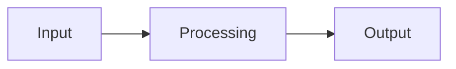

# <Solution name>

> One sentence a hiring manager can repeat. What it does, for whom, and the outcome.
> Example shape: "An agent that opens claim files from unstructured intake calls for a
> mid-size PI firm, cutting time-to-file from 3 days to under an hour."

## At a glance

| | |
|---|---|
| **Client** | Anonymized descriptor: size, sector, region |
| **Domain** | e.g. Personal injury claims intake |
| **My role** | e.g. Sole engineer, discovery through deployment |
| **Timeline** | e.g. 6 weeks, Q1 2026 |
| **Stack** | e.g. Claude API, Supabase, Retool, Twilio |
| **Status** | In production / piloted / delivered and handed off |

---

## 1. Context

Two or three sentences on the business. What the organisation does, where this workflow sits,
who touches it. Enough that a reader outside the industry follows the rest.

## 2. Diagnosis: how I knew this was the problem to solve

The brief was rarely the real problem. Show the work:

- **What I was originally asked for** vs. what turned out to matter.
- **How I found out**: process mapping, shadowing, ticket or log analysis, stakeholder
  interviews, timing a workflow by hand, querying their own data back at them.
- **What the evidence said**: the number or observation that reframed the problem.
- **What I ruled out**, and why. The obvious fix that wouldn't have worked.

For forward-deployed roles this section carries more weight than the architecture.

## 3. Problem

The problem in three or four lines, stated crisply. Then quantify the cost of leaving it
alone: hours per week, cycle time, error rate, revenue leakage, headcount pressure.

## 4. Solution

What was built, in plain language first. Then the mechanics: the steps the system runs, what's
automated vs. human-in-the-loop, and where the judgment calls live.

## 5. Architecture



**Key decisions and tradeoffs**, three or four, each with the reasoning:

| Decision | Why | What I gave up |
|---|---|---|
| | | |

**Constraints I built inside.** The client-environment realities that shaped the design: no
infra access, a legacy system of record, compliance limits, non-technical end users, a hard
budget. Systems built in a vacuum aren't interesting, so name the real ones.

### Illustrative excerpt

The one piece of the implementation that's genuinely interesting: a prompt, a schema, a
scoring rule, a validation gate. Redacted. One block, not a code dump.

**Say what the block actually is.** Much of this work is built in Power Automate, Make and
similar, so an excerpt is often flow logic written out as code rather than source from a repo.
That is fine and beats a screenshot of a designer canvas, but label it that way. "Redacted"
tells the reader it is the real artifact with identifiers swapped.

```
```

## 6. My involvement

Explicit and honest. What I owned end to end, what I shared, what someone else did. Include
the unglamorous parts: stakeholder wrangling, training the users, the handoff.

## 7. Impact

| Metric | Before | After |
|---|---|---|
| | | |

If a number isn't measured, say so and give the qualitative outcome instead. Never invent a
metric. An unverifiable stat is worse than none.

## 8. What I'd do differently

Two or three honest reflections. What broke, what I over-built, what I'd cut.

---

<details>
<summary>Evidence</summary>

Sanitized screenshots, sample input and output, redacted artifacts. Check every image for
client names, party names, real dollar figures, and PHI before committing.

</details>
