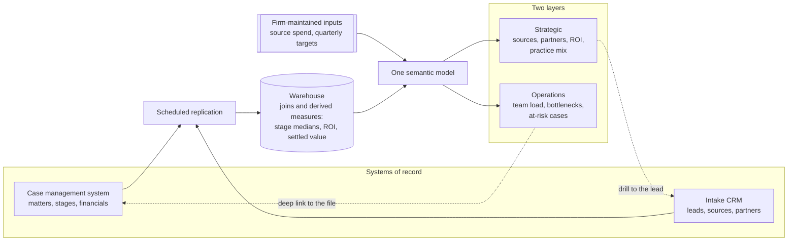

# Dashboards: how I decide what goes on them

> How I scope reporting for a firm, in two layers. A **strategic** layer showing the owner where
> cases come from and which of those relationships are worth money, and an **operations** layer
> showing where the work is stuck this week. Both sit on one modelled copy of the firm's own
> data, because a case management system cannot answer a question that spans two of its objects.
> Built twice, at two different firms, both linked below.

## At a glance

| | |
|---|---|
| **What it is** | How I decide what a firm's dashboard carries, and in what order to build it. A framework rather than a single build |
| **Applies to** | A firm running its practice inside a case management system with an intake CRM in front of it, no analyst on staff, and no reporting beyond what those systems ship. Written through personal injury and criminal defense firms, which is where I have built it |
| **Where it has been used** | Two builds at **two different firms**, on different stacks: [firm operating dashboards](./firm-operating-dashboards.md) and [the marketing ROI dashboard](./marketing-roi-dashboard.md) |
| **My role** | Built both dashboards and the models under them. Each page carries its own role detail and its own caveats |
| **Stack** | Power BI on both, over Azure SQL or BigQuery, fed by Skyvia or a custom connector, off Clio Manage, Clio Grow and Lawmatics |
| **Status** | Both in production |

<!-- OPEN: this page is written as a framework, so it departs from the eight-section template the
case studies follow, the same way document automation does. -->

---

## 1. Two layers, answering to different people

| | **Strategic** | **Operations** |
|---|---|---|
| The question | Where does growth come from, and what is it costing | What is stuck, and what is at risk |
| Who reads it | The owner and the partners | Team leads, case managers, intake managers |
| Cadence | Monthly and quarterly | Daily and weekly |
| Grain | Starts high, gets a bit more granular, stays big picture | The team, the file, the task |
| What a reading changes | Where the marketing money goes, which relationships to invest in, which case types to take | Who picks up the next case, which file gets chased today |

Both builds below carry both layers on one model.

## 2. The strategic layer

This layer exists so the owner can see the firm from above and work out where growth comes from.
In personal injury it starts with three counts and one question:

- How many leads arrived.
- How many the firm signed.
- How many it did not.
- Why not.

The fourth splits the layer in two, because the reasons have different owners. A lead that went
to another attorney is an intake problem. A lead the firm turned away is a marketing problem.

**Losing leads to another attorney is a people and process question.** Break the losses down by
the intake manager who worked them and a person carrying an unusual share of them shows up,
which is either a training conversation or a sign the intake process needs changing. Neither is
visible in a firm-wide conversion rate.

**Leads the firm rejects are a media buying question.** Every rejected lead was paid for. Split
the rejections by source and the sources sending junk cases become obvious, and each one is then
a decision to correct the targeting or cut the source altogether.

**Referral partners get the same treatment.** Which partners send the most cases, which send the
best ones, and which relationships are therefore worth nurturing. Ranking by volume and ranking
by signed cases answer different questions, so a partner has to be readable both ways. The firm
operating dashboards page carries a worked example, a partner showing 68 referrals against one
closed case, and what the client worked out about it from the two rankings together.

**Then money, which is a different ranking again.** Conversion rate does not settle which source
deserves the budget. The comparison that does is what a source costs against the value of the
cases it produces. Take a source sending 40 signed cases a year at an average settlement of
$5,000, against one sending 20 at $15,000 for a third more spend. The first wins on volume and
on cost per signed case. The second produces $300,000 of case value against $200,000, so it
earns more of the budget while signing half as many cases.

So a source belongs on a row carrying hired count, conversion rate, median and total case value,
and what the source costs, together. Getting settled value onto that row is usually the hard
part, since the value lives in the case management system and the source lives in the CRM, and
the settled figure has to be carried back onto the lead that produced it. That is most of what
the [marketing attribution](../marketing-attribution) project was, and the dashboard on top of
it is [here](./marketing-roi-dashboard.md).

## 3. The operations layer

This layer tracks the work rather than the business, per team:

- How many cases the team is carrying, and how many arrived.
- How many it is closing, and how fast.
- Which tasks are sitting pending.
- Which stage of the process is taking longest, which is where the bottleneck is.
- Which cases are at risk.

**At risk means two different things.** An approaching statute of limitations date is the
obvious one and the easiest to compute. The other is a case that has been with the firm
materially longer than the firm's own median for its stage, which surfaces a file that has gone
quiet without anyone remembering to go looking for it.

**That median has to be computed inside the stage.** A litigation matter open 400 days is
unremarkable and a pre-litigation matter open 400 days is a problem, so a single firm-wide
median flags the litigation caseload and misses the pre-litigation files that are genuinely
stuck. The benchmark is the median for the case's own stage, computed from that firm's own
closed matters. The measure that does it is on the [firm operating dashboards
page](./firm-operating-dashboards.md#illustrative-excerpt).

**Bottlenecks need stage-level timings.** Time to close says a case was slow without saying
where it sat. A pipeline shown stage by stage in the firm's own named stages, per practice area,
turns "discovery is slow" into a number the firm can compare against its own history.

The operations layer is also the part a team will open on its own. In one build that was a
per-team page scoped to the team's own caseload, its own goal progress, its own aging files and
its own calendar, and it is the part of that project that made it stick.

## 4. Neither layer works without the data layer underneath

Every question above spans objects. Conversion by source joins leads to matters to settled
value. Aging joins open matters to closed-matter history. Team performance joins matters to
teams to financials to a target. Case management systems and intake CRMs answer single-object
questions, so each of these becomes a manual export, and the questions that need asking weekly
stop being asked.

So the reporting layer sits outside the system of record. Replicate on a schedule into a
warehouse, model it there, and put one semantic model in front of every page. One model is what
stops leadership and a team quoting different values for the same measure.

**Hourly refresh.** These are performance and pipeline metrics, and no decision on either layer
changes inside an hour. Real time is the reflex request, and buying it spends the budget on
latency nobody needed.

**Every aggregate drills to the records, and every record deep links into the system of record.**
A number the owner distrusts has to resolve into the cases behind it in a few clicks, or the
alternative is going to search for them by hand. It also puts the page where you notice a stuck
file one click from where you fix it.

**The dashboard comes before the AI.** Both engagements below started in a conversation about
AI. The position taken going in was that a firm cannot evaluate AI against a process it cannot
see, and that if the dashboard is enough to make the call then the AI is not needed. One client
said it back plainly at the pilot review: *"If you can look at the dashboard and you can already
make the determination, you don't even need the AI."* On the other build the owner asked for an
assistant he could ask for trends and recommendations, and it was deferred on the grounds that a
model has nothing to flag until the targets exist, since without them it can only report that a
number moved.

<!-- OPEN: the firm operating dashboards page carries an open question on who first framed the
data-before-AI argument, you or the client. Same question applies to this paragraph, since it is
stated here as the position I take going in. -->

## 5. What the numbers have to mean

A report over a CRM inherits the CRM's definitions unless someone decides otherwise, and those
definitions decide whether anyone trusts the page.

- **Conversion rate excludes anything still in intake.** An unresolved lead is not a lead the
  firm failed to sign. Counting it as one understates conversion by however many cases are in
  flight on the day you look. This makes the dashboard disagree with the number the same people
  read in the CRM, so the disagreement gets explained at the walkthrough rather than found
  later.
- **Qualification rate depends on what counts as a lead at all.** Wrong numbers, current clients
  calling about an open case, test records and enquiries for work the firm does not do all sit
  in the denominator and hold the rate down.
- **Median case value next to the total, not the average.** One large settlement moves an
  average enough to make a channel look like something it is not, and per-source volumes are
  small enough that it happens often.
- **Loss reasons keep their granularity and get a rollup on top.** Twenty reason codes are what
  intake staff record and what makes a fix actionable. Three categories, the firm rejected it,
  the lead did not hire, the lead was invalid, are what the owner reads.
- **Show the practice areas the firm turns away.** It is the only place unmet demand appears.
  One firm found a steady stream of medical malpractice enquiries it had been rejecting on sight
  without ever counting them.
- **A target only means something next to what the source costs.** Word of mouth converts on its
  own and costs nothing to run, so holding it to paid search's conversion target says nothing
  about either. Goal lines are worth deferring until the client has used real data long enough
  to set targets per source.

## 6. How I sequence a build

**Ship the smallest complete slice first.** On one build that was intake and marketing off the
CRM, alone, as a pilot: the narrowest thing that proved the pipeline end to end and was useful
on its own. The reports covering teams, caseload, aging and finance followed that review.

Two of the most valuable views in that build came out of the review rather than the design.
Per-staffer intake performance was a byproduct of modelling the lead pipeline properly, and the
client named it unprompted as one of the most valuable views. Ranking referral partners by
signed cases instead of volume was asked for live, by the client, looking at the chart sorted by
volume.

**Not everyone will open a dashboard.** Scheduled extracts go to the people who want the number
in their inbox, and on one build they replaced a staff member rebuilding a scorecard by hand
every week.

**Licence cost per viewer is a launch conversation.** Power BI Pro is charged per person who
opens the report, which for a firm of this size is a real line item, so it gets said before
launch rather than after.

<!-- OPEN: worth your ruling on whether this belongs here as method. The single best idea in the
firm operating dashboards build, ranking partners by hired, came from the client reacting to a
chart rather than from the design. Same question is open on that page: is the lesson that the
first build should ship deliberately incomplete so the client fills the gaps? -->

## 7. The two builds

Two firms, two engagements, nothing shared between them.

**[Firm operating dashboards](./firm-operating-dashboards.md).** A plaintiff-side personal
injury firm on Clio Manage and Clio Grow, replicated hourly into Azure SQL, with five Power BI
reports on one semantic model: intake and marketing, leadership, team performance, a per-team
view and financials. Weighted toward the operations layer, including aging against stage
medians and per-team goals that feed quarterly bonuses.

**[The marketing ROI dashboard](./marketing-roi-dashboard.md).** A much smaller criminal defense
and personal injury firm on Lawmatics and Clio Manage, replicated into BigQuery, in five tabs.
Weighted toward the strategic layer: source and campaign performance against cost, loss reasons
by source, and settled value by lead source. It is the surface built on top of the
[marketing attribution](../marketing-attribution) rebuild, which is what made the numbers on it
true.
