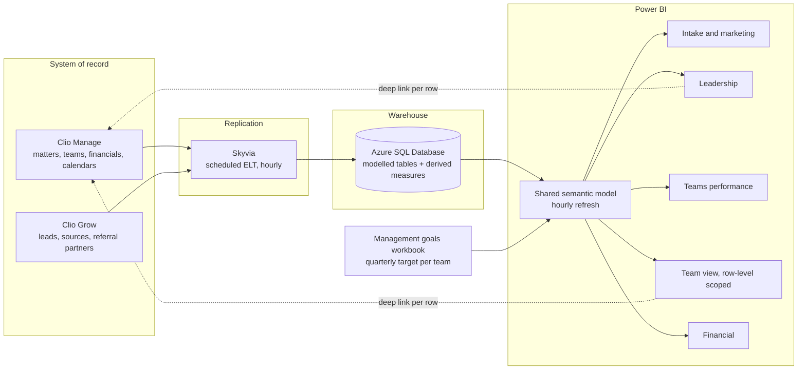

# Firm operating dashboards

One of the two builds behind [how I decide what goes on a dashboard](./README.md).

> A reporting layer over a plaintiff-side personal injury firm's case management system,
> replicating case and intake data into a warehouse every hour so leadership, each case team
> and finance run the business off shared live numbers instead of manual exports.

## At a glance

| | |
|---|---|
| **Client** | Plaintiff-side personal injury firm, US, ~$50M annual revenue and under 400 people |
| **Domain** | Legal operations and firm-wide business intelligence |
| **My role** | Built the dashboards and the underlying model. Co-built the Clio-to-warehouse connector. The diagnosis was the client's own, see section 2 |
| **Timeline** | <!-- OPEN: how long from kickoff to the intake pilot review, and how long to the full five reports? --> |
| **Stack** | Clio Manage, Clio Grow, Skyvia, Azure SQL Database, Power BI, Excel (goal input) |
| **Status** | In production. Started as a pilot engagement |

---

## 1. Context

A plaintiff-side personal injury firm turning around $50M a year, with under 400 people. It
runs its entire practice in Clio Manage, with Clio Grow in front of it for intake.
Every fact a partner might want lives in there already: which marketing source a lead arrived
from, which referral partner sent it, why a lead was declined, who worked it, what stage a
matter is at, what it settled for, when the statute of limitations expires.

The firm is organised into case teams, each carrying its own caseload and each paid a
quarterly bonus tied to the net fees it brings in. Leadership sets those targets. Above the
teams sit the questions leadership has to answer to grow: where good cases come from, which
teams are underloaded, which matters have gone quiet, and what is actually going to be
collected this quarter.

## 2. Diagnosis: how I knew this was the problem to solve

I should be straight about this one, because it is the exception in this portfolio. I did not
find the problem here. The client did, and they were right.

This was a pilot engagement. The firm came in already able to state its biggest pain point,
which is rarer than it sounds and worth taking at face value when it happens. Their data was
complete and unreadable, and they knew it. The diagnostic work I would normally do had already
been done by the people living inside it.

**Where the judgement actually went: sequencing, and holding off on AI.** The conversation
that brought us in was about AI. The position we took going in was that AI could not be
evaluated until the firm could see its own numbers, and that if a dashboard is enough to make
the call, the AI is not needed. That is the reasoning that shaped the engagement, and the
client came to the same conclusion looking at the first build.

<!-- OPEN: confirm who framed the "understand the data before buying AI" argument. Reading the
transcript it looks like it came from your side and the client agreed, but it could be read
either way, and it matters for how this section is written. -->

So the scope was deliberately narrow first. Intake and marketing only, off Clio Grow, because
it was the smallest complete slice that could prove the pipeline worked and be useful on its
own. The Clio Manage reports covering teams, caseload, aging and finance came after that
review.

**What the build surfaced that nobody had asked for.** Two things came out of putting the
first version in front of the client rather than out of any upfront analysis.

- *Employee-level intake performance.* Showing hired, in-intake and did-not-hire per intake
  staffer was a byproduct of modelling the lead pipeline properly. The client had not asked
  for it and named it unprompted as one of the most valuable views.
- *Ranking referral partners by hired, not by volume.* This one the client asked for live,
  while looking at the partner chart sorted by total leads. It is the strongest idea in the
  project and it was theirs. Its value showed up in the same session, described in section 7.

**What I ruled out.**

- *Clio's native reporting.* It answers single-object questions. Almost every KPI the firm
  wanted was a join across leads, matters, teams, financials and dates.
- *Reporting straight off the Clio API.* Every dashboard refresh would have become a
  pagination and rate-limit problem against the live system of record, and the firm has no
  engineer to keep that running.
- *Real-time.* Worth naming because it is the reflex answer. These are performance and
  pipeline metrics. No decision here changes inside an hour, and buying streaming would have
  spent the budget on latency nobody needed.

## 3. Problem

The firm's operating data was complete and unreadable. Clio Manage holds it but cannot report
across it, so every question that spanned two objects became a manual export, and questions
that had to be asked weekly simply stopped being asked. Leadership managed a multi-team
practice on recollection and spreadsheets. Teams could not see their own progress toward the
bonus they were working for. Marketing spend and referral relationships were maintained
without any measure of which ones produced signed cases.

<!-- OPEN: the cost of leaving it alone is the missing quantification here. Any of these
would land: hours per month spent building manual reports, how often leadership asked for a
number and waited days, marketing spend on sources that never converted. -->

## 4. Solution

A warehouse-backed Power BI reporting layer, refreshed hourly end to end.

Skyvia replicates Clio Manage and Clio Grow into an Azure SQL database on a schedule. The
warehouse is where the modelling happens: matters joined to teams, leads joined to sources and
referral partners, financials joined to matters, plus the derived measures Clio has no concept
of, like the firm's median days-to-close split between litigation and pre-litigation. Power BI
sits on top and refreshes on its own hourly schedule. Quarterly team goals are read from a
spreadsheet that management owns, so targets can be changed per team without touching the
build.

Five reports came out of it, sharing one semantic model so leadership and the teams cannot end
up quoting different numbers. The first was shipped alone as the pilot.

**Intake and marketing** (the pilot, off Clio Grow). Conversion rate over total leads, split
into hired, in-intake and did-not-hire, with the declination reason broken out (declined on
criteria, lost contact, retained other counsel, pending evaluation, co-counsel pending). Lead
sources and referral partners are ranked by total leads *and* by hired count, conversion rate
and case value, which is what separates a partner worth investing in from one sending volume
the firm never signs. Intake staff appear on the same hired / intake / did-not-hire split, so
a person carrying an unusual share of losses shows up as a coaching conversation rather than a
hunch. Matter types carry their own conversion rate and median value, which is how the firm
sees that a case type it takes rarely converts well.

**Leadership.** Open matters split litigation and pre-litigation, median days to close for
each, open caseload and estimated case value by team, and each team's top matter types and top
referral partners. Two aging tables list active cases open more than 50% longer than the
company median for their stage, so a pre-litigation matter that has sat for three years
surfaces without anyone going looking. A rules-driven alert panel flags conditions like a team
dropping under its caseload floor. Firm-wide SOL and trial calendars replace the filtered
personal calendar. Every row deep-links back into Clio, so the dashboard is where you notice
the problem and one click from where you fix it.

**Teams performance.** Each team against its net fee goal and closed case goal, quarter by
quarter, as a met / missed / in-progress grid. Progress to the current quarter's goal, with
the amount over goal shown separately. Average open caseload per team per month against
capacity bands, and cases closed by team with net and average settlement.

**Team view.** The same content scoped to one team, so a team sees its own goal gauge and
percentage to bonus, its own aging cases, its own SOL and trial dates, and its own referral
partners and matter types. This is the report the teams opened themselves, which is the part
that made the project stick.

**Financial.** Cash received per month from case distributions, revenue accrued on open cases
not yet paid, and total outstanding accrued balance, each toggleable between gross and net.

## 5. Architecture



**Key decisions and tradeoffs**

| Decision | Why | What I gave up |
|---|---|---|
| Off-the-shelf replication into a warehouse rather than code against the Clio API | The firm has no engineer to maintain a custom pipeline. A scheduled connector is something their own IT can reason about | Control of the extract. A vendor-side schema change arrives as a broken column instead of something I can intercept |
| Azure SQL in the middle instead of pointing Power BI at the source | Gives somewhere to model peer-group medians, the lit / pre-lit split and the goal join, and keeps analytical queries off the system of record | A component to pay for, secure and back up. Data is as fresh as the last sync |
| Hourly refresh | These metrics drive weekly and quarterly decisions. An hour of lag costs nothing, and against a firm with no reporting at all it reads as live | Rules the platform out for same-minute operational alerting if they ever want that |
| Team goals read from a spreadsheet management maintains | Targets differ per team and change per quarter. Hard-coding them would route every change back through me | A spreadsheet is a fragile input. A typo silently moves a bonus target, so the load needs validating |
| One semantic model behind all five reports, scoped per audience | Leadership and a team quoting different values for "net fees" would end the project's credibility on day one | Row-level security became the thing that had to be exactly right, since teams see revenue data |

**Constraints I built inside.** No in-house engineering, so every moving part had to be
schedulable and inspectable by a non-technical administrator. Clio stays the system of record
and nothing writes back to it. The readers are attorneys and case managers rather than
analysts, so each report had to answer its question on the first screen with no drill-down
required. And quarterly bonus money is calculated off these figures, which sets the bar for
correctness well above the usual dashboard.

### Illustrative excerpt

The aging-case rule, which drives the leadership tables and each team's "needs attention"
list. The point of it is the peer group: a litigation matter open 400 days is unremarkable and
a pre-litigation matter open 400 days is a problem, so the median has to be computed within
stage rather than across the firm. Redacted, with generic table names.

```dax
-- Median days-to-close for the case's own stage, from closed matters only.
-- ALLEXCEPT keeps the litigation / pre-litigation split and drops every other filter,
-- so the benchmark stays firm-wide even when the page is filtered to one team.
Peer Median Days To Close =
CALCULATE(
    MEDIAN( fct_matter[days_to_close] ),
    ALLEXCEPT( fct_matter, fct_matter[stage] ),
    fct_matter[status] = "Closed"
)

-- An open matter is flagged once it exceeds its peer median by the configured multiple.
-- The multiple lives in a config table rather than the measure, so leadership can retune
-- the threshold without a republish.
Aging Case Flag =
VAR Multiple  = SELECTEDVALUE( cfg_threshold[aging_multiple], 1.5 )
VAR Benchmark = [Peer Median Days To Close] * Multiple
RETURN
    IF(
        fct_matter[status] = "Open" && fct_matter[days_open] > Benchmark,
        1,
        0
    )
```

## 6. My involvement

I built the dashboards: the semantic model, the measures, the report design and the per-team
scoping. I co-built the Clio-to-warehouse connector rather than owning it alone.

I did not run the diagnosis, for the reason given in section 2. Where I did apply judgement
was in arguing for the data layer before any AI work, in scoping the pilot down to intake so
there was something real to react to early, and in the modelling decisions in section 5 that
the client never sees and would have felt within a quarter if they were wrong.

<!-- OPEN: worth adding if you have it. Who chose Skyvia and Azure, you or the client's side?
Who ran the KPI definition conversations with the partners? How were the teams brought onto
their own dashboards, and who owns the thing now? -->

## 7. Impact

No before-and-after metrics were captured on this engagement, so the honest version is
qualitative. What exists is the client's reaction in the pilot review, and one worked example
of a decision the dashboard changed.

| Capability | Before | After |
|---|---|---|
| Firm-wide reporting across leads, matters, teams and financials | Manual export and pivot per question | Five live reports, refreshed hourly |
| Referral partners ranked by signed cases | Not available | Standing view, by hired count, conversion rate and case value |
| Team visibility of progress toward quarterly bonus | Calculated by hand after the quarter closed | Self-serve, current within the hour |
| Firm-wide SOL and trial exposure | Buried in a filtered per-user calendar | Dedicated calendars, filterable by team |
| Aging cases | Found when someone remembered to look | Flagged automatically against the stage median |

**The referral partner case.** In the pilot review the client picked out a partner showing 68
referrals and a single closed case. Sorted by volume alone that reads as a partner not worth
the relationship. The dashboard let them see why the number looked that way: the referrals
were nearly all recent, following one large case the firm had closed for that partner, so the
low closure count was a lag artifact rather than a quality signal.

The wider pattern underneath it mattered more. That partner only takes auto collision work and
had started routing everything else, premises liability, animal bites and product liability,
into a referral marketplace. The client's firm takes those case types and had quietly picked
up six product liability matters that way. None of this was visible before, and it is the kind
of relationship worth actively cultivating rather than discovering by accident.

In the client's words, lightly redacted:

> "This is exactly what I want to see. We can see who's giving us cases. I forget some people
> that give us cases and I'm like, we should take them to a game. Let's do stuff with them if
> they're giving us this many cases."

> "It's a great point about [large auto-collision-only referral partner], but we can see only
> one of them has been closed out of 68, because that's why, because they're all new. We
> closed a big case for them and then they started giving us a lot of looks."

The ranking-by-hired view came out of this same session, asked for on the spot:

> "Something else that you could be doing with this one in particular is not only sorted by
> total amount but actually sorted by hired. So you can actually see in the last year how many
> of the referral partners did you actually hire from. And in this case we're talking about
> years, but you can move it to 6 months, 1 month."

On the pilot as a whole, before any of the Clio Manage reports existed:

> "This is just your first out the gate product, but I think this is so good just based on what
> I'm seeing right now, I can make 20 decisions that's going to increase our productivity."

> "This exceeded what I thought it was going to be already. I just thought it would be like I
> could see certain things. I didn't know, like searching, digging in this deep and going even
> by performance by employees. This is great."

And on the question the engagement started from:

> "If you can look at the dashboard and you can already make the determination, you don't even
> need the AI. I don't even need it."

<!-- OPEN: anything measured would still carry this section harder than quotes do. Weekly
active users across the five reports, whether marketing spend moved off a source the
conversion view exposed, whether the aging-case count fell after the flag shipped. -->

## 8. What I'd do differently

<!-- OPEN: needs your own reflections, this section is empty without them. Candidates from
the build, to confirm, replace or delete: the goals spreadsheet is an unvalidated input
feeding numbers that decide bonuses; the aging threshold and alert floors were fixed at build
time rather than configurable from the start; five reports may be one more than the firm
needed. -->

<!-- OPEN: one more worth capturing. The single best idea in the project, ranking partners by
hired, came from the client looking at a chart, not from the design. Is the lesson that the
first build should ship deliberately incomplete so the client fills the gaps? -->

---

<details>
<summary>Evidence</summary>

<!-- OPEN: screenshots are held back pending a clean anonymization pass. The exports reviewed
in session still carried client emails and phone numbers in the intake detail table, legible
client names in the case detail tables, a staff name in a slicer, and referral partner and
lead source lists that read as real firms rather than substitutes. Team labels also differed
between exports, suggesting two separate scrub passes. Re-export with substituted values at
source, or crop to the aggregate visuals only. The financial report is aggregate throughout
and is safe as-is. -->

</details>
