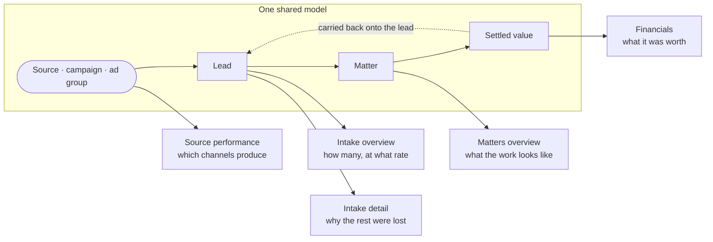
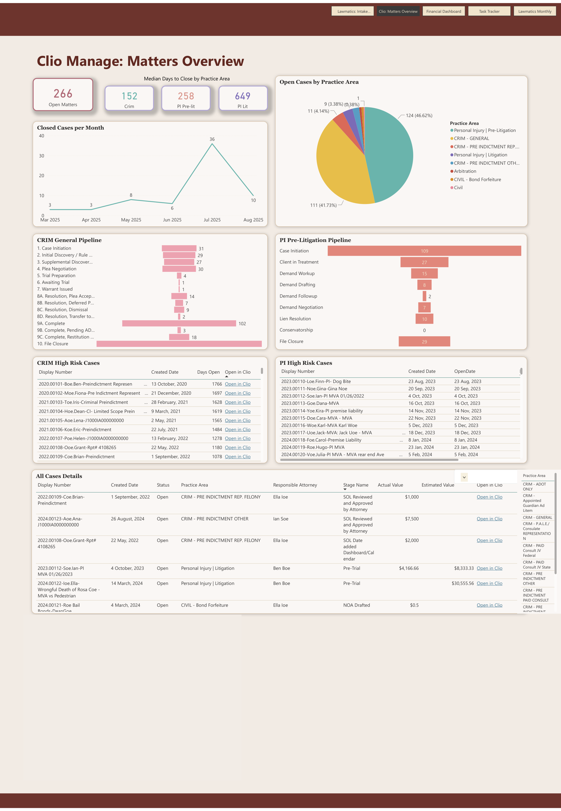
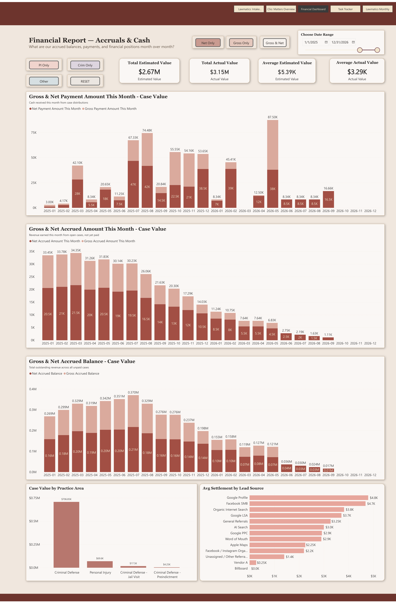
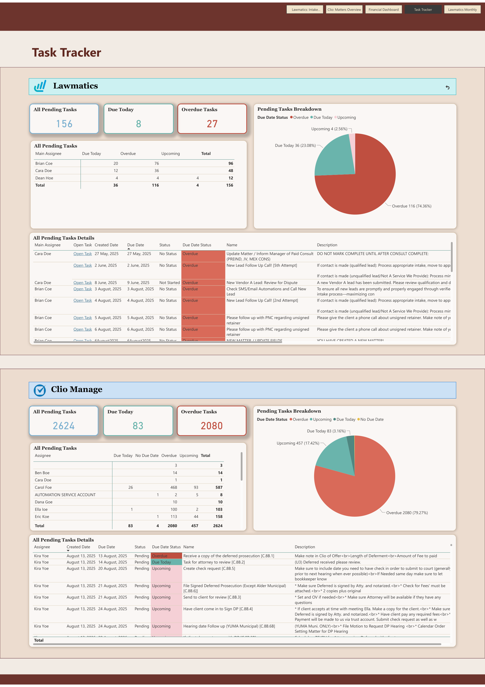

# The Marketing ROI Dashboard

One of the two builds behind [how I decide what goes on a dashboard](./README.md). Companion to
[Marketing Attribution](../marketing-attribution), which covers the five layers that had to be
rebuilt before any number here was true. This page covers the surface built on top of them.

## Why this piece carries the project

Everything upstream of the dashboard is invisible. A rebuilt taxonomy, an ad account
restructured under protest, remapped history, a cost model, settled value flowing back from the
case management system: none of it changes a decision on its own. It changes decisions when the
owner opens one screen and sees which spend earns.

It is also where half-fixed attribution would have shown. The people reading this dashboard know
their own channels, so a per-campaign number that contradicts what they already believe gets
noticed in the first week. Once one number is wrong the whole thing stops being opened, and the
firm goes back to the agency's monthly report on impressions and clicks.

## What it is

Power BI over an hourly BigQuery warehouse fed from both Lawmatics and Clio Manage, in five
tabs: Lawmatics: Intake Overview, Clio: Matters Overview, Financial Dashboard, Task Tracker and
Lawmatics Monthly. The firm had been reading three separate things: a scorecard a staff member
rebuilt by hand every week, a report exported out of the CRM, and a financial report living in a
different BI tool. All three are on one model here, which is what lets a marketing source and a
settlement figure appear in the same sentence.

The five tabs are not five screens. The intake tab runs long, so source performance and intake
detail below are its lower two thirds rather than tabs of their own.

**Intake overview.** The top of the funnel, from the CRM. Total leads, qualified leads, leads
currently in intake, hired and did-not-hire as headline counts, with the conversion and
qualification rates derived from them. Underneath, the status and qualification breakdowns, a
matrix of every stage inside each status, so the intake stages a lead can sit in are visible
individually rather than as one bucket. The funnel from total leads to qualified to hired, lead
volume split by practice area at each of those three steps, a six-month trend of the three
series together, and lead volume by day of week.

**Source performance.** The page the attribution work exists to make true. Leads by source and
by practice area as stacked bars, each segment being a status, so the shape of a source is
visible before any rate is read. Beside each, a table carrying total leads, hired, conversion
rate, qualification rate, median case value and total case value for every source, expandable
into the campaigns underneath it. Referral partners get the same treatment on their own, broken
out individually, because for this firm they behave like a channel rather than a rounding error.

**Intake detail.** Consultations booked, paid and followed up, split by practice area, with
completion, miss and pending rates for each. Then the reason breakdown, roughly twenty
categories, each prefixed to say who ended it. Rejections are the firm turning a lead away.
Did-not-hires are the lead going quiet, going elsewhere, or balking at cost. A summary donut
rolls those twenty categories into three: firm rejected, did not hire, and invalid. Under all of
it, the full lead list with source, campaign, stage and owner on every row.

**Matters overview**, from Clio. Open matters, closed cases per month, open cases by practice
area, and median days to close split by practice area and litigation stage, which is where the
difference between a criminal matter and a personal injury case in litigation stops being
folklore and becomes a number. Separate pipeline funnels per practice area, each showing the
firm's own named stages in order. Then the aging lists, oldest open files first, flagged as high
risk, each row linking straight into the matter in Clio.

**Financial report.** Accrual and cash side by side, which for a contingency practice are
genuinely different questions. Cash received this month from case distributions, revenue earned
this month on open cases and not yet paid, and total outstanding revenue across all unpaid
cases, each plotted month over month with gross and net together. Toggles switch between gross
only, net only and both, and between practice areas. Total and average estimated value against
total and average actual value as headline cards. And at the bottom, average settlement by lead
source, ranked, which is the chart the whole project was built to make possible.

## How the pages relate

One lead record carries the whole chain, and that is the point of the rebuild rather than a
feature of the reporting. A lead arrives in the CRM with a source, a campaign and an ad group on
it. If it signs, it becomes a matter in the case management system. When that matter settles,
its value comes back to the CRM and lands on the original lead. When the firm drops it, that
comes back too and the lead stops counting as a win.

So source is not a marketing field sitting on the marketing page. It is a dimension the whole
model shares, and every page answers a different question about the same one.

Because it is one model, filters cross the whole thing. Click the largest rejection reason and
the sources that produced it appear. Click a source and its rejection profile, its conversion
rate and its average settlement all move together. Drill through any aggregate and the
individual matters behind it are listed, each linking into the record in the source system, so a
number the owner distrusts takes about four clicks to resolve into the actual cases behind it.

That is what the CRM's native reporting cannot do, and it is why the reporting layer sits
outside the CRM at all. The ROI data itself is unified in the CRM by this point and needs no
help to answer the ROI question. Cross-filtering is what turns it from a figure into an
argument.

## What it exists to do

Three questions, none of which the firm could answer before.

**Which spend produces cases worth having.** Not leads. Not signed cases. Settled value per
source against what that source costs. A vendor selling pre-signed cases converts at close to a
hundred per cent on paper and can still be the worst line item in the budget, which is exactly
what the average-settlement-by-source chart showed once dropped cases flowed back from Clio.

**Where the losses actually come from.** Roughly twenty reason codes rolled into three
categories separate the firm's own decisions from the market's. The largest single reason for
losing a lead is that the firm does not offer the service asked for, which is a media buying
problem wearing an intake costume, and it is invisible until reason codes are counted against
the sources that produced them.

**Whether the firm is being told the truth by its suppliers.** The agency owned the landing
pages, the ad account and the reporting on its own performance. This dashboard is the firm's
independent read of the same question, built from its own records.

## What the numbers had to mean

A report over a CRM inherits the CRM's definitions unless someone decides otherwise. Two of
those decisions changed what the client saw.

**Conversion rate excludes anything still in intake.** A lead that has not resolved yet is not a
lead the firm failed to sign. Counting it as one, which is what the native report did,
understates conversion by however many cases happen to be in flight on the day you look. The
denominator here is hired plus did-not-hire, and everything sitting in an intake stage is out of
it. That makes the dashboard's headline conversion rate deliberately disagree with the number
the same people had been reading in the CRM, so the first walkthrough spent time on why.

**Qualification rate depends on what counts as a lead at all.** Wrong numbers, current clients
calling about an open case, internal test records and enquiries for work the firm does not do
all sit in the denominator and hold the rate down. The owner had a benchmark in mind that the
firm's own rate came nowhere near, and part of that gap was definitional rather than
performance.

**A target only means something next to what the source costs.** The client wanted goal lines on
the dashboard, per channel. Word of mouth converts on its own and costs nothing to run, so
holding it to the same conversion target as paid search says nothing about either. Rather than
ship goal lines against numbers nobody had seen yet, targets were left until the client had used
the real data for a while and could set ones that meant something.

## Design decisions

- **Everything cross-filters, and every aggregate drills to the matters underneath it.** The
  alternative is finding a number you distrust and then going to search for the cases by hand.
- **Median case value next to total, rather than average.** A single large settlement moves an
  average enough to make a channel look like something it is not, and with per-source volumes
  this small it happens often.
- **Loss reasons keep their full granularity and get a rollup on top.** Twenty codes are what
  intake staff actually record and what makes a fix actionable. Three categories are what the
  owner reads. Collapsing to three at the source would have thrown away the first.
- **Show the practice areas the firm does not take.** Lead volume is split by practice area
  including the ones rejected on sight, because that view is the only place unmet demand shows
  up. Another firm looked at the same page and found a steady stream of medical malpractice
  enquiries it had been turning away without ever counting.
- **Gross and net on the same axis.** The previous financial report put them on separate pages,
  so comparing the firm's fee against the settlement that generated it meant remembering a
  number while scrolling.
- **Scheduled extracts, not just a screen.** Weekly and monthly cuts go out to the people who
  need them on a schedule. The report they replace was a staff member exporting from the CRM and
  doing the arithmetic in a spreadsheet every week.
- **Fold the financial reporting in rather than leaving it where it was.** The firm's financial
  report already existed in Looker Studio, and moving it onto the same model made settlement
  value joinable to lead source.
- **Ship V1 with a known hole.** Personal injury case value was missing at launch, because the
  settled-value backflow from Clio was not finished. Waiting would have delayed everything else
  the client could already use, and the gap was named out loud rather than left to be discovered.
- **Power BI Pro per viewer.** Every person who opens the dashboard needs a licence. For a firm
  of this size that is a real line item, and it is the kind of thing that has to be said before
  launch rather than after.
- **No AI layer, for now.** The owner asked for an assistant he could ask for trends and
  recommendations. It was deferred on the grounds that an AI has nothing to flag until the
  targets exist, since without them it can only report that a number moved.

## Evidence

Four of the five tabs, exported with every value substituted at source. Lead and client names,
case display numbers, emails, phone numbers and staff names are synthetic, marketing vendors are
lettered, and referral partners carry placeholder names. The structure, measures and layout are
the deployed ones.

**Intake overview.** The whole top-of-funnel tab, and the longest page in the report. The
headline row carries total leads, qualified, in intake, hired and did-not-hire, with the
conversion and qualification rates derived from them, and the 16% conversion figure is the
definition described above: hired over hired plus did-not-hire, with everything still in intake
out of the denominator. Below that, the status and qualification breakdowns, the funnel, lead
volume by practice area and by day of week, and the source and referral partner tables with
total leads, hired, conversion rate, qualification rate, median value and total value on every
row. The intake details half of the page carries the consultation counts, the roughly twenty
loss reasons prefixed to say who ended it, the three-way rollup into firm rejected / did not hire
/ invalid, and the full lead list with source, campaign, stage and owner.

**Matters overview**, from Clio. Open matters, closed cases per month, open cases by practice
area, and the pipeline funnels showing the firm's own named stages in order, fifteen of them on
the criminal side against nine on personal injury pre-litigation. The aging lists underneath are
flagged high risk and each row links straight into the matter.

**Financial report.** Cash received, revenue earned but unpaid, and total outstanding balance,
each month over month with gross and net on the same axis. At the bottom is average settlement
by lead source, ranked, where the vendor selling pre-signed cases comes last at $0.25K against
$4.8K at the top.

**Task tracker.** Pending tasks by assignee with due-date status, overdue and due-today counts,
and the task description each one carries.

