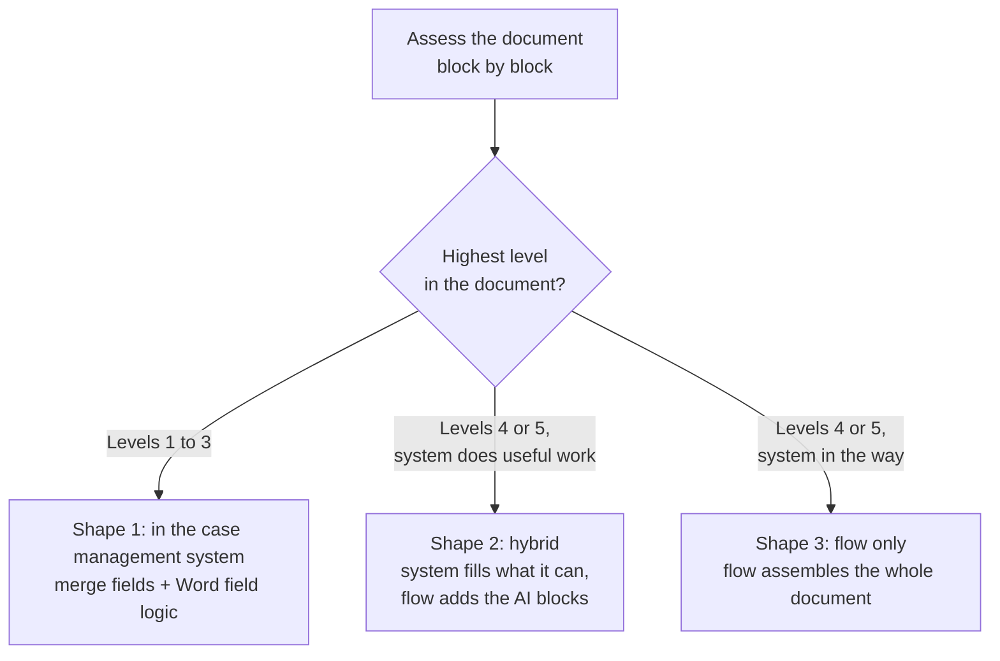
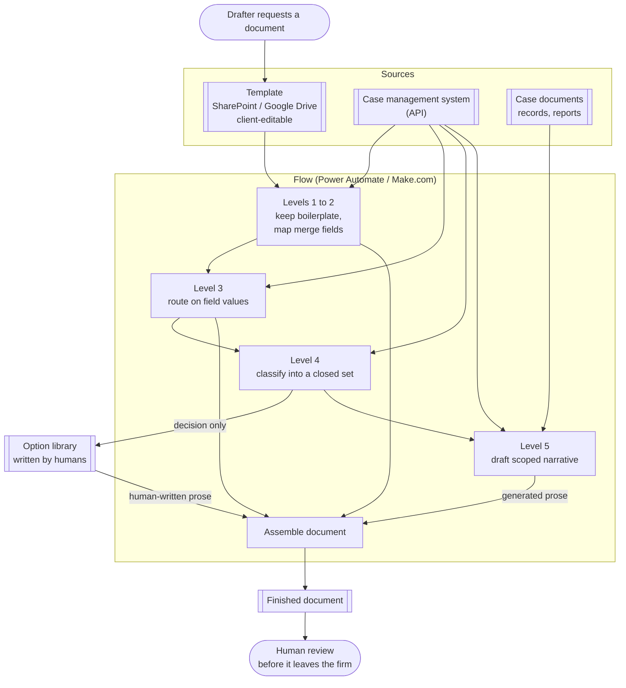

# Document automation: a five-level framework

> A method for automating any document that is mostly the same every time. Assess each section
> for the least powerful technique that will fill it, then assemble the document from five
> levels: boilerplate, merge fields, conditional logic, AI classification, AI narrative.
> Variability is a property of sections rather than of documents, so most of a long document
> needs no AI at all and a few passages need it badly. Applied at around a dozen US
> plaintiff-side personal injury firms, four of them by me.

## At a glance

| | |
|---|---|
| **What it is** | A framework, not a single build. The approach used whenever a solution has to emit a document |
| **Applies to** | Any high-volume document with a mostly repeated structure, a few genuinely variable passages, and a system of record holding the underlying data. Described here through personal injury documents, which is where it has been used |
| **Where it has been used** | Around a dozen US plaintiff-side personal injury firms across the practice, **four of them by me**, several documents each. Every application so far has been legal, though nothing in the framework is |
| **My role** | Co-developed the framework with the team, then applied it client-side across four engagements <!-- OPEN: for your four, sole builder or splitting work? Which parts were yours: template authoring, field mapping, flow build, prompt design, option libraries? --> |
| **Provenance** | The five levels came out of a group working session. I co-developed them and someone else on the team wrote them up |
| **Stack** | Power Automate, Make.com, SharePoint / Google Drive for template storage, Word field logic, system-of-record APIs, LLM classification and drafting nodes |
| **Status** | Shipped for multiple clients. The standing approach whenever a solution has to produce a document |

<!-- OPEN: this page is now written as a framework rather than a case study, so it departs from
the eight-section template on purpose. Two naming questions that follow from that. (a) The
folder is still `document-generation` while the page is titled document automation, which is
your phrasing. Rename the folder and the root README links, or retitle the page? (b) Root
README still carries an OPEN asking whether this is a flagship. -->

---

## 1. The framework

Every block of a document (a section, a paragraph, a line) gets assigned to one of five levels.

| Level | What it is | Example | Who decides the words | Verification burden | Hallucination risk |
|---|---|---|---|---|---|
| **1. Boilerplate** | Language that never changes case to case | Form instructions, standing recitals | Nobody. It is fixed | None | None |
| **2. Merge fields** | Placeholder replaced by a mapped value from the case management system | Claimant name, date of loss, file number | The field | Check the mapping once | None |
| **3. Conditional logic** | Pre-written language selected by a rule reading a field | Pronouns, corporate against individual defendant language | A rule you wrote | Test the branches | None |
| **4. AI classification** | Pre-written language selected by a model, where no clean field exists | Picking the right liability paragraph from a fixed list | A model **chooses**. It does not write | Check the choice | Wrong choice, right prose |
| **5. AI narrative** | Case-specific prose that cannot be templatized | How the injury changed this person's life | A model **writes** | Read every word | Full |

**The design rule is to use the lowest level that will fill the block.** Deterministic where
possible, AI where needed. Every level up buys flexibility and charges verification burden and
maintenance, and from Level 4 up it adds hallucination risk to a block that had none.

Nothing in the five levels is specific to legal documents. The framework applies to any
document with a mostly repeated structure, a few genuinely variable passages, and a system of
record holding the data behind them, which describes plenty of insurance, HR, finance and
procurement documents as well. Everything below is written through personal injury documents
because that is where I have applied it, so the examples are statements of claim and demand
letters and the system of record is a case management system.

## 2. Why the two obvious approaches fail

The request that arrives is "can AI write our demand letters", and both obvious answers are
wrong.

**Hand the whole document to a model.** Give a good model a good prompt and the case file, and
ask for the finished document. No prompt fixes what happens next:

- **It costs more and performs worse** than the mechanical alternative on the parts that were
  already solved. You are paying a model to retype form instructions.
- **It destroys formatting.** These are Word documents with numbered paragraphs, defined terms
  and mandated layout. A model rewriting the document rewrites the structure with it.
- **It puts a verification burden on every line.** If the model produced the whole page, a
  human has to read the whole page, including the boilerplate that has not changed in five
  years. The review cost eats the drafting saving.
- **It introduces hallucination risk into sections that had none.** Level 1 boilerplate cannot
  be wrong. Route it through a model and now it can.

**Merge fields only.** This is where most case management systems land, and it stalls one
step short of useful. Almost every document a firm needs has some narrative in it. If the tool
cannot produce that, the drafter still opens the document, still reads it top to bottom, still
writes the passage by hand, and the automation saved them keystrokes rather than a task.

Assessing per section is what lets you tell a reviewer which parts of the page could not have
come out wrong, so their attention goes to the parts that could. Generating the whole document
with a model loses that, and so does refusing to generate any of it.

## 3. How to assess a document

The assessment is the reusable part, and it runs before anything gets built.

1. **Collect past executed versions** of the same document from different matters. Five or six
   is usually enough for the pattern to show.
2. **Compare them block by block** and ask what actually changed between them, rather than what
   could theoretically change.
3. **Sort each block by how it changed.** Never changed is Level 1. Changed only in its values
   is Level 2. Changed between a small number of known variants is Level 3. Changed in a way
   that tracks a property of the case with no field behind it is Level 4. Changed completely is
   Level 5.
4. **Push each Level 4 and 5 assignment back down** by asking whether a field could be added
   upstream instead. A dropdown someone fills in at intake turns a classification into a rule,
   and a rule cannot be wrong.
5. **Scope the inputs for whatever is left at Level 5.** Decide which documents and fields each
   narrative block is allowed to read before writing the prompt.

Clients arrive expecting most of the document to need AI, and step 3 normally puts most of it
at Levels 1 to 3.

The assessment is **manual today**. It depends on the person doing it and on their having read
enough of these documents to know what varies.

## 4. Worked example: a personal injury demand letter

A demand letter is the document these firms most often ask to have automated, and it carries
all five levels on a single page.

The assessment, one row per section:

| Section | What varied between past letters | Level | Why not a level higher |
|---|---|---|---|
| Letterhead, settlement-purposes recital, closing | Nothing | 1 | Nothing to decide |
| Re: line: claimant, insured, claim number, date of loss, policy limits | The values | 2 | Every one is a field the system already holds |
| Representation paragraph | Pronouns, and whether a spouse brings a derivative claim | 3 | Both branch on fields that exist |
| Facts of loss | Everything | 5 | No two are alike, so there is nothing to select from |
| Liability paragraph | Which theory applies | 4 | No field says the impact was a rear-end, but an attorney can pre-write every paragraph the firm would use |
| Treatment and provider summary | Providers, dates, billed amounts | 2 | It is a table off the billing ledger, not prose |
| Special damages | The values, and the arithmetic over them | 2 | Computed |
| Pain and suffering, life impact | Everything | 5 | Cannot be templatized |
| Demand figure and response deadline | Values, derived from the above | 2 | Deterministic |

Two things fall out of that table. Most of a demand letter sits at Levels 1 to 3, and the two
sections clients most often assume need AI, the treatment summary and the damages, are the two
most mechanical blocks on the page. A model summarizing a billing ledger can only introduce an
error the ledger does not have.

<!-- OPEN: this table is my reconstruction of a demand letter's sections, not yours. It is the
first thing to check on this page, since it is the most concrete claim here. Correct the
section list, the level calls, and anything the firms actually did differently. In particular:
did the treatment summary really come off the ledger as a table, or did someone want prose
there? And how many liability paragraphs were in a typical option library? -->

**[Download `demand-letter-levels.html`](./assets/demand-letter-levels.html) and open it in a
browser** to click through the letter. GitHub shows committed HTML as source rather than
rendering it, so use the **Download raw file** button on that page and open the saved file. One
file, nothing to install.

The letter sits on the right. Click a marker in its margin, a highlighted field or a generated
paragraph, and the panel on the left names the level, what fills the block, why not a level
higher, and how it can be wrong. The case management data that block reads lights up in the
column beneath the panel, so every block maps back to its source.
Synthetic throughout, so no firm, client, party, carrier or matter on it is real.

The letter with the liability paragraph selected, showing the three sources it reads:


## 5. Where the work runs

Three deployment shapes, chosen by how high the document's highest block goes and by what the
case management system can do.



**Shape 1, inside the case management system.** The template lives somewhere the client can still
edit it, usually SharePoint or Google Drive, and the system merges fields into it. Since most
of these systems have no conditional logic of their own, the conditionals are built as
**formula fields inside the Word document itself**: if this value equals that, print this
clause, otherwise print the other one. The logic lives in the generated document rather than in
the system. This only works when merge fields and conditionals are the whole job.

**Shape 2, hybrid.** Let the case management system do what it is good at, then export the partially
filled document into a flow, generate the AI blocks there, and write the finished document
back.

**Shape 3, flow only.** The flow owns the entire assembly. Taking that as the general case:



Level 4 sends a decision into a library of human-written text, and the human-written text is
what reaches the document. Only Level 5 has a path from a model straight onto the page.

## 6. The two levels that need care

### Level 4 returns a key, never a paragraph

Where there is no field to branch on, the model is handed the case information and asked to
pick from a closed set. Its output is a routing decision, and the prose that lands in the
document was written by a human in advance and sits in the template. The failure mode is a
document saying something true about the wrong kind of case, which a reviewer catches by
checking one line. Compare Level 5, where the failure mode is a fluent sentence asserting
something that never happened.

The closed sets are generally the values the case management system already knows about, which keeps
the list maintainable and the vocabulary consistent with the rest of the firm's data.

*Not source code. The contract written out for readability, from a pattern built in a flow
platform. The decision worth showing is that the model returns an option key and nothing else.*

```jsonc
// IN: case facts and a closed list. No prose is requested and none is accepted.
{
  "case_summary": "<case facts>",
  "options": [
    { "key": "mva_rear_end",     "label": "Motor vehicle, rear-end impact" },
    { "key": "mva_intersection", "label": "Motor vehicle, intersection" },
    { "key": "slip_and_fall",    "label": "Slip and fall, premises" }
  ]
}

// OUT: a decision, a confidence, and a reason for the human. Never a paragraph.
{
  "key": "mva_rear_end",
  "confidence": "high",
  "basis": "Police report describes impact to rear bumper while plaintiff stationary."
}
```

```js
// The prose comes from the library, keyed by the model's choice. If the model returns
// something outside the closed set, or is unsure, the block goes to a human instead of
// letting the model improvise a paragraph.
const chosen = LIABILITY_OPTIONS[result.key];

if (!chosen || result.confidence === 'low') {
  flagForDrafter(block, result);          // no text is inserted
} else {
  insert(block, chosen.text);             // human-written, unchanged
}
```

A closed list with no escape hatch quietly becomes an open list the moment a case does not fit,
because whoever is under deadline will pick the nearest option. Routing low confidence and
unrecognized keys to a person keeps the list honest, and the flagged cases are the queue you
read to decide what the next option should be.

### Two ways to wire Level 5

Where narrative is needed, the instructions can live in the flow or in the template.

| | **A. One node per section** | **B. Prompts inside the template** |
|---|---|---|
| How | A separate AI node for each narrative block, each with its own instruction and its own scoped inputs. Output is inserted into the template | The prompt sits in the template in brackets. The model reads the document and replaces each bracketed instruction with its result |
| Example | A facts-of-loss node fed the relevant records and fields, told to return one paragraph, two sentences maximum | Paragraph 2 of the template reads `[insert facts of loss, one paragraph, max two sentences, from the case documents and fields X and Y]` |
| Strengths | Tight control per block. Inputs scoped per block, so a model drafting the damages passage never sees material it should not use. Consistent output shape | Fast to set up. Non-engineers can change a prompt by editing the document. Handles documents whose structure shifts case to case, where a fixed set of nodes assumes paragraphs that may not exist |
| Weaknesses | One node per block, so long documents mean many nodes to build and maintain. Assumes the document always has the same sections | Less consistent. The model sees the whole document, so input scoping is weaker |

The choice comes down to document length and how much the document's own structure varies.
<!-- OPEN: still want to check I have this the right way round. My reading: pattern B for
documents whose structure varies case to case, because pattern A's fixed node-per-section
assumes a document that is always laid out the same way. Correct me if it was the reverse. -->

## 7. Trade-offs and constraints

| Decision | Why | What I gave up |
|---|---|---|
| **Use the lowest level that will fill the block** | Every level up adds verification burden and maintenance, and Levels 4 and 5 add hallucination risk. Boilerplate routed through a model can be wrong. Boilerplate copied cannot | The system is a patchwork of five techniques rather than one mechanism. More moving parts to explain and hand over |
| **Level 4 chooses, humans write** | Keeps the "which theory applies" judgment with the model and the words with a lawyer. Reduces a prose-generation risk to a classification risk, which a reviewer can check in one glance | Coverage is capped by the option library. A case that fits nothing on the list needs a human, or a new option |
| **Templates stored where the client can edit them** | The firm changes its own language constantly. A template locked inside an integration becomes a change request, and change requests do not get made | Template edits happen outside version control, so someone can break a merge field or a Word formula with no review |
| **Conditionals as Word field formulas when the system cannot branch** | Gets Level 3 documents fully generated without dragging a whole flow platform into the project | The logic hides inside a Word document, which is an awkward place to debug or hand over |
| **Scope the model's inputs rather than trying to make it truthful** | You cannot stop a model hallucinating. You can restrict it to the documents and fields it is allowed to draw from, which lowers the odds | Lower odds, not zero. Level 5 output still needs a human read before the document leaves the firm |
| **Do the AI work in a flow platform, outside the case management system** | Case management systems do not do this and are not going to. Keeping generation in a flow means the same pattern ports across clients on different systems | Another platform in the estate, and flow-based orchestration is harder to test than plain code |

**Constraints I built inside.**

- **The case management system is a given.** Different firms, different systems, most supporting merge
  fields and nothing more. The method has to degrade gracefully onto whatever is there, which is
  why there are three deployment shapes rather than one.
- **The output is a Word document that has to keep its formatting.** Mandated layout and
  numbered paragraphs survive a template-and-insert approach. They do not survive a model
  rewriting the page.
- **The end users are legal staff.** They edit templates, not integrations.
- **Clients are non-technical and follow our lead on level assignments.** Nobody on the client
  side is going to catch it if a block gets assigned to Level 5 when Level 3 would have done.

## 8. My involvement, and what changed

**The framework.** Co-developed in a group working session with the team.

**The application.** Four client engagements, all US plaintiff-side personal injury firms,
several documents each. Assessing their existing templates block by block, deciding which level
each piece belonged to, picking the deployment shape their system allowed, and building it.

<!-- OPEN: this is the section interviewers read closest and I only have the outline above.
  - For the four clients: sole builder, or splitting work with others? Which parts were yours
    (template authoring, field mapping, flow build, prompt design, option libraries)?
  - Did you run the template assessments yourself, sitting with their past documents?
  - Which document types did those four actually automate? Demand letters and statements of
    claim are the two I know of. Retainers? Discovery responses? Medical chronologies?
  - Who trained the drafters, and how did adoption go?
  - Handed off to the client, or still maintained by you?
  - Anything that was clearly someone else's work, say so and I will attribute it. -->

| | Before | After |
|---|---|---|
| Who fills a boilerplate block | A person, re-reading it every time | Nobody. It is fixed in the template |
| Who fills a data block | A person, copying from the case management system | A mapped merge field |
| Who selects standard language | A person, deciding case by case | A rule, or a classifier picking from human-written options |
| Who writes case-specific narrative | A person, from scratch | A model, from scoped inputs, reviewed by a person |
| Where review attention goes | The whole document | The Level 4 choices and the Level 5 passages |

<!-- OPEN: anything measured at any of the four clients turns this from structural to real.
Drafting hours per document, documents per week, number of templates automated, turnaround
before and after, or even "the drafter said it went from half a day to an hour." An attributed
anecdote beats no number. If nothing was measured, this stays as it is. -->

<!-- OPEN: no "what I'd do differently" section, because it would be mine rather than yours and
that has had to be deleted from four entries already. Yours whenever you want to write it. What
actually went wrong on one of the four? A document that came out wrong, a level call you
regret, a client who wanted more AI than the document justified, a platform that fought you? -->

---

<details>
<summary>Evidence</summary>

**[`demand-letter-levels.html`](./assets/demand-letter-levels.html)**, a synthetic personal
injury demand letter laid out as a document on the right, with a level marker in the margin of
every block and merge fields highlighted where they are actually filled. The detail panel and
the case management data behind each block sit in a column on the left. Download it with the
**Download raw file** button and open it in a browser. Static screenshots are committed alongside for reading in place:
[light](./assets/demand-letter-levels.png), [dark](./assets/demand-letter-levels-dark.png).

<!-- Still to add:
     - The Ontario Statement of Claim walkthrough video. OPEN before it can go in a public
       README: (a) is the link public or does it need a Swans login, (b) does the sample
       document contain a real party name, file number or anything identifiable, (c) do you
       want it embedded at all. Note the sample is Ontario while the four clients were US, so
       the entry has to say so.
     - A flow screenshot showing the Level 4 classify-then-route node, client identifiers
       removed.
     Check every image for: firm name, party names, file or claim numbers, dollar figures tied
     to a real matter, dates of loss, PHI, and vendor branding in screenshots. -->

</details>
