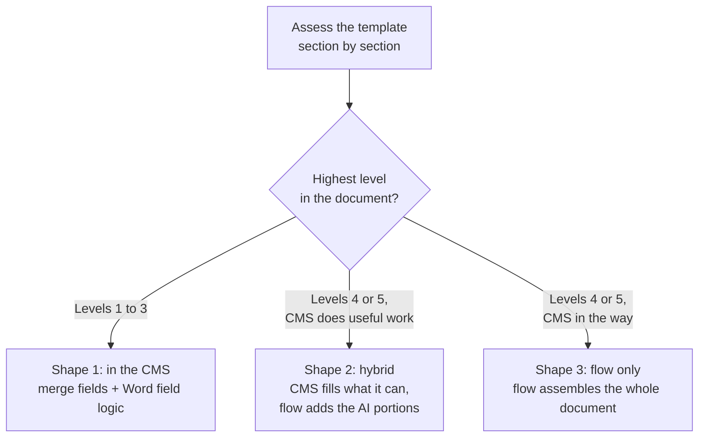
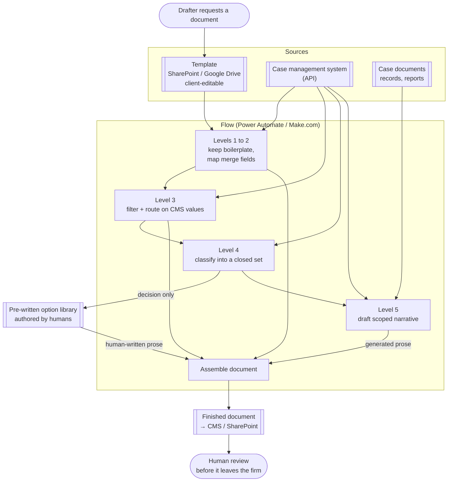

# Document generation

> A method for automating long legal documents by assessing **each section** for the least
> powerful technique that will fill it, then assembling the document from five levels of
> automation. Variability lives in sections, not in documents, so most of a statement of claim
> needs no AI at all and a few passages need it badly. Applied at around a dozen US
> plaintiff-side PI firms, four of them by me.

## At a glance

| | |
|---|---|
| **Client** | US plaintiff-side personal injury firms. Around a dozen across the practice, **four that I worked on directly**, several documents each |
| **Domain** | Legal document drafting: statements of claim, demand letters, and other long case documents <!-- OPEN: which document types did YOUR four clients actually automate? Demand letters and statements of claim are the two I know of. Retainers? Discovery responses? Medical chronologies? --> |
| **My role** | Co-developed the framework with the team, then applied it client-side across four engagements <!-- OPEN: for your four, were you sole builder or working with others? Who did the template work vs the flow work? --> |
| **Timeline** | <!-- OPEN: when was the framework settled, and over what period were the four clients delivered? --> |
| **Stack** | Power Automate, Make.com, SharePoint / Google Drive (template storage), Word field logic, case management system APIs, LLM classification and drafting nodes |
| **Status** | Shipped for multiple clients. Reused as the standing approach whenever a solution has to produce a document |

**This entry is a method, not a single build.** Document generation is not one solution. It is
the approach we reach for whenever some other solution has to emit a document, so pieces of it
sit inside several of the other case studies here. It earns its own entry because the reusable
part is the assessment, not any one implementation.

---

## 1. Context

Plaintiff-side PI firms run on long documents that are mostly the same every time. A statement
of claim, a demand letter, a retainer packet. Each one is many pages of language that has been
written a thousand times, wrapped around a few passages that are genuinely specific to the
case: what happened, what it did to the plaintiff's life, what the liability theory is.

Drafting them is expensive because the specific passages and the repeated ones arrive
interleaved. A drafter cannot skip to the interesting parts. They open a prior document, work
down it, and retype or re-check every line, including the lines that could never have been
different.

Most case management systems ship some form of document generation, and it stops at merge
fields. Very few support conditional logic. None of them write narrative.

## 2. Diagnosis: how I knew this was the problem to solve

The request that arrives is "can AI write our demand letters." Both obvious answers are wrong.

**Failure mode one: hand the whole document to a model.** Give Gemini or Claude a good prompt
and a case file and ask for the finished statement of claim. No prompt fixes what happens
next:

- **It costs more and performs worse** than the mechanical alternative on exactly the parts
  that were already solved. You are paying a model to retype form instructions.
- **It destroys formatting.** These are Word documents with numbered paragraphs, defined
  terms, court-mandated layout. A model rewriting the document rewrites the structure with it.
- **It puts a verification burden on every line.** If the model produced the whole page, a
  human has to read the whole page, including the boilerplate that has not changed in five
  years. The review cost eats the drafting saving.
- **It introduces hallucination risk into sections that had none.** Level 1 boilerplate cannot
  be wrong. Route it through a model and now it can.

**Failure mode two: merge fields only.** This is where CMS-native tooling lands, and it stalls
one step short of useful. Almost every document these firms need has at least a bit of
narrative in it. If the tool cannot produce that, the drafter still opens the document, still
reads it top to bottom, still writes the passage by hand, and the automation saved them
keystrokes rather than a task.

**The reframe.** Variability is a property of the section, not of the document. A statement of
claim is a stack of blocks whose variability ranges from zero to total, and the correct
technique is different for each block. Once you assess it that way, the design rule falls out:
**use the lowest level that will do the job.** Deterministic where
possible, AI where needed. Do not shoot a cannon at a mosquito, because every level you climb
buys you flexibility and charges you verification burden, maintenance, and, from Level 4 up,
hallucination risk.

**How the assessment gets done.** By reading the client's own past executed documents section
by section and asking what actually changed between them. That work is **manual today**, which
is the limitation I would fix first (see §8).

**Provenance, stated plainly.** The five-level framework came out of a group working session.
I co-developed it and someone else on the team wrote it up. What I own is the application: four
clients, several documents each, deciding section by section which level each piece belonged to
and building the result.

## 3. Problem

Firms want their long documents drafted automatically. The techniques available split into two
camps that both fail, one by being too weak to finish the document and one by being so strong
it re-introduces cost, formatting damage, review burden, and hallucination risk into parts of
the document that were never hard. Without a way to decide **per section**, every project
defaults to whichever camp the builder is more comfortable in.

<!-- OPEN: I have no before-state numbers for this entry, which is the main thing keeping it
from landing as hard as the FNOL one. Anything you measured or were told at any of the four
clients would help: hours to draft a demand letter or statement of claim by hand, how many of
them per week, how many templates you automated, turnaround time before and after. Even a
range from a client interview is usable if I attribute it as such. -->

## 4. Solution

Treat the document as building blocks (sections, paragraphs, lines) and assign every block to
one of five levels.

| Level | What it is | Example | Who decides the words | Verification burden | Hallucination risk |
|---|---|---|---|---|---|
| **1. Boilerplate** | Language that never changes case to case | Form instructions, standing legal recitals | Nobody. It is fixed | None | None |
| **2. Merge fields** | Placeholder replaced by a mapped CMS value | Client name, date of loss, court file number | The CMS field | Check the mapping once | None |
| **3. Conditional logic** | Pre-written language selected by a CMS value | `his`/`her` from the client's pronoun field, corporate vs individual defendant language | A rule you wrote | Test the branches | None |
| **4. AI conditional logic** | Pre-written language selected by a model, where no clean CMS field exists | Picking the right liability statement for an MVA from a fixed list of options | A model **chooses**. It does not write | Check the choice | Wrong choice, right prose |
| **5. AI narrative** | Genuinely case-specific prose that cannot be templatized | How the injury changed the plaintiff's life | A model **writes** | Read every word | Full |

**Level 4 is a classifier, not a writer.** When there is no dropdown to branch on, the model is
handed the case information and asked to pick from a closed set of options: slip and fall, MVA,
other. Its output is a routing decision. The prose that lands in the document was written by a
human in advance and
sits in the template. So the failure mode of Level 4 is "the document says something true
about the wrong accident type," which a reviewer catches by checking one field. Compare Level
5, where the failure mode is a fluent sentence asserting something that never happened.

**The option lists come from the CMS.** The closed sets that Level 4 chooses between are
generally the same values the case management system already knows about, which keeps the list
maintainable and keeps the vocabulary consistent with the rest of the firm's data.

<!-- OPEN: the walkthrough video on a sample Ontario Statement of Claim is the single best
artifact for this entry, since the levels are much easier to see than to describe. Before it
goes in a public README I need: (a) is that link public or does it require a Swans login,
(b) does the sample document contain a real party name, file number or anything identifiable,
(c) do you want it embedded here at all. Note the sample is Ontario but the four clients were
US, so the entry should say the walkthrough uses an Ontario document as an example. -->

## 5. Architecture

### Where the work runs

Three shapes, chosen by how high the document's highest section goes.



**Shape 1, inside the CMS.** The template lives somewhere the client can still edit it,
usually their SharePoint or Google Drive, and the CMS merges fields into it. Since most case
management systems have no conditional logic of their own, the conditionals are built as
**formula fields inside the Word document itself**: if this value equals that, print this
clause, otherwise print the other one. The logic lives in the generated document rather than
in the CMS. This is only viable when merge fields and conditionals are the whole job.

**Shape 2, hybrid.** Let the CMS do what it is good at, then export the partially filled
document into a flow (Power Automate, Make.com or similar), generate the AI portions there,
and write the finished document back to the CMS or SharePoint.

**Shape 3, flow only.** The flow owns the entire assembly.

### Runtime, taking shape 3 as the general case



Level 4 sends a decision into a library of human-written text, and the human-written text is
what reaches the document. Only Level 5 has a path from a model straight into the page.

### Two ways to wire Level 5

Where narrative is needed, the instructions can live in the flow or in the template.

| | **A. One node per section** | **B. Prompts inside the template** |
|---|---|---|
| How | A separate AI node for each narrative section, each with its own instruction and its own scoped inputs. Output is inserted into the template | The prompt sits in the template in brackets. The model reads the document and replaces each bracketed instruction with its result |
| Example | A "facts of loss" node fed the relevant records and the relevant CMS fields, told to return one paragraph, two sentences maximum | Paragraph 2 of the template reads `[insert facts of loss, one paragraph, max two sentences, from the case documents and CMS fields X and Y]` |
| Strengths | Tight control per section. Inputs scoped per section, so a model drafting the damages passage never sees material it should not use. Consistent output shape | Fast to set up. Non-engineers can change a prompt by editing the document. Handles documents whose structure shifts case to case, where a fixed set of nodes assumes paragraphs that may not exist |
| Weaknesses | One node per section, so long documents mean many nodes to build and maintain. Assumes the document always has the same sections | Less consistent. The model sees the whole document, so input scoping is weaker |

The choice comes down to document length and how much the document's own structure varies.
<!-- OPEN: I want to check I got this tradeoff the right way round. My reading: pattern B for
documents whose structure varies case to case, because pattern A's fixed node-per-section
assumes a document that is always laid out the same way. Correct me if it was the reverse. -->

### Key decisions and tradeoffs

| Decision | Why | What I gave up |
|---|---|---|
| **Use the lowest level that will do the job** | Every level up adds verification burden and maintenance, and Levels 4 and 5 add hallucination risk. Boilerplate routed through a model can be wrong. Boilerplate copied cannot | The system is a patchwork of five techniques rather than one elegant mechanism. More moving parts to explain and hand over |
| **Level 4 chooses, humans write** | Keeps the "which theory applies" judgment with the model and the words with a lawyer. Reduces a prose-generation risk to a classification risk, which a reviewer can check in one glance | Coverage is capped by the option library. A case that fits nothing on the list needs a human, or a new option |
| **Templates stored where the client can edit them** | The firm changes its own language constantly. A template locked inside an integration becomes a change request, and change requests do not get made | Template edits happen outside version control, so someone can break a merge field or a Word formula with no review |
| **Conditionals as Word field formulas when the CMS cannot branch** | Gets Level 3 documents fully generated without dragging a whole flow platform into the project | The logic hides inside a Word document, which is a genuinely awkward place to debug or hand over |
| **Scope the model's inputs rather than trying to make it truthful** | You cannot stop a model hallucinating. You can restrict it to the documents and fields it is allowed to draw from, which lowers the odds | Lower odds, not zero. Level 5 output still needs a human read before the document leaves the firm |
| **Do the AI work in a flow platform, outside the CMS** | Case management systems do not do this and are not going to. Keeping generation in a flow means the same pattern ports across clients on different systems | Another platform in the estate, and flow-based orchestration is harder to test than plain code |

### Constraints I built inside

- **The CMS is a given.** Different firms, different systems, most of them supporting merge
  fields and nothing more. The method has to degrade gracefully onto whatever is there, which
  is why there are three deployment shapes rather than one.
- **The output is a Word document that has to keep its formatting.** Court-mandated layout and
  numbered paragraphs survive a template-and-insert approach. They do not survive a model
  rewriting the page.
- **The end users are legal staff.** They edit templates, not integrations.
- **Clients are non-technical and follow our lead on level assignments.** That is convenient
  and it is a responsibility, since nobody on the client side is going to catch it if a
  section gets assigned to Level 5 when Level 3 would have done.

### Illustrative excerpt: one page, five levels

*Synthetic template fragment, not client material. Annotated to show which technique fills
which block.*

```jsonc
// A statement of claim template, level-tagged. The point is the mix on a single page.

"1.  The Plaintiff claims:"                                    // L1  fixed recital
"    (a) general damages in the sum of {{claim.general}};"      // L2  merge field
"    (b) special damages in the sum of {{claim.special}};"      // L2  merge field

"2.  The Plaintiff, {{client.full_name}}, resides in"           // L2
"    {{client.city}}. At all material times {{client.pronoun_subject}}"
"    was employed as {{client.occupation}}."                    // L3  pronoun from CMS field

"3.  {{#if defendant.type == 'corporation'}}"                   // L3  conditional block
"      The Defendant is a corporation registered under the laws"
"      of {{defendant.jurisdiction}}."
"    {{else}}"
"      The Defendant is an individual residing in"
"      {{defendant.city}}."
"    {{/if}}"

"4.  {{liability_statement}}"                                   // L4  classifier picks one of
                                                                //     N human-written options

"5.  {{narrative.facts_of_loss}}"                               // L5  generated, scoped inputs
"6.  {{narrative.life_impact}}"                                 // L5  generated, scoped inputs
```

Blocks 1 to 3 cannot be wrong in a way a model could cause. Block 4 can pick the wrong option
and still read correctly. Blocks 5 and 6 are the only two places on the page where a sentence
can be fluent and false, which is also where the reviewer's attention should go.

### Illustrative excerpt: the Level 4 contract

*Redacted and simplified. The decision worth showing is that the model returns an option key
and nothing else.*

```jsonc
// IN: case facts only. No prose is requested and none is accepted.
{
  "case_summary": "<redacted case facts>",
  "options": [
    { "key": "mva_rear_end",     "label": "Motor vehicle, rear-end impact" },
    { "key": "mva_intersection", "label": "Motor vehicle, intersection" },
    { "key": "slip_and_fall",    "label": "Slip and fall, premises" }
  ]
}

// OUT: a decision, a confidence, and a reason for the human. Never a paragraph.
{
  "key": "mva_rear_end",
  "confidence": "high",
  "basis": "Police report describes impact to rear bumper while plaintiff stationary."
}
```

```js
// The prose comes from the library, keyed by the model's choice. If the model returns
// something outside the closed set, or is unsure, the block goes to a human instead of
// letting the model improvise a paragraph.
const chosen = LIABILITY_OPTIONS[result.key];

if (!chosen || result.confidence === 'low') {
  flagForDrafter(block, result);          // no text is inserted
} else {
  insert(block, chosen.text);             // human-written, unchanged
}
```

A closed list with no escape hatch quietly becomes an open list the moment a case does not fit,
because whoever is under deadline will pick the nearest option. Routing low confidence and
unrecognized keys to a person keeps the list honest, and the flagged cases are the queue you
read to decide what the next option should be.

## 6. My involvement

**The framework.** Co-developed in a group working session with the team. Someone else wrote
up the version that gets shown to clients. I am not claiming sole authorship of the five
levels.

**The application.** Four client engagements, all US plaintiff-side PI firms, several documents
each. Assessing their existing templates section by section, deciding which level each block
belonged to, picking the deployment shape their CMS allowed, and building it.

<!-- OPEN: this is the section interviewers read closest and I only have the outline above.
  - For the four clients: sole builder, or splitting work with others? Which parts were yours
    (template authoring, CMS mapping, flow build, prompt design, option libraries)?
  - Did you run the template assessments yourself, sitting with their past documents?
  - Who trained the drafters, and how did adoption go? Did anyone resist having their
    drafting automated?
  - Handed off to the client, or still maintained by you?
  - Anything that was clearly someone else's work, say so and I will attribute it. -->

## 7. Impact

Nothing here was measured in a form I can quote, so this section says what changed structurally
rather than putting a number on it.

| | Before | After |
|---|---|---|
| Who fills a boilerplate section | A person, re-reading it every time | Nobody. It is fixed in the template |
| Who fills a data section | A person, copying from the CMS | Mapped merge field |
| Who selects standard language | A person, deciding case by case | A rule, or a classifier picking from human-written options |
| Who writes case-specific narrative | A person, from scratch | A model, from scoped inputs, reviewed by a person |
| Where review attention goes | The whole document | The Level 4 choices and the Level 5 passages |

Generating the whole document with a model loses that last row. Assessing per section is what
lets you tell a reviewer which parts of the page could not have come out wrong, so their
attention goes to the parts that could.

<!-- OPEN: anything measured at any of the four clients turns this section from structural to
real. Drafting hours per document, documents per week, number of templates automated,
turnaround before and after, or even "the drafter said it went from half a day to an hour."
Attributed anecdote beats no number. If nothing was measured, this section stays as it is,
which is honest but weaker. -->

## 8. What I'd do differently

- **The assessment is manual and undocumented.** Deciding a document's levels means reading
  past executed versions and judging what varied. It works, it depends on the person doing it,
  and it does not scale past whoever has done it before. Diffing a corpus of past documents to
  surface which blocks actually changed would turn a judgment call into evidence, and would
  make the level assignment reviewable rather than trusted.
- **Two Level 5 patterns, no rule for choosing between them.** Node-per-section and
  prompts-in-template both got used. The choice came down to feel about document length and
  variability. A stated rule would have made handover easier and stopped the two patterns
  appearing in the same client's estate for no articulable reason.
- **Nothing tests the narrative sections.** Levels 2 and 3 are testable and were tested. Level
  5 was checked by reading the output and deciding it looked right. A small set of fixed test
  cases with expected properties (length, no facts absent from the inputs, correct tense) would
  have caught prompt regressions that currently surface as a drafter noticing something odd.
- **Client-editable templates have no safety net.** Storing templates where the firm can edit
  them was the right call for adoption and it means a well-meaning edit can break a merge field
  or a Word formula silently. A validation pass over the template before generation, checking
  that every placeholder still resolves, is a small piece of work I did not do.
- <!-- OPEN: yours. What actually went wrong on one of the four? A document that came out
  wrong, a level call you regret, a client who wanted more AI than the document justified,
  a platform that fought you? One concrete failure here is worth more than the four
  reflections above. -->

---

<details>
<summary>Evidence</summary>

<!-- Candidates:
     - The Ontario Statement of Claim walkthrough video, if the link is public and the sample
       document is clean (see OPEN in §4). Best single artifact by far.
     - A level-tagged page of a sample template as an image, color-coded by level. Could be
       built from synthetic content, so no redaction risk at all.
     - A flow screenshot showing the Level 4 classify-then-route node, with client identifiers
       removed.
     - Before/after of one generated document, fully synthetic.
     Check every image for: firm name, party names, file or claim numbers, dollar figures tied
     to a real matter, dates of loss, PHI, and CMS vendor branding in screenshots. -->

Not yet added. A color-coded sample template page is the cheapest strong artifact here, since
it can be built entirely from synthetic content.

</details>
