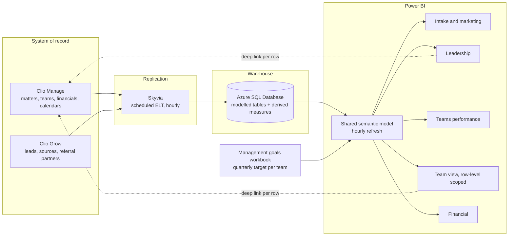

# Firm operating dashboards

> A reporting layer over a plaintiff-side personal injury firm's case management system,
> replicating case and intake data into a warehouse every hour so leadership, each case team
> and finance run the business off shared live numbers instead of manual exports.

## At a glance

| | |
|---|---|
| **Client** | <!-- OPEN: size, region, headcount. Confirmed only as a plaintiff-side PI firm running Clio Manage and Clio Grow --> Plaintiff-side personal injury firm, US |
| **Domain** | Legal operations and firm-wide business intelligence |
| **My role** | <!-- OPEN: sole build? who else was on it? --> |
| **Timeline** | <!-- OPEN --> |
| **Stack** | Clio Manage, Clio Grow, Skyvia, Azure SQL Database, Power BI, Excel (goal input) |
| **Status** | In production |

---

## 1. Context

The firm runs its entire practice in Clio Manage, with Clio Grow in front of it for intake.
Every fact a partner might want lives in there already: which marketing source a lead arrived
from, which referral partner sent it, why a lead was declined, who worked it, what stage a
matter is at, what it settled for, when the statute of limitations expires.

The firm is organised into case teams, each carrying its own caseload and each paid a
quarterly bonus tied to the net fees it brings in. Leadership sets those targets. Above the
teams sit the questions leadership has to answer to grow: where good cases come from, which
teams are underloaded, which matters have gone quiet, and what is actually going to be
collected this quarter.

## 2. Diagnosis: how I knew this was the problem to solve

The ask was a dashboard. The useful finding was that the firm was not missing data, it was
missing every path from the data to a decision.

<!-- OPEN: this section is reconstructed from Lara's verbal account and needs her detail on
how the diagnosis actually ran. Was there a formal audit, interviews, a workshop where
leadership listed the questions? Which questions came from partners vs. from the teams? -->

**Taking the questions seriously one at a time.** Rather than designing charts, I worked
through the questions people were already asking and traced where each one died inside Clio.
The pattern held across all of them. The field existed; the report that joined it to anything
else did not.

- *Which referral partners are worth keeping warm?* Clio can list matters by referring party.
  It cannot rank partners by how many of those referrals the firm actually signed. A partner
  sending twenty cases the firm declines looks identical to one sending twenty it takes.
- *Are we losing intakes for reasons we control?* The declination reason was captured on every
  lead. Splitting "declined because it is not our case type" from "declined because we lost
  contact" needed a manual export and a pivot table.
- *Which trials and statutes of limitations are coming up firm-wide?* Clio's calendar mixes
  every event type together and defaults to the current user's own items. Seeing the firm's
  SOL exposure meant clearing filters and reading around everything else on the calendar.
- *How close is my team to its bonus?* No one could see it until the quarter closed and
  someone worked it out by hand.

**What the evidence said.** The referral question was the one that reframed the project. The
firm had partner relationships it maintained on instinct, with no way to see that some
partners send volume the firm never signs. That is a relationship being funded for nothing,
and the reverse case is worse: a partner quietly sending the firm its best work with nobody
noticing. Ranking partners by *hired* cases rather than by referral count turned out to be a
line the client could act on the same week.

**What I ruled out.**

- *Clio's native reporting.* It answers single-object questions. Almost every KPI the firm
  wanted was a join across leads, matters, teams, financials and dates.
- *Reporting straight off the Clio API.* Every dashboard refresh would have become a
  pagination and rate-limit problem against the live system of record, and the firm has no
  engineer to keep that running.
- *Real-time.* Worth naming because it is the reflex answer. These are performance and
  pipeline metrics. No decision here changes inside an hour, and buying streaming would have
  spent the budget on latency nobody needed.

## 3. Problem

The firm's operating data was complete and unreadable. Clio Manage holds it but cannot report
across it, so every question that spanned two objects became a manual export, and questions
that had to be asked weekly simply stopped being asked. Leadership managed a multi-team
practice on recollection and spreadsheets. Teams could not see their own progress toward the
bonus they were working for. Marketing spend and referral relationships were maintained
without any measure of which ones produced signed cases.

<!-- OPEN: the cost of leaving it alone is the missing quantification here. Any of these
would land: hours per month spent building manual reports, how often leadership asked for a
number and waited days, marketing spend on sources that never converted. -->

## 4. Solution

A warehouse-backed Power BI reporting layer, refreshed hourly end to end.

Skyvia replicates Clio Manage and Clio Grow into an Azure SQL database on a schedule. The
warehouse is where the modelling happens: matters joined to teams, leads joined to sources and
referral partners, financials joined to matters, plus the derived measures Clio has no concept
of, like the firm's median days-to-close split between litigation and pre-litigation. Power BI
sits on top and refreshes on its own hourly schedule. Quarterly team goals are read from a
spreadsheet that management owns, so targets can be changed per team without touching the
build.

Five reports came out of it, sharing one semantic model so leadership and the teams cannot end
up quoting different numbers.

**Intake and marketing.** Conversion rate over total leads, split into hired, in-intake and
did-not-hire, with the declination reason broken out (declined on criteria, lost contact,
retained other counsel, pending evaluation, co-counsel pending). Lead sources and referral
partners are both ranked by total leads *and* by conversion rate and case value, which is the
view that separates a partner worth courtside seats from one worth a polite email. Intake
staff appear on the same hired / intake / did-not-hire split, so a person carrying an unusual
share of losses shows up as a coaching conversation rather than a hunch. Matter types carry
their own conversion rate and median value, which is how the firm sees that a case type it
takes rarely converts well.

**Leadership.** Open matters split litigation and pre-litigation, median days to close for
each, open caseload and estimated case value by team, and each team's top matter types and top
referral partners. Two aging tables list active cases open more than 50% longer than the
company median for their stage, so a pre-litigation matter that has sat for three years
surfaces without anyone going looking. A rules-driven alert panel flags conditions like a team
dropping under its caseload floor. Firm-wide SOL and trial calendars replace the filtered
personal calendar. Every row deep-links back into Clio, so the dashboard is where you notice
the problem and one click from where you fix it.

**Teams performance.** Each team against its net fee goal and closed case goal, quarter by
quarter, as a met / missed / in-progress grid. Progress to the current quarter's goal, with
the amount over goal shown separately. Average open caseload per team per month against
capacity bands, and cases closed by team with net and average settlement.

**Team view.** The same content scoped to one team, so a team sees its own goal gauge and
percentage to bonus, its own aging cases, its own SOL and trial dates, and its own referral
partners and matter types. This is the report the teams opened themselves, which is the part
that made the project stick.

**Financial.** Cash received per month from case distributions, revenue accrued on open cases
not yet paid, and total outstanding accrued balance, each toggleable between gross and net.

## 5. Architecture



**Key decisions and tradeoffs**

| Decision | Why | What I gave up |
|---|---|---|
| Off-the-shelf replication into a warehouse rather than code against the Clio API | The firm has no engineer to maintain a custom pipeline. A scheduled connector is something their own IT can reason about | Control of the extract. A vendor-side schema change arrives as a broken column instead of something I can intercept |
| Azure SQL in the middle instead of pointing Power BI at the source | Gives somewhere to model peer-group medians, the lit / pre-lit split and the goal join, and keeps analytical queries off the system of record | A component to pay for, secure and back up. Data is as fresh as the last sync |
| Hourly refresh | These metrics drive weekly and quarterly decisions. An hour of lag costs nothing, and against a firm with no reporting at all it reads as live | Rules the platform out for same-minute operational alerting if they ever want that |
| Team goals read from a spreadsheet management maintains | Targets differ per team and change per quarter. Hard-coding them would route every change back through me | A spreadsheet is a fragile input. A typo silently moves a bonus target, so the load needs validating |
| One semantic model behind all five reports, scoped per audience | Leadership and a team quoting different values for "net fees" would end the project's credibility on day one | Row-level security became the thing that had to be exactly right, since teams see revenue data |

**Constraints I built inside.** No in-house engineering, so every moving part had to be
schedulable and inspectable by a non-technical administrator. Clio stays the system of record
and nothing writes back to it. The readers are attorneys and case managers rather than
analysts, so each report had to answer its question on the first screen with no drill-down
required. And quarterly bonus money is calculated off these figures, which sets the bar for
correctness well above the usual dashboard.

### Illustrative excerpt

The aging-case rule, which drives the leadership tables and each team's "needs attention"
list. The point of it is the peer group: a litigation matter open 400 days is unremarkable and
a pre-litigation matter open 400 days is a problem, so the median has to be computed within
stage rather than across the firm. Redacted, with generic table names.

```dax
-- Median days-to-close for the case's own stage, from closed matters only.
-- ALLEXCEPT keeps the litigation / pre-litigation split and drops every other filter,
-- so the benchmark stays firm-wide even when the page is filtered to one team.
Peer Median Days To Close =
CALCULATE(
    MEDIAN( fct_matter[days_to_close] ),
    ALLEXCEPT( fct_matter, fct_matter[stage] ),
    fct_matter[status] = "Closed"
)

-- An open matter is flagged once it exceeds its peer median by the configured multiple.
-- The multiple lives in a config table rather than the measure, so leadership can retune
-- the threshold without a republish.
Aging Case Flag =
VAR Multiple  = SELECTEDVALUE( cfg_threshold[aging_multiple], 1.5 )
VAR Benchmark = [Peer Median Days To Close] * Multiple
RETURN
    IF(
        fct_matter[status] = "Open" && fct_matter[days_open] > Benchmark,
        1,
        0
    )
```

## 6. My involvement

<!-- OPEN: needs Lara's account. What was owned end to end vs. shared? Who chose Skyvia and
Azure? Who ran the KPI definition sessions with the partners? Who trained the teams on their
own dashboard, and how was it handed over? The unglamorous parts belong here. -->

## 7. Impact

No before-and-after metrics were captured on this engagement, so the honest version is
qualitative.

| Metric | Before | After |
|---|---|---|
| Firm-wide reporting across leads, matters, teams and financials | Manual export and pivot per question | Five live reports, refreshed hourly |
| Referral partners ranked by signed cases | Not available | Standing view, by conversion rate and case value |
| Team visibility of progress toward quarterly bonus | Calculated by hand after the quarter closed | Self-serve, current within the hour |
| Firm-wide SOL and trial exposure | Buried in a filtered per-user calendar | Dedicated calendars, filterable by team |
| Aging cases | Found when someone remembered to look | Flagged automatically against the stage median |

The outcome the client talked about was the referral ranking. Being able to see which partners
send cases the firm actually signs changed how the relationships were worked, immediately and
without needing a project to act on it.

<!-- OPEN: is there anything measured at all? Adoption (how many people open these weekly),
whether the intake declination split changed marketing spend, whether aging-case counts fell
after the flag went live? Even one measured number would carry this section. -->

## 8. What I'd do differently

<!-- OPEN: needs Lara's own reflections. Candidates from the build, to confirm or replace:
the goals spreadsheet as an unvalidated input, whether five reports was one too many, whether
the alert thresholds should have been configurable from the start. -->

---

<details>
<summary>Evidence</summary>

<!-- OPEN: screenshots are held back pending a clean anonymization pass. The exports reviewed
in session still carried client emails and phone numbers in the intake detail table, legible
client names in the case detail tables, a staff name in a slicer, and referral partner and
lead source lists that read as real firms rather than substitutes. Team labels also differed
between exports, suggesting two separate scrub passes. Re-export with substituted values at
source, or crop to the aggregate visuals only. The financial report is aggregate throughout
and is safe as-is. -->

</details>
