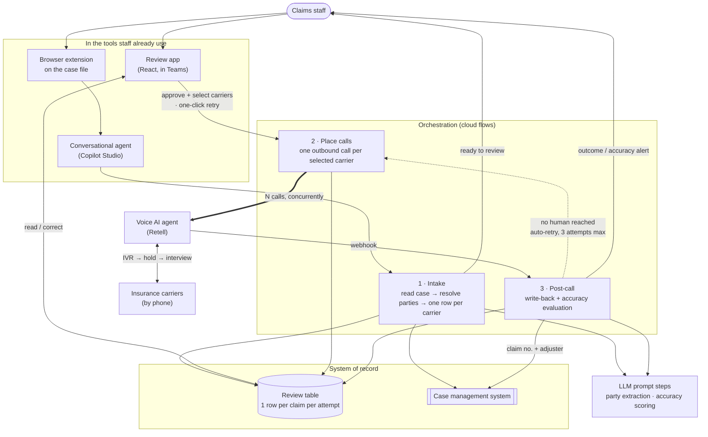

# FNOL Voice Agent

> A voice AI agent that phones insurance carriers to open first-notice-of-loss claims for a
> 400-person personal injury firm. It navigates the IVR, sits on hold, answers the carrier's
> interview, and writes the claim number back into the case file. Software can hold five
> phone lines at once and a person can't, so a case that took **2.5 hours of sequential
> calling now takes one ~30-minute step.**

## At a glance

| | |
|---|---|
| **Client** | Plaintiff-side personal injury firm, ~400 staff, ~$50M annual revenue (US) |
| **Domain** | Claims operations, a ~30-person department, opening FNOL claims with carriers |
| **My role** | Co-diagnosed the problem and co-decided the approach. Built the voice agent and the system around it |
| **Timeline** | 6 weeks from the first client conversation to rollout, alongside nine other solutions from the same audit |
| **Stack** | Retell AI (voice), Microsoft Copilot Studio, Power Automate, Dataverse, AI Builder, React/TypeScript Code App, Teams, Chromium extension |
| **Status** | Completed and rolled out |

---

## 1. Context

The firm runs plaintiff-side personal injury cases across a ~400-person operation, of which
the claims department is about **30 people**. When a new case arrives, that department has to
open a claim with **every insurance carrier attached to the accident**: the client's own
insurer (first-party) and each defendant's insurer (third-party). None of the substantive
work on the file can begin until those claim numbers exist.

Most carriers still only accept a new claim **over the phone**.

## 2. Diagnosis: how I knew this was the problem to solve

This project came out of an audit, not a feature request. Nobody asked for a voice agent.

**Stage one. The firm's own data pointed at a department.** Management had measured time on
desk per department. Their read was that claims wasn't the *slowest* department, it was the
one **consuming the most man-hours**. The volume of work per file was the problem, not the
latency.

That points at a department rather than a workflow, so there was nothing to build yet.

**Stage two. Interviews down the whole ladder.** We audited the claims department by talking
to it end to end: department management, case builders, and the people doing the day-to-day
work. Management describes the process as designed. The people doing it describe what
actually happens. The gap between those two accounts is where the finding was.

The heaviest workflow turned out to be the most mundane one, *opening the claim*. Each call
ran **30–40 minutes**, and almost none of that time went on skilled work. It went on:

- navigating the carrier's IVR menu tree,
- waiting on hold,
- then answering a long, repetitive interview about the accident: facts of loss, vehicles,
  drivability, airbags, seatbelts, policy details.

Every answer already existed in the case management system. A person was reading a screen
down a phone line for half an hour.

**Why it added up to real money.** The arithmetic is what made this fundable:

| | |
|---|---|
| New cases per week (department) | ~100–125 |
| Claims to open per case (avg) | ~2.5 (client's carrier, defendant's carrier, usually at least one more) |
| Carrier calls per week | **~250–310** |
| Duration each | 30–40 min |
| **Weekly staff time** | **~125–200 hours** |

The department has about 30 people, so its total weekly capacity is roughly 1,200 hours.
Claim-opening calls were consuming 125–200 of them. That is **between a tenth and a sixth of
the entire department's capacity**, or the equivalent of three to five people doing nothing
but navigating IVR menus, waiting on hold, and reading a screen down a phone line.

It is also why the audit landed here rather than on a more interesting workflow. This wasn't
the department's hardest problem. It was its largest, and it was made entirely of work nobody
needed a person for.

**The reframe.** The obvious framing is that the calls take too long, so make them shorter.
That caps out fast, because you can't compress a carrier's interview much below its question
list. The actual constraint is that a human can only be on one call at a time. A case with
five carriers means five sequential calls, roughly 2.5 hours of wall clock, and not because
any one call is slow. They simply can't overlap. The bottleneck was **serialization**. That
makes the target concurrent calls, and the only way to get concurrency is to take the human
off the line.

This FNOL agent was **one of roughly ten solutions** the audit produced for this client. It
was prioritized early because the cost was large, measurable, and concentrated in a single
repetitive workflow, which is what you want from a first target while a program still has to
prove itself.

## 3. Problem

Opening claims consumed **125–200 staff-hours a week**, a tenth to a sixth of the claims
department's entire capacity, in unskilled telephone time. Because calls could only run one
at a time, each new case sat for hours before substantive work could start. The cost scaled
linearly with caseload, so growth made it worse. The work was too repetitive to justify
skilled staff and too consequential to do carelessly: these are recorded calls with an
opposing insurer, on the record, at the start of a legal matter.

## 4. Solution

A voice AI agent places the carrier calls, and a human approves what it's going to say before
it dials.

From the case file open in front of them, a staff member clicks a browser extension and picks
**FNOL**. Everything after that is automated up to a single review step:

1. **Intake.** The system reads the case, works out every party on the accident and every
   carrier attached to them, and builds **one reviewable row per carrier**. Multi-defendant
   and multi-policy cases fan out correctly, so two defendants with two policies each is four
   claims to open.
2. **Human review.** The reviewer gets a card in Teams, opens the claim, checks the
   pre-filled details, fixes anything wrong, and **selects which carriers to call.** Nothing
   dials until they hit submit. If a carrier is missing, they add it in the case management
   system first, because the app deliberately won't let them create one.
3. **Parallel calling.** Every selected carrier is called **simultaneously**. The voice agent
   works through the IVR, holds, reaches a human, and answers the carrier's interview from
   the approved case data, while staying inside limits on what it will *not* disclose.
4. **Automatic retry when no human is reached.** Carrier lines fail in ordinary ways. The IVR
   changes, the menu path dead-ends, nobody picks up. When a call ends without reaching a
   person, the system calls that carrier again, up to **three attempts** in total, before it
   tells the staff member no human was reached and to try later.
5. **One-click retry.** If all three attempts fail, the staff member retries from the app
   itself. No going back to the case file, no re-opening the extension, no re-reviewing data
   they already approved. One button re-launches the same approved call, or set of calls.
6. **Write-back.** Each call returns the **claim number, whether the claim was opened, the
   assigned adjuster and their contact details**, plus a transcript, recording and summary.
   These go back into the case management system and the case file.
7. **Accuracy check.** A second AI pass compares **what the agent actually said on the call**
   against **what the reviewer approved**, field by field, and flags mismatches. Nobody has
   to read a transcript to find out whether the agent got it right. If they hear nothing, it
   did.

The staff member's involvement drops from ~2.5 hours of talking to a few minutes of
reviewing.

## 5. Architecture



### Key decisions and tradeoffs

| Decision | Why | What I gave up |
|---|---|---|
| **Human review sits between automated intake and automated calling** | The review costs minutes. The call costs 30–40 minutes and is *irreversible and outward-facing*, because you cannot un-say something to an opposing carrier on a recorded line. Gate the expensive, unrecoverable step rather than the cheap one. | Not fully autonomous. A person is still in the loop on every case. |
| **One row per carrier per attempt**, rather than one record per case | Makes fan-out (multi-defendant, multi-policy) and retry fall out of the data model instead of needing special-casing. Each attempt keeps its own transcript, outcome and accuracy score, so a retry never overwrites the history of the call before it. | More rows. Three attempts on one carrier is three rows, so the app has to group attempts under their carrier rather than list them flat. |
| **One adaptable agent for every carrier**, rather than a scripted agent per carrier | We could have hardcoded the biggest carriers, as in press 2, then 4, then read these answers in this order. That is cheaper per call and more predictable. It also only ever covers the carriers we built it for, it breaks the day a carrier reorders its IVR or changes its question list, and it has nowhere to go when a call leaves the script. One agent that can navigate an unfamiliar menu and answer an unfamiliar interview covers every carrier the firm might call, including the ones nobody thought to configure, and it survives the carrier changing its process. | Somewhat higher cost per call, and a lot more iteration to get the call design right. The scripted version would have been faster to make work for the top few carriers. |
| **No direct carrier API integrations on this build** | Where a carrier will accept a claim submitted straight into their system, that is faster, cheaper and less error-prone than phoning them, and we have built those integrations on other work. Each one needs a conversation with the carrier and then build time. This project had six weeks from first conversation to rollout, shared with nine other solutions, and that time did not exist. One route that works for every carrier beat a better route that would have covered a handful. | The highest-volume carriers get dialed when they could have been sent a request. This is the first thing I would revisit (§8). |
| **Post-call accuracy evaluation on top of prevention** | Prevention does most of the work. The agent answers from reviewer-approved data and is constrained on what it may say, which holds misstatement under 3% of calls. It cannot reach zero, because some hallucination is inherent to the model. The evaluation catches the rest, and it is also what makes the system worth using. Without it, staff would read every transcript to be sure the agent got it right, which costs roughly what the call did. Because the system reports its own errors loudly, silence is informative, and a reviewer can trust that no alert means the call was accurate. | A second LLM pass per call, and the last few percent are remediated after the fact rather than prevented. |
| **Two tiers of severity on that check** (essential and minor) | Some answers have to be right for the claim to be right, like the date of loss, the client's name, or how many passengers were in the car. Others are questions the carrier asks that carry no urgency if they come out wrong, like whether the airbags deployed or what the weather was. Every mismatch of either kind is reported and visible in the post-call accuracy view. Only an essential-field mismatch raises an urgent alert and pins the claim open, which is what keeps that alert worth reacting to. | Which fields count as essential is a judgement call, and the list has to be maintained as scored fields are added. |
| **Carriers can only be added in the case management system, never in the app** | If a carrier is missing, the reviewer has to go add it upstream before the call can go out. The tempting alternative is to let them type it into the review app, which is faster in the moment and quietly starts a second source of truth. Data entered only where it was needed stops being available to everything else the firm runs off that system. Sending the reviewer upstream keeps one place where a carrier exists. | A slower path when a carrier really is missing, and an obvious feature request I chose not to build. |
| **Automatic retry, then a one-click retry** | Not reaching a human is the common failure and it is usually transient, so three automatic attempts absorb most of it without anyone noticing. When it does need a person, the expensive part (reading the case, checking the pre-filled data, approving it) is already done and should not be repeated. | The system will occupy a line for three attempts before admitting defeat, so a genuinely unreachable carrier takes longer to surface than a single call would. |
| **Built entirely inside the firm's existing Microsoft estate** | The firm was already on Teams, Entra and Power Platform. A standalone app would have meant new logins, a new access model, and IT owning something unfamiliar. Access is granted by existing group membership. | Platform ceilings. Per-service capacity and throttling limits, and the shape of the solution is bounded by what the platform exposes. |
| **Triggered from a browser extension on the case file** | Staff live in the case management system all day. Making them navigate elsewhere and paste a case ID is where adoption dies. One click, in place. | An extension to distribute and maintain per-user. |
| **No credentials in the client app** | All carrier calling, case-system access and messaging happen server-side in the flows. The browser app holds no secrets. | Slightly more indirection, since the UI can't call third parties directly. |

### Constraints I built inside

- **Non-technical end users.** Claims staff, not analysts. The whole surface is one click in
  the browser and one card in Teams.
- **Recorded, adversarial calls.** The counterparty is the opposing insurer, and the call
  becomes part of the record on a legal matter. That drove both the pre-call human gate and
  the post-call verification.
- **The agent had to withhold as well as answer.** A plaintiff firm should not volunteer
  everything to a defendant's carrier, so scope of disclosure was a design requirement.

### Illustrative excerpt: the accuracy evaluator's contract

*Redacted and simplified. The decision worth showing is scoring per field and deriving
severity in code, rather than letting the model grade its own homework.*

```jsonc
// Post-call: the transcript is compared against the values the reviewer approved.
// The model returns per-field verdicts only. It does not decide how bad the miss is.
{
  "fields": [
    { "key": "date_of_loss",  "approved": "2026-03-14", "heard": "2026-03-14", "status": "correct" },
    { "key": "policy_number", "approved": "<redacted>",  "heard": "<redacted>", "status": "correct" },
    { "key": "airbags",       "approved": "Did not deploy", "heard": null,      "status": "not_disclosed" },
    { "key": "client_name",   "approved": "<redacted>",  "heard": "<redacted>", "status": "incorrect" }
  ]
}
```

```js
// Severity is computed deterministically, outside the model.
// A model that both makes the error and rates its seriousness is not a control.
const ESSENTIAL = ['date_of_loss', 'client_name', 'policy_number', 'vehicle', /* … */];

const scored    = fields.filter(f => f.status !== 'not_provided_by_user');
const incorrect = scored.filter(f => f.status === 'incorrect');

const severity =
  incorrect.length === 0                                   ? 'perfect'   : // green
  incorrect.some(f => ESSENTIAL.includes(f.key))           ? 'essential' : // red  → alert + pin open
                                                             'minor';     // yellow → visible, no alert

const score = Math.round(
  (scored.filter(f => f.status === 'correct').length / scored.length) * 100
);
```

Three deliberate choices there. Fields the reviewer never supplied are excluded from the
denominator, so the score isn't punished for absent data. `not_disclosed` (the agent didn't
say it) is tracked separately from `incorrect` (the agent said it wrong), because they are
different failures. And only `essential` interrupts a human. A
`minor` mismatch is still reported and still visible in the post-call accuracy view, it just
doesn't raise an alarm, which keeps the alarm worth reacting to.

## 6. My involvement

I co-ran the diagnosis and co-decided what to build. That is the part of the work that
decided whether this project should exist at all, and it came out of the department audit
described in §2 rather than from a client request.

I then built the voice agent and the system around it:

- **The voice agent in Retell AI.** The call design, the prompting, how it handles a carrier's
  interview, and the limits on what it will not disclose to an opposing insurer.
- **The Power App.** The review surface where staff check the pre-filled claim, correct it,
  choose which carriers to call, and retry.
- **The Power Automate flows.** Intake and party resolution, placing the concurrent calls,
  the retry logic, write-back into the case management system, and the post-call accuracy
  evaluation.
- **The Copilot Studio agent.** The conversational entry point staff talk to.

Six weeks from the first client conversation to rollout, running alongside the nine other
solutions the same audit produced.

## 7. Impact

**The before state, measured in the audit:**

| Metric | Before |
|---|---|
| Carrier calls per week | ~250–310 |
| Duration per call | 30–40 min (IVR + hold + interview) |
| Weekly staff time on claim opening | **~125–200 hours**, or 10–17% of the 30-person department's capacity |
| A five-carrier case | ~2.5 hours of sequential calling |
| Staff time per case (avg 2.5 carriers) | ~90 minutes |

**What the design changes, mechanically.** Calls stop being sequential. A five-carrier case
goes from ~2.5 hours of one-at-a-time calling to a single review step plus five concurrent
calls. The wall clock becomes the length of the *longest* call rather than the *sum* of them,
and the staff member isn't on any of them. Per-case human involvement drops from ~90 minutes
of talking to a few minutes of reviewing.

<!-- OPEN: this section deliberately stops at "mechanically" because I only have the
before-state numbers. To make it land I need whatever was actually measured after
deployment:
  - claims opened through the agent (count, over what period)
  - measured hours saved / change in time on desk, if tracked
  - how often the agent successfully opened the claim (success rate)
  - how often the accuracy check caught a real error, even "we found N in M calls"
  - adoption: how many staff use it, is it the default path now
If none of it was measured, say so and I'll write it as an honest qualitative outcome. An
unverifiable percentage in a public portfolio is worse than no percentage. -->

## 8. What I'd do differently

- **Re-evaluate the voice platform.** Retell was a good choice at the time. Voice AI is moving
  fast enough that the right answer has a short shelf life, so I would benchmark the
  alternatives again rather than assume the original pick still wins.
- **Go to the largest carriers directly and try to skip the call.** A handful of carriers
  account for most of the volume. For those I would open a conversation about an API
  integration that submits the claim straight into their system, which is faster, cheaper and
  less error-prone than dialing, and would leave the voice agent to cover the long tail. We
  have built that kind of integration successfully on other work. Here it lost to the six-week
  timeline, which was the right call at the time and is the first thing worth doing next.

---

<details>
<summary>Evidence</summary>

<!-- Candidates, all needing a redaction pass before they go in:
     - Review app screenshot with the carrier list (client/party names blurred)
     - Accuracy check: field-by-field comparison view, green/yellow/red
     - A Teams outcome card
     - A sanitized call transcript excerpt (best single artifact, since it shows the agent
       handling a real carrier interview; needs heavy redaction: no party names, no policy
       or claim numbers, no carrier name)
     Check every image for: firm name, party names, claim/policy numbers, dollar figures,
     dates of loss, adjuster names, PHI. -->

Not yet added.

</details>
