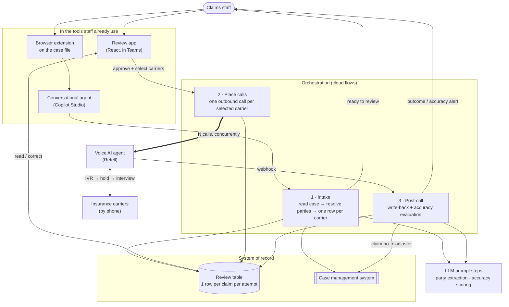

# FNOL Voice Agent — opening insurance claims in parallel

> A voice AI agent that phones insurance carriers to open first-notice-of-loss claims for a
> 100-person personal injury firm — navigating the IVR, sitting on hold, answering the
> carrier's interview, and writing the claim number back into the case file. Because
> software can hold five phone lines at once and a person can't, a case that took **2.5
> hours of sequential calling now takes one ~30-minute step.**

## At a glance

| | |
|---|---|
| **Client** | Plaintiff-side personal injury firm, ~100 staff, ~$50M annual revenue (US) |
| **Domain** | Claims operations — opening FNOL claims with insurance carriers |
| **My role** | <!-- OPEN: solo vs team; which parts were yours --> |
| **Timeline** | <!-- OPEN: dates + duration --> |
| **Stack** | Retell AI (voice), Microsoft Copilot Studio, Power Automate, Dataverse, AI Builder, React/TypeScript Code App, Teams, Chromium extension |
| **Status** | <!-- OPEN: in production since when? --> |

---

## 1. Context

The firm runs plaintiff-side personal injury cases. When a new case arrives, the claims
department has to open a claim with **every insurance carrier attached to the accident** —
the client's own insurer (first-party) and each defendant's insurer (third-party) — before
any of the substantive work on the file can begin. Nothing moves until those claim numbers
exist.

Most carriers still only accept a new claim **over the phone**.

## 2. Diagnosis — how I knew this was the problem to solve

This project came out of an audit, not a feature request. Nobody asked for a voice agent.

**Stage one — the firm's own data pointed at a department.** Management had measured time
on desk per department. Their read was that claims wasn't the *slowest* department, it was
the one **consuming the most man-hours** — the volume of work per file was the problem, not
latency.

That's a diagnosis of a department, not of a workflow. It's not yet actionable.

**Stage two — interviews down the whole ladder.** We audited the claims department by
talking to it end to end: department management, case builders, and the people doing the
day-to-day work. Management describes the process as designed; the people doing it
describe what actually happens. The gap between those two accounts is where the finding
was.

**What the audit surfaced:** the single heaviest workflow was the most mundane one —
*opening the claim.* Each call ran **30–40 minutes**, and the staff time wasn't spent on
skilled work. It was spent:

- navigating the carrier's IVR menu tree,
- waiting on hold,
- then answering a long, highly repetitive interview about the accident — facts of loss,
  vehicles, drivability, airbags, seatbelts, policy details.

Every answer already existed in the case management system. A person was reading a screen
down a phone line for half an hour.

**Why it added up to real money.** The arithmetic is what made this fundable:

| | |
|---|---|
| New cases per week (department) | ~100–125 |
| Claims to open per case (avg) | ~2.5 — client's carrier, defendant's carrier, usually at least one more |
| Carrier calls per week | **~250–310** |
| Duration each | 30–40 min |
| **Weekly staff time** | **~125–200 hours** |

That is **three to five full-time people whose job is largely being on hold.**

**The reframe that mattered.** The obvious framing is "these calls take too long — make
them shorter." That framing caps out fast; you can't compress a carrier's interview much
below its question list. The real constraint was different: **a human can only be on one
call at a time.** A case with five carriers is five sequential calls — ~2.5 hours of
wall-clock — not because any call is slow but because they can't overlap. The bottleneck
was *serialization, not duration.* Once you see it that way the target isn't a faster call,
it's **concurrent calls**, and that's only reachable by taking the human off the line
entirely.

**What I ruled out.** <!-- OPEN: confirm/correct. Presumably considered: (a) carrier web
portals / APIs — unavailable or partial for these lines, hence phone; (b) hiring more
claims staff — linear cost, and the work is unskilled hold time; (c) a script/macro to
speed the human's data entry — doesn't touch hold time or serialization. Tell me which of
these you actually evaluated and why each was rejected. -->

This FNOL agent was **one of roughly ten solutions** the audit produced for this client.
It was prioritized early because the cost was large, measurable, and concentrated in a
single repetitive workflow — the ideal first target when you need a program to prove itself.

## 3. Problem

Opening claims consumed **125–200 staff-hours a week** of unskilled telephone time, and
because calls could only run one at a time, each new case sat for hours before substantive
work could start. The cost scaled linearly with caseload, so growth made it worse. The
work was too repetitive to justify skilled staff and too consequential to do carelessly —
these are recorded calls with an opposing insurer, on the record, at the start of a legal
matter.

## 4. Solution

A voice AI agent places the carrier calls, and a human approves what it's going to say
before it dials.

From the case file open in front of them, a staff member clicks a browser extension and
picks **FNOL**. Everything after that is automated up to a single review step:

1. **Intake.** The system reads the case, works out every party on the accident and every
   carrier attached to them, and builds **one reviewable row per carrier**. Multi-defendant
   and multi-policy cases fan out correctly — two defendants with two policies each is four
   claims to open.
2. **Human review.** The reviewer gets a card in Teams, opens the claim, checks the
   pre-filled details, fixes anything wrong, and **selects which carriers to call.** Nothing
   dials until they hit submit.
3. **Parallel calling.** Every selected carrier is called **simultaneously**. The voice
   agent works through the IVR, holds, reaches a human, and answers the carrier's interview
   from the approved case data — and is constrained on what it will *not* disclose.
4. **Write-back.** Each call returns the **claim number, whether the claim was opened, the
   assigned adjuster and their contact details**, plus a transcript, recording and summary.
   These go back into the case management system and the case file.
5. **Accuracy check.** A second AI pass compares **what the agent actually said on the call**
   against **what the reviewer approved**, field by field, and flags mismatches.

The staff member's involvement drops from ~2.5 hours of talking to a few minutes of
reviewing.

## 5. Architecture



### Key decisions and tradeoffs

| Decision | Why | What I gave up |
|---|---|---|
| **Human review sits between automated intake and automated calling** | The review costs minutes; the call costs 30–40 minutes and is *irreversible and outward-facing* — you cannot un-say something to an opposing carrier on a recorded line. Gate the expensive, unrecoverable step, not the cheap one. | Not fully autonomous. A person is still in the loop on every case. |
| **One row per carrier per attempt**, rather than one record per case | Makes fan-out (multi-defendant, multi-policy) and retry fall out of the data model instead of needing special-casing. Each attempt keeps its own transcript, outcome and accuracy score, so history is never overwritten. | More rows and a grouping concern in the UI — attempts are nested under their carrier. |
| **Post-hoc accuracy evaluation** rather than trying to prevent misstatement | You can't validate a live speech act. Hallucination here is rare but not zero, and the consequence — wrong date of loss or policy number lodged with a carrier — is expensive. So detect and remediate fast rather than pretend prevention. | Errors are caught after the call, not prevented. Costs a second LLM pass per call. |
| **Two-tier severity** on that check (essential vs. minor) | A flat "94% match" is noise. A wrong *date of loss* and a wrong *middle initial* are not the same event. Only essential-field mismatches raise an alert and pin the claim open. | A hand-maintained list of which fields are essential — real config drift risk (see §8). |
| **Built entirely inside the firm's existing Microsoft estate** | The firm was already on Teams, Entra and Power Platform. A standalone app would have meant new logins, a new access model, and IT owning something unfamiliar. Access is granted by existing group membership. | Platform ceilings — per-service capacity/credit limits, and orchestration that's harder to test than plain code. |
| **Triggered from a browser extension on the case file** | Staff live in the case management system all day. Making them navigate elsewhere and paste a case ID is where adoption dies. One click, in place. | An extension to distribute and maintain per-user. |
| **No credentials in the client app** | All carrier calling, case-system access and messaging happen server-side in the flows. The browser app holds no secrets. | Slightly more indirection — the UI can't call third parties directly. |

### Constraints I built inside

- **The case management system is long-established with an incomplete API.** Getting case
  data in and claim numbers back out required working around what the API didn't expose
  rather than a clean integration. <!-- OPEN: how much can I say about the workaround? The
  architecture doc implies an HTTP bridge. Naming the technique (without naming the vendor)
  is a strong detail; confirm what's safe. -->
- **Non-technical end users.** Claims staff, not analysts. The whole surface is one click
  in the browser and one card in Teams.
- **Recorded, adversarial calls.** The counterparty is the opposing insurer, and the call
  becomes part of the record on a legal matter. This is what drove both the pre-call human
  gate and the post-call verification.
- **The agent had to withhold as well as answer** — there is information a plaintiff firm
  should not volunteer to a defendant's carrier. Scope of disclosure was a design
  requirement, not a nice-to-have.

### Illustrative excerpt — the accuracy evaluator's contract

*Redacted and simplified. The interesting part isn't the prompt, it's the decision to score
per field and to derive severity in code rather than let the model grade its own homework.*

```jsonc
// Post-call: the transcript is compared against the values the reviewer approved.
// The model returns per-field verdicts ONLY — it does not decide how bad the miss is.
{
  "fields": [
    { "key": "date_of_loss",  "approved": "2026-03-14", "heard": "2026-03-14", "status": "correct" },
    { "key": "policy_number", "approved": "<redacted>",  "heard": "<redacted>", "status": "correct" },
    { "key": "airbags",       "approved": "Did not deploy", "heard": null,      "status": "not_disclosed" },
    { "key": "client_name",   "approved": "<redacted>",  "heard": "<redacted>", "status": "incorrect" }
  ]
}
```

```js
// Severity is computed deterministically, outside the model.
// A model that both makes the error and rates its seriousness is not a control.
const ESSENTIAL = ['date_of_loss', 'client_name', 'policy_number', 'vehicle', /* … */];

const scored    = fields.filter(f => f.status !== 'not_provided_by_user');
const incorrect = scored.filter(f => f.status === 'incorrect');

const severity =
  incorrect.length === 0                                   ? 'perfect'   : // green
  incorrect.some(f => ESSENTIAL.includes(f.key))           ? 'essential' : // red  → alert + pin open
                                                             'minor';     // yellow → visible, no alert

const score = Math.round(
  (scored.filter(f => f.status === 'correct').length / scored.length) * 100
);
```

Three deliberate choices in that snippet: fields the reviewer never supplied are excluded
from the denominator so the score isn't punished for absent data; `not_disclosed` (the agent
didn't say it) is tracked separately from `incorrect` (the agent said it wrong), because
they're different failures; and only `essential` interrupts a human — everything else is
visible but silent, so the alert keeps meaning something.

## 6. My involvement

<!-- OPEN: This is the section I can't write for you, and it's the one interviewers read
closest. Specifically:
  - Did you run the audit/interviews yourself, or join after? Who else was in the room?
  - Which components did you personally build vs. review vs. delegate?
    (voice agent + prompt design / the four flows / the React review app / the browser
    extension / the accuracy evaluator / the data model)
  - Did you write the three handover docs? They're unusually good and that's worth claiming.
  - Who did the user training and the rollout? Any resistance to manage?
  - Is it handed off to the client's IT, or still yours?
Give it to me plainly, including anything that was someone else's. -->

## 7. Impact

**The before state, measured in the audit:**

| Metric | Before |
|---|---|
| Carrier calls per week | ~250–310 |
| Duration per call | 30–40 min (IVR + hold + interview) |
| Weekly staff time on claim opening | **~125–200 hours** (≈3–5 FTE) |
| A five-carrier case | ~2.5 hours of sequential calling |
| Staff time per case (avg 2.5 carriers) | ~90 minutes |

**What the design changes, mechanically:** calls stop being sequential. A five-carrier case
goes from ~2.5 hours of one-at-a-time calling to a single review step plus five concurrent
calls — the wall clock becomes the length of the *longest* call rather than the *sum* of
them, and the staff member isn't on any of them. Per-case human involvement drops from ~90
minutes of talking to a few minutes of reviewing.

<!-- OPEN: this section deliberately stops at "mechanically" because I only have the
before-state numbers. To make it land I need whatever was actually measured after
deployment:
  - claims opened through the agent (count, over what period)
  - measured hours saved / change in time on desk, if tracked
  - how often the agent successfully opened the claim (success rate)
  - how often the accuracy check caught a real error — even "we found N in M calls"
  - adoption: how many staff use it, is it the default path now
If none of it was measured, say so and I'll write it as an honest qualitative outcome. An
unverifiable percentage in a public portfolio is worse than no percentage. -->

## 8. What I'd do differently

- **The severity rule lives in two places.** Which fields count as essential is defined
  both in the orchestration flow and in the app's field catalog, and they have to be kept
  in sync by hand — adding a scored field means remembering to update both. That's a
  latent bug I built in for expediency. One source of truth, read by both.
- **A status column was superseded but not removed.** The review state moved to a new
  operational status field, and the original column stayed behind in the schema. A cleanup
  job still watching the old column silently stopped matching anything and is currently
  turned off — which is why discarded rows don't get deleted. Nothing is broken for users,
  but it's exactly the kind of drift that costs someone a confusing afternoon later.
  Migrations should delete, not orphan.
- **Choice fields leaked raw option codes** into the accuracy comparison in some cases —
  the numeric code rather than the human label — which made correct answers look wrong.
  Formatting belongs at the boundary where data leaves the platform, not at the point of
  comparison.
- <!-- OPEN: yours. What actually frustrated you, or what would you rebuild? Anything about
  the platform choice, the voice agent's reliability, the review UI, the rollout? -->

---

<details>
<summary>Evidence</summary>

<!-- Candidates, all needing a redaction pass before they go in:
     - Review app screenshot with the carrier list (client/party names blurred)
     - Accuracy check: field-by-field comparison view, green/yellow/red
     - A Teams outcome card
     - A sanitized call transcript excerpt (best single artifact — it shows the agent
       handling a real carrier interview; needs heavy redaction: no party names, no policy
       or claim numbers, no carrier name)
     Check every image for: firm name, party names, claim/policy numbers, dollar figures,
     dates of loss, adjuster names, PHI. -->

Not yet added.

</details>
