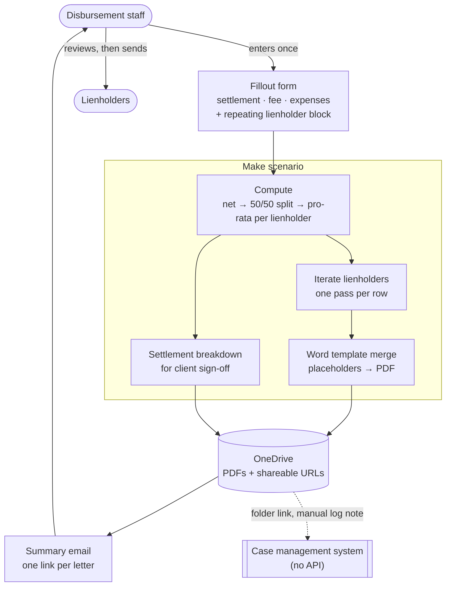

# Lien Reduction Letters

> When a personal injury settlement can't cover the medical liens filed against it, the firm
> has to write to every lienholder showing the statutory math and asking them to accept less.
> That was a spreadsheet, a desk calculator, and hand-typing totals into a Word template, once
> per provider, per case. Now it is **one form submission that produces every letter.**

## At a glance

| | |
|---|---|
| **Client** | Plaintiff-side personal injury firm, Missouri (US) <!-- OPEN: firm size / headcount, so the descriptor matches the house style used on the FNOL entry --> |
| **Domain** | Settlement disbursement, medical provider liens |
| **My role** | <!-- OPEN: see §6. The source doc was authored by a colleague, so I need your account of what was yours. --> |
| **Timeline** | <!-- OPEN: dates + duration --> |
| **Stack** | Fillout (forms), Make (orchestration), Microsoft 365 Word document merge, OneDrive, Outlook |
| **Status** | <!-- OPEN: in production since when? Still running? --> |

---

## 1. Context

When a personal injury case settles, the money does not go to the client. It gets divided.
The attorney's fee comes off first, then case expenses, and what remains is the net recovery.
Under the framework this firm works under, that net is then **split in half**: one half to the
client, one half reserved as a pool for the medical providers who treated them and filed a
lien against the recovery.

Each provider with a lien on file is entitled to a share of that pool proportional to what
they claimed. Nothing complicated so far.

The complication is that **the claimed liens routinely add up to more than the pool.** A
client with six months of treatment can easily have $50,000 in provider liens sitting against
a pool of $27,000. Every lienholder cannot be paid in full, so before the firm can disburse
anything it has to write to each one, show them the arithmetic, and formally ask them to
reduce their claim to the pro-rata figure. Those are lien reduction letters, and no
disbursement happens until they are out the door.

<details>
<summary>The arithmetic, with illustrative figures</summary>

Not a real matter. Round numbers chosen to show the shape.

| | |
|---|---|
| Gross settlement | $90,000 |
| Attorney's fee (⅓) | −$30,000 |
| Case expenses | −$6,000 |
| **Net recovery** | **$54,000** |
| Client's half | $27,000 |
| **Lien pool** | **$27,000** |

Three providers have filed liens totalling **$50,000** against a **$27,000** pool, so every
lienholder is reduced to 54% of what they claimed:

| Lienholder | Claimed | Share of claims | Pro-rata payout |
|---|---|---|---|
| Provider A | $30,000 | 60% | $16,200 |
| Provider B | $15,000 | 30% | $8,100 |
| Provider C | $5,000 | 10% | $2,700 |
| | $50,000 | | **$27,000** |

Three letters, three different figures, one shared derivation. Get one number wrong upstream
and all three are wrong in a way the recipient is motivated to find.

</details>

## 2. Diagnosis: how I knew this was the problem to solve

<!-- OPEN: This is the section the source handover doc doesn't cover, and it's the one that
carries the most weight for forward-deployed roles. What I'd need from you:
  - How did this surface? Was it named in an audit, raised by the disbursement staff, or did
    it come in as a request ("can you automate our lien letters")?
  - Did anyone measure the before state? Letters per week, minutes per letter, cases per
    month with liens exceeding the pool?
  - How did you find out the case management system couldn't do it? Did you check the
    vendor's capability yourself, or was that already known?
  - Was a math error ever actually caught in the wild, or was the error risk theoretical?
    A single real story ("a provider spotted a transposed figure and the firm had to reissue
    four letters") is worth more here than any amount of process description.
Below is what the source material supports. Correct it. -->

**What was asked for versus what mattered.** The visible ask was document generation, since
staff were re-typing the same numbers into a Word template over and over. The re-typing was
real, but it was the cheaper half of the problem. The expensive half was that **the
calculation had no home.** The case management system does not implement the 50/50 pro-rata
split, so the numbers lived in an Excel sheet maintained alongside the system of record, were
worked by hand on a calculator, and were then transcribed into letters. Three places holding
the same figures, reconciled by a person.

**Why that framing changes the build.** Automating the letters alone would have left the
spreadsheet in place and the reconciliation with it. Making the form the single point of
entry for every settlement variable is what removes the reconciliation, and the letters then
fall out of it as an artifact rather than being the point.

**Why not fix it in the case management system.** The system has no API to pull case data
from, so there was no route to reading the settlement figures out of it, computing there, or
writing results back automatically. That constraint decided the shape of the whole solution:
the data has to be **entered**, once, deliberately, rather than fetched.

## 3. Problem

Every case that settled with liens exceeding the pool required a per-lienholder letter, each
carrying a different payout figure derived from a shared calculation that no system performed.
Staff maintained the figures in Excel, ran the pro-rata split on a calculator, and
hand-transcribed totals and provider details into a Word template once per lienholder. The
work scaled with the number of providers on the case, which is exactly the direction it should
not scale. Every transcription was a chance to send a lienholder a number that did not match
the derivation printed above it in the same letter.

<!-- OPEN: quantify. Cases per month with liens over the pool, average lienholders per case,
minutes per letter. Without at least one of these, §7 stays qualitative. -->

## 4. Solution

One form, submitted once per settlement, produces every letter.

A staff member opens a form and enters the settlement amount, the attorney's fee, the case
expenses, and then one repeating block per lienholder covering provider name, address,
contact and claimed amount. That is the entire human contribution. On submit:

1. **Compute.** Net recovery, the 50/50 split, the total claimed, each lienholder's
   proportional share, and each resulting payout.
2. **Fan out.** One pass per lienholder, merging that lienholder's own figures plus the shared
   settlement derivation into a Word letter template, exported as PDF.
3. **Client breakdown.** The same inputs generate a settlement breakdown document showing the
   client their gross, fee, expenses and net share, ready for sign-off.
4. **Store.** Everything lands in OneDrive and comes back as shareable links.
5. **Notify.** A single email to the address given on the form, listing a link per letter plus
   the breakdown, subject line carrying the case identifier.
6. **Log back.** A note goes onto the case file in the case management system pointing at the
   OneDrive folder, so the case file still knows the letters exist.

Nothing sends to a lienholder automatically. The output is a set of reviewed-then-sent
documents, and a person still reads each one before it leaves the firm.

## 5. Architecture



### Key decisions and tradeoffs

| Decision | Why | What I gave up |
|---|---|---|
| **Capture every settlement variable in one form submission** rather than automating the letter from the existing spreadsheet | The spreadsheet was the source of the reconciliation problem. Leaving it in place would have automated the typing and kept the drift. One entry point means one set of numbers. | Staff re-key figures that exist elsewhere in the firm. With no API on the case management system, there was no alternative. |
| **Do the arithmetic in the orchestration layer, not in the document template** | The same derivation appears in every letter and in the client breakdown. Computing once and merging the results keeps all of them consistent by construction. | The math is not visible to whoever edits the letter template later, so a formula change is a developer change. |
| **Email shareable links instead of attachments** | A case with six lienholders is six PDFs plus a breakdown. As attachments that is a heavy mail; as links the team opens what it needs and the documents stay in one folder. | Recipients need OneDrive access, and a link is a live document rather than a frozen copy of what was generated. |
| **Generate PDFs, but keep the letter body a Word template** | The firm's own staff own the wording, which is legal language they revise. Placeholders in a Word file are editable by a paralegal. A hard-coded template would have made every wording tweak a change request. | Placeholder names become a contract. Renaming one in the template silently breaks a merge. |
| **No automatic send to lienholders** | These are letters asking a creditor to accept less, on firm letterhead, on a live matter. The saving is in the preparation, and the review step costs minutes. | Not end-to-end. A person still sends every letter. |

### Constraints I built inside

- **The case management system exposes no API.** No reading case data out, no writing results
  back. Every downstream design decision follows from that, including the form existing at
  all.
- **The system of record cannot do the math.** It has no concept of the 50/50 split or a
  pro-rata pool, which is why the figures had ended up in Excel.
- **The wording is legal text the firm owns.** It cites the statutory framework and gets
  revised. Non-developers had to be able to edit it.
- **Non-technical users.** Disbursement staff, not analysts. The whole surface is a web form
  and an email full of links.

### Illustrative excerpt: the calculation

*Redacted and simplified. The formula is trivial. What earns the excerpt is the two
invariants it has to hold, spelled out underneath.*

```js
// One derivation, computed once, merged into every letter and the client breakdown.
const fee      = feeIsPercent ? settlement * (feeRate / 100) : feeAmount;
const net      = settlement - fee - expenses;
const clientShare = net / 2;
const lienPool    = net / 2;

const totalClaimed = lienholders.reduce((sum, l) => sum + l.claimed, 0);

// Each lienholder is reduced by the same ratio, so the letters are mutually consistent:
// every recipient can check their own figure against the shared derivation printed above it.
const reductionRatio = lienPool / totalClaimed;   // < 1 whenever a reduction is needed

const payouts = lienholders.map(l => ({
  ...l,
  payout: round2(l.claimed * reductionRatio),
}));
```

Two things this has to guarantee, because a lienholder's staff will check both. Every letter
must show the **same** settlement, fee, expenses and pool, since providers on the same matter
compare notes. And the payouts must **sum to the pool**, which independent per-row rounding
does not promise. See §8.

<!-- OPEN: I need to know whether the built version handles the rounding remainder, or whether
it rounds each row independently and lets the total drift by a cent or two. Both are
defensible for the money involved. I've written §8 as if it was not handled, because that's
what the source doc implies. Correct me and I'll move it. -->

## 6. My involvement

<!-- OPEN: BLOCKING. The handover doc you gave me is authored by someone else, and it says
"we" throughout. This repo is a portfolio of work *you* delivered, so I will not write this
section from inference. Tell me plainly:
  - Was this your build, a colleague's build you're documenting, or a shared one?
  - If shared: what was yours? The discovery with the firm, the calculation, the Make
    scenario, the Word template, the client-facing documentation, the training?
  - If it was mostly someone else's, this should probably not be one of the seven, or should
    be framed explicitly as work you led rather than built.
Whatever the answer, saying it accurately is stronger than a vague "I delivered". -->

## 7. Impact

Nothing here was measured, and I would rather say that than publish a percentage.

| | Before | After |
|---|---|---|
| Where the settlement figures live | Excel sheet, kept alongside the case management system | The form submission, single entry |
| The pro-rata math | By hand, on a calculator, per case | Computed identically every time |
| Producing N letters | Hand-transcribe totals and provider details into a Word template, once per lienholder | One pass, all letters and the client breakdown |
| Provider names and addresses | Typed into each letter | Entered once, flow into all |
| Risk of an inconsistent figure between letters on the same matter | Real, and it scales with lienholder count | Removed by construction |

The qualitative outcomes the firm reported: less data entry, no calculator work, and letters
arriving as a set of reviewable documents rather than a task list. The pattern also turned
out to be reusable, since Word-template merge driven by structured form input applies to
demands, settlement statements and notices, which is a large share of what a plaintiff firm
produces.

<!-- OPEN: if anything at all was counted after go-live (cases run through it, letters
generated, weeks it's been in use, an estimate from the disbursement lead) it belongs here.
Even "roughly X settlements a month go through it" turns this from a process description into
a result. -->

## 8. What I'd do differently

<!-- OPEN: yours, please. Candidates I can see from the source material, take or leave: -->

- **The rounding remainder should be allocated, not left to chance.** Rounding each payout
  independently to the cent does not guarantee the payouts sum to the pool, so a six-provider
  case can distribute a cent more or less than exists. Nobody is harmed by a cent, but a
  letter whose figures do not reconcile is exactly the kind of thing a lienholder's billing
  department writes back about, and the reply costs more than the cent. Allocating the
  remainder to the largest claim makes the set provably sum to the pool.
- **Placeholder names in the Word template are an undocumented contract.** The template is
  editable by design, which is right, but nothing stops someone renaming a placeholder and
  finding out at merge time. A validation step that checks the template's placeholders against
  the fields the scenario supplies would catch it before a letter goes out with a blank in it.
- **The link back to the case file is manual.** With no API, the case management system only
  learns about the letters if someone posts the folder link. That is the one step still
  relying on a person remembering.

---

<details>
<summary>Evidence</summary>

<!-- Candidates, all needing a redaction pass:
     - The Fillout form, with the repeating lienholder block visible (no real case data)
     - A generated letter with every identifying field replaced by the illustrative figures
       in §1: no provider names, no firm letterhead, no client name, no real amounts
     - The Make scenario canvas, which shows the fan-out shape well and carries no data
     Check every image for: firm name, provider names, client name, claim numbers, real
     dollar figures, dates of treatment, PHI. A lien letter is dense with all of these. -->

Not yet added.

</details>
