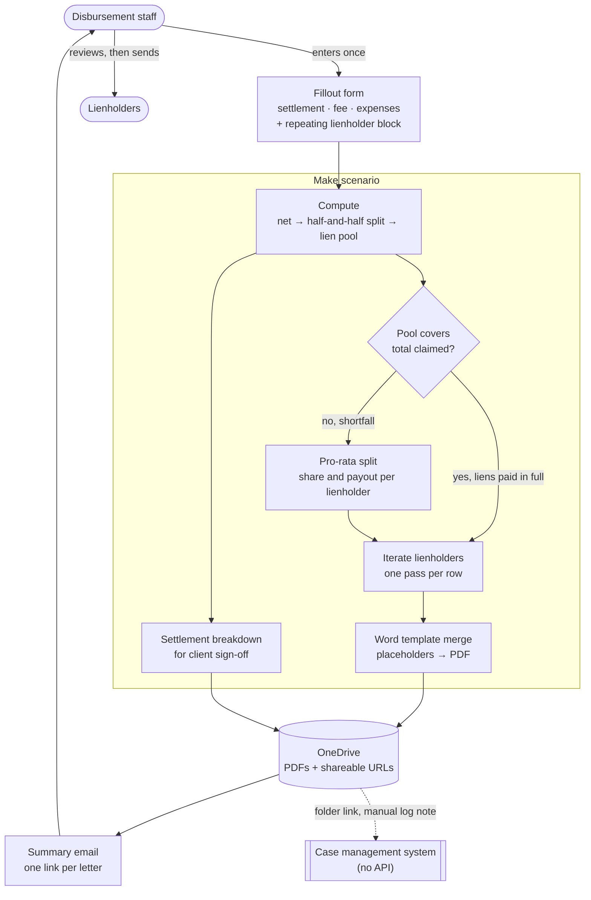

# Lien Reduction Letters

> When a personal injury settlement can't cover the medical liens filed against it, the firm
> has to write to every lienholder showing the statutory math and asking them to accept less.
> That was a spreadsheet, a desk calculator, and hand-typing totals into a Word template, once
> per provider, per case. Now it is **one form submission that produces every letter.**

## At a glance

| | |
|---|---|
| **Client** | Plaintiff-side personal injury firm, Missouri (US) |
| **Domain** | Settlement disbursement, medical provider liens |
| **My role** | Co-built. A colleague wrote the first version; the reworked system described here is mine <!-- OPEN: worth one line if you can give it. Which parts did the rework touch? The calculation, the per-lienholder fan-out, the template handling, the delivery, the client documentation? Naming even two turns "reworked substantially" into something a reader can picture. --> |
| **Timeline** | ~2 weeks |
| **Stack** | Fillout (forms), Make (orchestration), Microsoft 365 Word document merge, OneDrive, Outlook |
| **Status** | Completed and delivered |

---

## 1. Context

When a personal injury case settles, the money does not go to the client. It gets divided.
The attorney's fee comes off first, then case expenses, and what remains is the net recovery.
Under the framework this firm works under, that net is then **split in half**: one half to the
client, one half reserved as a pool for the medical providers who treated them and filed a
lien against the recovery.

Each provider with a lien on file is entitled to a share of that pool proportional to what
they claimed. Nothing complicated so far.

The complication is that **the claimed liens routinely add up to more than the pool.** A
client with months of treatment can easily have $50,000 in provider liens sitting against a
pool of $27,000. Every lienholder cannot be paid in full, so before the firm can disburse
anything it has to write to each one, show them the arithmetic, and formally ask them to
reduce their claim to the pro-rata figure. Those are lien reduction letters, and no
disbursement happens until they are out the door.

<details>
<summary>The arithmetic, with illustrative figures</summary>

Not a real matter. Round numbers chosen to show the shape.

| | |
|---|---|
| Gross settlement | $90,000 |
| Attorney's fee (⅓) | −$30,000 |
| Case expenses | −$6,000 |
| **Net recovery** | **$54,000** |
| Client's half | $27,000 |
| **Lien pool** | **$27,000** |

Three providers have filed liens totalling **$50,000** against a **$27,000** pool, so every
lienholder is reduced to 54% of what they claimed:

| Lienholder | Claimed | Share of claims | Pro-rata payout |
|---|---|---|---|
| Provider A | $30,000 | 60% | $16,200 |
| Provider B | $15,000 | 30% | $8,100 |
| Provider C | $5,000 | 10% | $2,700 |
| | $50,000 | | **$27,000** |

Three letters, three different figures, one shared derivation. Get one number wrong upstream
and all three are wrong in a way the recipient is motivated to find.

</details>

The pool does not always fall short. Plenty of settlements cover every lien on the case in
full, and those still need a letter to each lienholder, with no reduction to argue and no
pro-rata figure to derive.

## 2. Problem

Every case that settled with liens exceeding the pool required a per-lienholder letter, each
carrying a different payout figure derived from a shared calculation that no system
performed. Staff maintained the figures in Excel, ran the pro-rata split on a calculator, and
hand-transcribed totals and provider details into a Word template once per lienholder. The
work scaled with the number of providers on the case, which is exactly the direction it
should not scale. Every transcription was a chance to send a lienholder a number that did not
match the derivation printed above it in the same letter.

The cases where the pool covered everything were no faster. The arithmetic was easier, but
the letters were still typed one at a time.

The case management system was no help with any of it. It exposes no API, and it implements
neither the half-and-half split nor the pro-rata pool, which is why the figures had ended up
in Excel alongside the system of record in the first place.

## 3. Solution

One form, submitted once per settlement, produces every letter.

A staff member enters the settlement amount, the attorney's fee, the case expenses, and then
one repeating block per lienholder covering provider name, address, contact and claimed
amount. That is the entire human contribution. On submit:

1. **Compute the pool and check it against the claims.** Net recovery, the half-and-half
   split, and the total of what the lienholders claim.
2. **Branch.** If the pool covers the claims, no reduction is needed and the scenario goes
   straight to drafting. That letter is close to the same one, stating the amount that will
   be paid rather than asking the lienholder to accept less. If the claims exceed the pool,
   the scenario runs the pro-rata split and works out each lienholder's share and payout
   first.
3. **Fan out.** One pass per lienholder, merging that lienholder's own figures plus the
   shared settlement derivation into a Word letter template, exported as PDF.
4. **Client breakdown.** The same inputs generate a settlement breakdown document showing the
   client their gross, fee, expenses and net share, ready for sign-off.
5. **Store.** Everything lands in OneDrive and comes back as shareable links.
6. **Notify.** A single email to the address given on the form, listing a link per letter plus
   the breakdown, subject line carrying the case identifier.
7. **Log back.** A note goes onto the case file pointing at the OneDrive folder, so the case
   file still knows the letters exist.

Nothing sends to a lienholder automatically. The output is a set of documents a person reads
before any of them leave the firm.

## 4. Architecture



### Key decisions and tradeoffs

| Decision | Why | What I gave up |
|---|---|---|
| **Capture every settlement variable in one form submission** rather than merging letters from the existing spreadsheet | The spreadsheet was the source of the reconciliation problem. Leaving it in place would have automated the typing and kept the drift. One entry point means one set of numbers. | Staff re-key figures that exist elsewhere in the firm. With no API on the case management system, there was no alternative. |
| **Test whether the pool covers the claims and branch**, rather than treating a shortfall as the only case | The shortfall is what the firm asked about, but the letters still have to go out when there is enough money to pay everyone, and staff were typing those by hand for want of anywhere else to produce them. One test at the top of the scenario makes the form the entry point for both. | Two paths through one scenario, so a change to the letter set has to be checked on both. |
| **Do the arithmetic in the orchestration layer, not in the document template** | The same derivation appears in every letter and in the client breakdown. Computing once and merging the results keeps all of them consistent by construction. | The math is invisible to whoever edits the letter template later, so a formula change is a developer change. |
| **Email shareable links instead of attachments** | A case with six lienholders is six PDFs plus a breakdown. As attachments that is a heavy mail; as links the team opens what it needs and the documents stay in one folder. | Recipients need OneDrive access, and a link is a live document rather than a frozen copy of what was generated. |
| **Generate PDFs, but keep the letter body a Word template** | The wording is legal language the firm owns and revises. Placeholders in a Word file are editable by a paralegal. Hard-coding the template would have made every wording tweak a change request. | Placeholder names become a contract. Renaming one in the template silently breaks a merge. |
| **No automatic send to lienholders** | These are letters asking a creditor to accept less, on firm letterhead, on a live matter. The saving is in the preparation, and the review step costs minutes. | Not end to end. A person still sends every letter. |

### Constraints I built inside

- **The case management system exposes no API.** No reading case data out, no writing results
  back. Every downstream decision follows from that, including the form existing at all.
- **The system of record cannot do the math.** It has no concept of the half-and-half split
  or a pro-rata pool, which is why the figures had ended up in Excel.
- **The wording is legal text the firm owns.** It cites the statutory framework and gets
  revised. Non-developers had to be able to edit it.
- **Non-technical users.** Disbursement staff, not analysts. The whole surface is a web form
  and an email full of links.

### Illustrative excerpt: the calculation

*Not source code. The logic of the Make scenario written out for readability. The formula is
trivial. What earns the excerpt is the branch and the two invariants underneath it.*

```js
// One derivation, computed once, merged into every letter and the client breakdown.
const fee         = feeIsPercent ? settlement * (feeRate / 100) : feeAmount;
const net         = settlement - fee - expenses;
const clientShare = net / 2;
const lienPool    = net / 2;

const totalClaimed = lienholders.reduce((sum, l) => sum + l.claimed, 0);

// The gate. The letters go out whether or not the money runs short. The ratio is what changes.
const needsReduction = totalClaimed > lienPool;

// When reducing, every lienholder is cut by the same ratio, so the letters are mutually
// consistent: each recipient can check their own figure against the derivation printed above it.
const reductionRatio = needsReduction ? lienPool / totalClaimed : 1;

const payouts = lienholders.map(l => ({
  ...l,
  payout: round2(l.claimed * reductionRatio),   // claimed in full when there is enough to go round
}));
```

Two things this has to guarantee, because a lienholder's billing department will check both.
Every letter must show the **same** settlement, fee, expenses and pool, since providers on the
same matter compare notes. And whenever a reduction is applied the payouts must **sum to the
pool**.

## 5. Impact

| | Before | After |
|---|---|---|
| Where the settlement figures live | Excel sheet, kept alongside the case management system | The form submission, single entry |
| The pro-rata math | By hand, on a calculator, per case | Computed identically every time |
| Producing N letters | Hand-transcribe totals and provider details into a Word template, once per lienholder | One pass, all letters and the client breakdown |
| Cases where the pool covers every lien | Still typed one letter at a time | Same form, same output, the scenario skips the reduction |
| Provider names and addresses | Typed into each letter | Entered once, flow into all |
| Risk of an inconsistent figure between letters on the same matter | Real, and it scales with lienholder count | Removed by construction |

What the firm reported: no calculator work, no re-typing, and letters arriving as a set of
reviewable documents rather than a task list.

The pattern also generalises. Word-template merge driven by structured form input covers
demands, settlement statements and notices, which is a large share of what a plaintiff firm
produces.

## 6. What I'd do differently

I'd have it read the settlement figures out of the case management system instead of asking
someone to type them into the form, and write the calculated reductions back onto the case once
the letters are drafted. The figures would stay in the system of record rather than being
re-keyed, and the results would land on the case file instead of arriving there as a folder
link somebody has to remember to post. The system's API could not support either direction.

---

<details>
<summary>Evidence</summary>

<!-- Candidates, all needing a redaction pass:
     - The Fillout form, with the repeating lienholder block visible (no real case data)
     - A generated letter with every identifying field replaced by the illustrative figures
       in §1: no provider names, no firm letterhead, no client name, no real amounts
     - The Make scenario canvas, which shows the fan-out shape well and carries no data
     Check every image for: firm name, provider names, client name, claim numbers, real
     dollar figures, dates of treatment, PHI. A lien letter is dense with all of these. -->

Not yet added.

</details>
