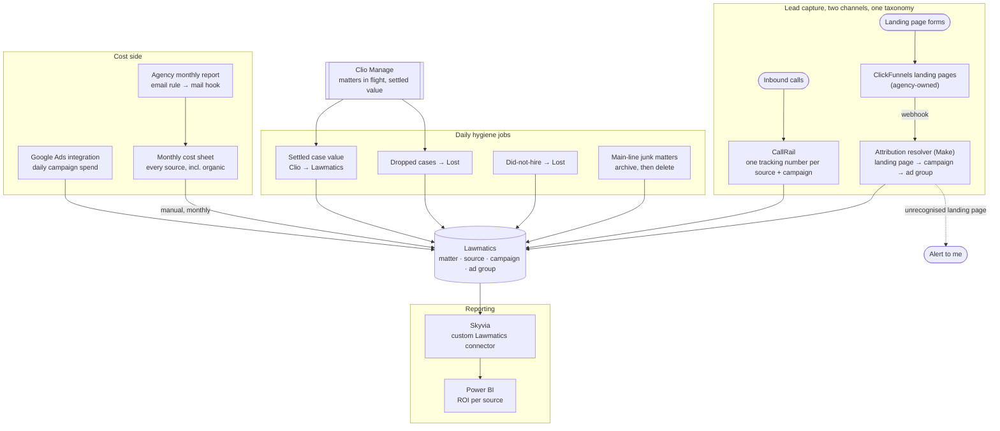

# Marketing Attribution

> A small criminal-defense and personal-injury firm was spending well over half a million
> dollars a year on marketing and could not say which of it produced cases. I rebuilt
> attribution end to end, from a thousand junk source records to a clean taxonomy with lead
> capture, ad spend and settled case value all landing on the same rows, then put a Power BI
> dashboard on top of it. **ROI per marketing source became a number the owner could act on**
> rather than a slide produced by the vendor being evaluated.

## At a glance

| | |
|---|---|
| **Client** | US law firm, criminal defense and personal injury, single office <!-- OPEN: headcount? I only know ~6 people by role (owner, ops/marketing manager, intake specialist, Clio admin, accountant). Small enough that the owner sees every invoice. --> |
| **Domain** | Marketing operations and intake attribution |
| **My role** | Sole engineer, from pitching the work unasked through to handover |
| **Timeline** | <!-- OPEN: when did you pick this client up, and over what period did the attribution work run? The walkthrough implies many months. --> |
| **Stack** | Lawmatics, Clio Manage, Make, Skyvia, Power BI, CallRail, Google Ads, Google LSA, ClickFunnels, Google Sheets, Google Workspace admin rules |
| **Status** | In production, handed off to a colleague |

---

## 1. Context

The firm practises criminal defense and personal injury out of a single office. Criminal
defense is the larger book. Its cases are priced at intake, because the fee is what the client
agrees to pay. Personal injury is the growth bet, and a PI case is worth nothing definite
until it settles, months or years later.

New business arrives through two doors. People call, or people fill in a form on a landing
page. Everything lands in **Lawmatics**, the intake CRM, where leads are qualified and either
converted or marked lost. The ones that convert move into **Clio Manage**, where the legal
work happens and where a case's real value is eventually recorded.

The firm buys most of its new business. Paid search, local service ads, social, printed ads,
streaming ads, a marketing agency on retainer, and a lead vendor that sells personal injury
cases **already signed** at roughly $3,000 each. <!-- OPEN: confirm the ~$30k/month lead
vendor figure and the ~$20k/month PPC budget cap. Both are from the walkthrough call and I
want them confirmed before they sit in a public repo. -->

## 2. Diagnosis: how I knew this was the problem to solve

Nobody asked for this. There was no ticket, no brief, and no budget line. I pitched it, and it
took months to land.

**Where it started.** The firm kept telling me it wanted to grow. Growth for a firm that buys
its cases means spending more on marketing, and they had no basis for deciding where the next
dollar should go. So the question I kept putting in front of them was not "what should we
automate", it was "you are about to spend more, and you cannot tell me what the last spend
bought you."

That is a slower sell than a broken workflow, because nothing is visibly on fire. It only
became fundable once growth came up as an explicit goal, and a diagnosis with no proposal
attached gets nodded at and forgotten. I had one ready.

**What the evidence said.** Four things, each of which independently broke ROI reporting:

1. **The source taxonomy was unusable.** Roughly **a thousand marketing sources** in
   Lawmatics, because someone had created one source per individual referral partner. Add
   duplicates on top, including three separate sources that all meant paid search. No
   grouping, so no denominator, so no rate of anything.
2. **Half the leads arrived with no attribution at all.** Form submissions came in from the
   agency's landing pages through an integration that created the matter but carried no source
   or campaign, because the agency did not set UTM parameters. Those leads sat in Lawmatics
   with the marketing origin blank.
3. **The revenue side only counted half the firm.** Case value is recorded in Clio Manage and
   never flowed back to Lawmatics, so Lawmatics reported revenue for criminal defense (priced
   at intake) and effectively zero for personal injury. Every PI source looked like it
   produced nothing.
4. **The conversion rates were wrong in the firm's favour.** Cases marked hired and then
   dropped stayed hired. Leads moved into the "did not hire" pipeline kept an open status.
   Both inflate conversion, and both inflate it hardest on the sources sending the weakest
   cases, which is precisely where you need the number to be honest.

**The reports that already existed.** The agency sent a monthly report, and it was vanity
numbers. Impressions, clicks, reach. Nothing connecting a dollar to a signed case, and nothing
the firm could audit, because the agency owned the reporting, the landing pages, the ad
accounts and the analysis of its own performance. The firm was paying a vendor to grade
itself.

That reframes the project. The deliverable is not a dashboard. It is **the firm's ability to
evaluate its own suppliers**, including the agency and including the lead vendor selling
$3,000 pre-signed cases that the firm was quietly dropping later.

**What building the reporting layer then surfaced.** Two of the four problems above I only
found once I started modelling the data for the dashboard. Aggregating the pipeline is what
exposed matters sitting in a did-not-hire stage while still carrying an open status, which is
invisible one record at a time and obvious the moment you count. Building the reporting layer
turned out to be the best diagnostic instrument on the project, which is an argument for
building it earlier than felt justified.

**What I ruled out.** Pulling spend from the ad platforms and the accounting system and
reporting on it outside Lawmatics entirely. It would have been faster and it was the obvious
move. I rejected it because spend is only half the fraction. The other half is signed cases
and their settled value, which live in Lawmatics and Clio, and joining them somewhere else
means maintaining a parallel copy of the firm's operational data to answer a question
Lawmatics already answers once the data underneath it is correct. The principle I held to:

> We could fake the numbers in the dashboard. We want everything as clean as possible instead
> of modifying the information at the point where it gets displayed.

So the work went into the source data, and the reporting layer stayed thin.

## 3. Problem

The firm was spending well over half a million dollars a year to acquire cases and had no
reliable read on which sources produced them. The source taxonomy could not be grouped, a
whole capture channel arrived unattributed, personal injury revenue never reached the system
doing the reporting, and the conversion rates that did exist were biased upward by cases that
had been dropped or rejected without being marked as such.

The cost of leaving it alone is not staff hours. It is capital allocation. Every month the
firm renewed a roughly $20,000 paid search budget, a retainer with an agency it suspected was
underperforming, and a lead vendor charging $3,000 a case, on the basis of numbers that were
either wrong or supplied by the vendor being evaluated. Scaling marketing spend without
attribution scales the error.

## 4. Solution

One clean taxonomy, both capture channels attributed against it, spend and settled revenue
landing on the same rows, daily jobs whose only purpose is to stop the data drifting back out
of true, and a Power BI dashboard reading the result.

**Rebuild the taxonomy.** I mapped every existing source to a target model, collapsed the
per-partner sprawl into grouped sources such as referrals and word of mouth, deduplicated paid
search, and added the sources the firm was actually using but had never set up. Then I
exported every historical matter, remapped old sources to new ones, and had the file
reimported so history stayed comparable. I did that remapping by hand rather than handing it
to a model, because a silent mis-map in the historical data poisons every rate the system
later reports and there is no way to notice it happened.

**Attribute the calls.** A CallRail tracking number per source and campaign, wired through the
native Lawmatics integration, so an inbound call creates a matter already carrying its origin.

**Attribute the forms.** The hard one, and mostly not a technical problem (see §5). The agency
owned the ClickFunnels landing pages, pushed submissions into Lawmatics without source or
campaign, and told us there was nothing they could do. I had the webhook redirected to a Make
scenario instead, and derive campaign and ad group from the **landing page the form was
submitted on**, which is the only signal in the payload the agency cannot quietly change
without our routing failing loudly.

**Get the real revenue in.** Criminal defense value is already correct at intake. Personal
injury value is only final when Clio says so, so a daily job carries the settled value across,
gated on an explicit "this value is final" checkbox rather than on a stage change or case
closure.

**Stop the metrics lying.** Three jobs, each closing a specific gap: dropped cases get marked
lost, did-not-hire leads get their status corrected, and junk matters created by the firm's
main phone line get archived and deleted.

**Get the costs in.** Daily ad spend arrives through the Google Ads integration. Everything
else, including organic channels costed honestly at the staff time and tooling they consume,
comes from a monthly cost sheet, partly populated by parsing the agency's own monthly report
out of email. That last mile is manual, and §5 explains why it has to be.

**Put a dashboard on it.** Lawmatics' native reporting is the floor, not the ceiling, so the
reporting layer is Power BI. Getting Lawmatics data into it needed a connector that did not
exist, which I built.

<!-- OPEN: the dashboard and the Skyvia connector are the part I have almost nothing on. The
walkthrough call predates them. Here is my current understanding, written out so you only have
to correct the deltas rather than explain it from scratch:

  - Skyvia has no off-the-shelf Lawmatics connector, so you authored a custom REST connector
    definition against the Lawmatics API to make Lawmatics a source Skyvia can replicate from.
    Is that right, or did you build something that pushes into Skyvia from the other side?
  - Skyvia then replicates into a relational target and/or exposes an OData endpoint, and
    Power BI reads that. Which is it, and what is the target store?
  - Refresh cadence? Scheduled replication, and how often?
  - Why Skyvia at all, rather than Power BI hitting the Lawmatics API directly, or a Make
    scenario writing to a database? That tradeoff is the interesting part for a reader.
  - Does the dashboard read Clio too, or only Lawmatics?
  - Where do the costs come from in the dashboard: the values keyed into Lawmatics monthly,
    or the Google Sheet directly?
  - What the connector actually had to handle: auth, pagination, rate limits, incremental
    sync. This is where a custom connector gets genuinely hard and it is worth showing.
  - What is on the dashboard? Which views, which metrics, sliced how?
  - Who uses it, how often, and did it replace the V1 Lawmatics-native dashboard entirely?
  - You said you vibe coded the connector. I think that is worth saying plainly in §6, it
    reads as current and honest rather than sloppy, but it is your call and I have not put it
    in yet.
-->

## 5. Architecture



<!-- OPEN: the Skyvia and Power BI edges are drawn from my best guess at the shape. Correct
the arrows once you have told me how the connector actually works. -->

### Key decisions and tradeoffs

| Decision | Why | What I gave up |
|---|---|---|
| **Fix the source data, do not correct at the reporting layer** | A dashboard that compensates for known-bad inputs becomes a second source of truth that silently diverges from the first. Clean statuses in Lawmatics benefit every consumer, not just the report. | Much slower. A presentation-layer fix would have shown a plausible number in days. |
| **Derive campaign and ad group from the landing page** | We control neither the landing pages, the ad accounts, nor the UTM parameters, and the party who does had already declined to help. The landing page is in every payload and cannot be repointed without our routing breaking visibly. | A hard dependency on a page-to-campaign convention that is enforced socially rather than technically. |
| **Gate the case-value sync on an explicit "final" checkbox** | Both alternatives are worse. Triggering on case closure adds months of lag, because the firm only closes a file when it is completely finished. Triggering on a stage change relies on staff updating the value before they move the stage, and lets them skip the stage entirely. | Depends on a human ticking a box. If they never tick it, the value never arrives, and nothing errors. |
| **Write a "migrated" flag back into Clio** | The syncs are daily sweeps over recently-updated records rather than event-driven, so they must be safe to re-run. Flipping a flag on the source record makes the query filter itself the idempotency guard. | A write back into Clio on every sync, and one more field for staff to see and wonder about. |
| **Archive junk matters to a sheet before deleting them** | The firm was nervous about an automation that deletes. The archive costs one step and made the deletion approvable. | Nobody has ever read the archive. It is a trust artifact, and it earns its cost anyway. |
| **Costs entered by hand each month** | Lawmatics has no API for marketing-source costs, and its only alternative is per-campaign daily entry, which for a fixed monthly agency fee means asking a person to divide by thirty and type it in thirty times. | About fifteen minutes of manual work a month, and a dependency on someone remembering. I filed a feature request for the cost endpoint. |
| **Power BI over Lawmatics' native dashboards** | <!-- OPEN: your reasoning. Mine would be that native reporting cannot join Lawmatics to Clio or to the cost sheet, and cannot express ROI per source the way the owner needs to read it. Confirm or replace. --> | <!-- OPEN --> |
| **A custom Skyvia connector rather than a direct API pull** | <!-- OPEN: this is the decision a technical reader will care about most, and I do not want to invent the reasoning. --> | <!-- OPEN --> |

### Constraints I built inside

- **A key vendor owned the inputs and was also the party being measured.** The agency held the
  landing page platform, the ad accounts and the reporting. Any design that needed their
  cooperation had to survive them not cooperating.
- **Lawmatics has no API for marketing-source costs**, which puts a permanent manual step in
  the middle of an otherwise automated pipeline.
- **Lawmatics fires a given automation once per matter, ever.** A lead that goes lost, comes
  back, and goes lost again does not re-trigger. That single limitation is why the hygiene
  jobs are daily sweeps instead of triggers.
- **The CallRail integration cannot filter by number.** Every call to the tracked main line
  creates a matter, and roughly nine in ten of those are junk, because the firm routed its
  general telephony through it.
- **No off-the-shelf path from Lawmatics into Power BI.** <!-- OPEN: expand once you have
  described the connector. -->
- **Non-technical users throughout.** The people whose behaviour the data quality depends on
  are an intake specialist and an operations manager, so anything that needed doing had to be
  a checkbox on a screen they were already looking at.

### Illustrative excerpt: attributing a form submission with no UTM parameters

*Redacted and simplified. The decision worth showing is deriving attribution from the one
field a hostile-ish upstream cannot quietly change, and making the unmatched case loud.*

```js
// The agency owns the landing pages and does not set UTM parameters, so source, campaign
// and ad group are derived from the page the form was submitted on. This is only sound
// because I got a one-page-per-ad-group rule agreed first (see below).
const ROUTES = {
  '<campaign-a>/<ad-group-1>': { source: PAID_SEARCH, campaign: '<campaign-a>', adGroup: '<ad-group-1>' },
  '<campaign-a>/<ad-group-2>': { source: PAID_SEARCH, campaign: '<campaign-a>', adGroup: '<ad-group-2>' },
  // ... one entry per ad group, across every live campaign
};

const route = ROUTES[normalise(payload.landing_page)];

if (!route) {
  // Do not guess, and do not drop it. An unrecognised page means the upstream changed
  // something, and every lead through that page is mis-attributed until it is mapped.
  notify(`Unmapped landing page: ${payload.landing_page}`);
  return createMatter({ ...payload, source: UNATTRIBUTED });
}

return createMatter({ ...payload, ...route });
```

**The part that made this work was not the code.** The agency had been running the same
landing page across several campaigns and ad groups, and reusing one tracking number across
different campaigns, which makes attribution impossible from any signal in the payload. Their
position was that they could produce the statistics from their own platforms, which is true
and useless, because those numbers cannot reach Lawmatics where the signed cases are. So I
took it to the firm's owner, who has commercial leverage I do not, and got **one landing page
per ad group per campaign** agreed as a standing rule. The routing table above is only correct
because that negotiation happened first.

*Second excerpt: the daily value sync, and why it is safe to re-run.*

```js
// Runs daily. Sweeps rather than subscribes, because Lawmatics automations fire once per
// matter for all time, so anything event-driven silently misses the second occurrence.
const candidates = await clio.matters.updatedSince(hoursAgo(24));

for (const m of candidates) {
  if (m.practiceArea !== PERSONAL_INJURY) continue;   // criminal value is correct at intake
  if (!m.actualValueIsFinal) continue;                // the explicit human gate
  if (m.syncedToLawmatics) continue;                  // idempotency: already carried across

  await lawmatics.matters.update(m.lawmaticsId, { actualValue: m.actualValue });
  await clio.matters.update(m.id, { syncedToLawmatics: true });  // flip only after the write lands
}
```

The flag is written to the source system rather than held in the job, so the guard survives
the job being re-run, re-deployed, or run twice in a day after a failed reauthentication.

## 6. My involvement

Sole engineer on this client, and the work was mine end to end. <!-- OPEN: confirm the split
below and correct anything I have wrong. -->

**Mine.** Pitching the project and getting it funded. The source taxonomy analysis and target
model. The historical data remap, done by hand. The custom field cleanup and the Lawmatics to
Clio field mapping. The lead vendor integration, including its field mapping, workflow
carve-outs, and the task automation around the seven-day window for disputing leads the firm
is charged for. The attribution resolver and every Make scenario. The cost model, including
costing organic channels by sitting down with the person who posts and working out her hours.
The daily sync and hygiene jobs. The Skyvia connector and the Power BI dashboard. The client
relationship, weekly updates, and the handover.

**Not mine.** A colleague set Clio Manage up before I took the client over, including its
document templates and task lists, and built the inbound document routing. I worked on top of
that and did not touch it.

**The unglamorous parts.** Most of the difficulty here was not engineering. It was getting a
vendor with no incentive to cooperate to change how it built landing pages, which took several
meetings and eventually the owner's involvement. It was persuading a firm that had been burned
by bad reporting to accept an automation that deletes records, which is what the archive step
is for. And it was months of pitching a project nobody had asked for.

## 7. Impact

**The before state, measured while scoping:**

| | Before |
|---|---|
| Marketing sources in Lawmatics | ~1,000, one per referral partner, plus duplicates |
| Form-submitted leads carrying source and campaign | None |
| Personal injury revenue visible to ROI reporting | None |
| Conversion rates | Overstated, since dropped and rejected cases kept their prior status |
| Junk matters from the main phone line | ~9 in 10 tracked main-line calls created one |
| Basis for evaluating the agency and the lead vendor | The vendors' own reports |

<!-- OPEN: this section decides whether the case study lands, and I do not have the after
numbers. Whatever you have:
  - ROI per source now populated: for how many sources, and is the owner actually using it?
  - Did it change a spend decision? The lead vendor evaluation at month six or nine, the
    agency contract non-renewal, a budget reallocation. One decision made on these numbers is
    worth more than any percentage.
  - Conversion rate before vs after the hygiene jobs, if you can see both.
  - Junk matters deleted per week.
  - Lead-dispute recovery: did the seven-day task automation actually save chargebacks, and
    roughly how much? At $3,000 a lead this could be the single best number in the study.
  - Dashboard adoption: who opens it, how often.
If none of it was measured, say so and I will write it as an honest qualitative outcome. -->

## 8. What I'd do differently

- **The routing table encodes a convention I do not control.** Every entry depends on the
  agency keeping one landing page per ad group. The alert on an unrecognised page is a good
  tripwire, and it is still only a tripwire. I would push much harder and much earlier for the
  firm to own the landing page platform under its own account, which is the dependency the
  firm later had to start unwinding anyway.
- **I over-engineered the cost ingestion.** Parsing the agency's monthly report out of email,
  finding the right month's column and writing two cells into a copied sheet is a lot of
  machinery to save someone copying two numbers. It has more ways to break than the manual
  step it replaced.
- **The "value is final" checkbox is a silent failure mode.** If nobody ticks it, nothing
  errors and the case value simply never arrives. It needs a companion report of settled cases
  sitting unflagged, so the gap is visible rather than absent.
- **Deleting junk matters fights the users.** When staff merge a newly created matter into an
  existing one, the merged record can inherit the new matter's identity and get deleted by a
  job that was right to fire. I patched it with a "created today" guard, which narrows the
  window without closing it. The real fix is upstream, in whether the general phone line
  should have been routed through call tracking at all.
- **I should have built the dashboard first.** Two of the four data-quality problems were only
  visible in aggregate, and I found them late because I treated reporting as the last step
  rather than as the instrument that shows you what is wrong.

---

<details>
<summary>Evidence</summary>

<!-- Candidates, all needing a redaction pass:
     - The source mapping sheet, old taxonomy to new (redact referral partner names)
     - The Make scenario canvas showing the campaign routers (redact campaign names, which
       contain the practice area and the state)
     - The monthly cost sheet (redact vendor names, or redact spend, not neither)
     - The Power BI dashboard, ROI by source view (redact spend and vendor names)
     Check every image for: firm name, staff names, vendor names, campaign names containing
     the city or state, tracking phone numbers, real spend figures, client names. -->

Not yet added.

</details>
