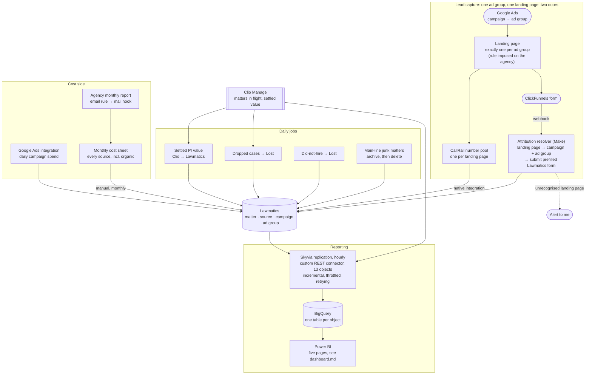

# Marketing Attribution

> A small criminal-defense and personal-injury firm was spending well over half a million
> dollars a year on marketing and could not say which of it produced cases. Fixing that meant
> rebuilding five layers underneath the reports: the source taxonomy, the Google Ads account structure
> that made a lead attributable at all, the historical data, the cost model, and the revenue
> backflow from the case management system. Paid search went from **no attribution to
> ad-group-level attribution on both the call and the form channel**, with ROI per source the
> owner could act on instead of a slide written by the vendor being evaluated.

## At a glance

| | |
|---|---|
| **Client** | US law firm, criminal defense and personal injury, single office <!-- OPEN: headcount? I only know ~6 people by role (owner, ops/marketing manager, intake specialist, Clio admin, accountant). Small enough that the owner sees every invoice. --> |
| **Domain** | Marketing operations and intake attribution |
| **My role** | Sole engineer. The client asked for the work, and I owned it from scoping through to handover |
| **Timeline** | ~3 months, roughly one month each on attribution, cost mapping, and dashboard design |
| **Stack** | Lawmatics, Clio Manage, Make, Skyvia, BigQuery, Power BI, CallRail, Google Ads, Google LSA, Meta Ads, ClickFunnels, QuickBooks Online, Google Sheets, Google Workspace admin rules |
| **Status** | Finalised and rolled out |

---

## 1. Context

The firm practises criminal defense and personal injury out of a single office. Criminal
defense is the larger book. Its cases are priced at intake, because the fee is what the client
agrees to pay. Personal injury is the growth bet, and a PI case is worth nothing definite
until it settles, months or years later.

New business arrives through two doors. People call, or people fill in a form on a landing
page. Everything lands in **Lawmatics**, the intake CRM, where leads are qualified and either
converted or marked lost. The ones that convert move into **Clio Manage**, where the legal
work happens and where a case's real value is eventually recorded.

The firm buys most of its new business. Paid search, local service ads, social, printed ads,
streaming ads, a marketing agency on retainer, and a lead vendor that sells personal injury
cases **already signed** at roughly $3,000 each. <!-- OPEN: confirm the ~$30k/month lead
vendor figure and the ~$20k/month PPC budget cap. Both are from the walkthrough call and I
want them confirmed before they sit in a public repo. -->

## 2. Diagnosis: how I knew this was the problem to solve

The firm named the symptom itself and asked for help with it. It was spending heavily across a
lot of marketing sources and could not see which of them worked. What it did not have was a
cause, a route to fixing one, or any sense of how far down the problem went. The symptom sounds
like a reporting request, and the fix turned out to sit four layers underneath the reports.

**What the evidence said.** Four things, each of which independently broke ROI reporting:

1. **The source taxonomy was unusable.** About **50 marketing sources** in Lawmatics, held as
   one flat list that had stopped meaning a single thing. Many entries were individual referral
   partners or specific pushes recorded as sources in their own right, when they should have sat
   as campaigns under one grouped source, so a single channel was split across rows that never
   got added together. Others were stale, for spend that had stopped running, still attached to
   historical matters and still selectable on new ones. Add duplicates on top, including three
   separate sources that all meant paid search. No grouping, so no denominator, so no rate of
   anything.
2. **The Google Ads account had no one-to-one structure, so neither channel could be attributed.**
   This is the root cause, and it sat in the agency's Google Ads setup rather than anywhere in
   the firm's systems. The same landing page was serving several campaigns and ad groups at
   once, so a personal injury ad and a criminal defense ad could deliver a visitor to the same
   page. That page carries one call-tracking number and one form, so both routes into the firm
   arrive identical no matter which ad was paid for. Tracking numbers were reused across
   campaigns on top of that. The form path made it worse by pushing submissions into Lawmatics
   through an integration that set no UTM parameters, so those leads landed with the marketing
   origin blank.

   **Why not gclid.** Google Ads stamps every paid click with a gclid, and that identifier does
   carry the campaign and ad group. It resolves inside Google's own stack, and Lawmatics can
   neither read it nor exchange it for anything. The agency's setup fed the click data into
   their own systems, which is why they could produce a report and the firm could not.
   Attribution had to arrive in a form the CRM could store on a lead, which rules out anything
   that has to be resolved against an API the CRM does not call.
3. **The revenue side only counted half the firm.** Case value is recorded in Clio Manage and
   never flowed back to Lawmatics, so Lawmatics reported revenue for criminal defense (priced
   at intake) and effectively zero for personal injury. Every PI source looked like it
   produced nothing.
4. **The conversion rates were wrong in the firm's favour.** A lead that signs is marked hired
   in Lawmatics and the matter migrates to Clio. When the firm later drops that case, it is
   dropped in Clio, and nothing communicates that back, so the lead sits in Lawmatics as hired
   permanently. Conversion is inflated, and it is inflated hardest on the sources sending the
   weakest cases, which is exactly where the number needs to be honest.

**The reports that already existed.** The agency sent a monthly report, and it was vanity
numbers. Impressions, clicks, reach. Nothing connecting a dollar to a signed case, and nothing
the firm could audit, because the agency owned the reporting, the landing pages, the ad
accounts and the analysis of its own performance. The firm was paying a vendor to grade
itself.

That reframes the project. The deliverable is the **firm's ability to evaluate its own
suppliers**, including the agency and including the lead vendor selling $3,000 pre-signed cases
that the firm was quietly dropping later.

**What I ruled out.** Pulling spend from the ad platforms and the accounting system and
reporting on it outside Lawmatics entirely. It would have been faster and it was the obvious
move. I rejected it because spend is only half the fraction. The other half is signed cases
and their settled value, which live in Lawmatics and Clio, and joining them somewhere else
means maintaining a parallel copy of the firm's operational data to answer a question
Lawmatics already answers once the data underneath it is correct. So the work went into the
source data, and the reporting layer stayed thin.

## 3. Problem

The firm was spending well over half a million dollars a year to acquire cases and had no
reliable read on which sources produced them. The Google Ads account had no one-to-one structure, so
paid search leads could not be attributed on either the call or the form channel. The source
taxonomy could not be grouped. Personal injury revenue never reached the system doing the
reporting. And the conversion rates that did exist were biased upward by cases the firm had
dropped in Clio that still read as hired in Lawmatics.

The cost of leaving it alone is not staff hours. It is capital allocation. Every month the
firm renewed a roughly $20,000 paid search budget, a retainer with an agency it suspected was
underperforming, and a lead vendor charging $3,000 a case, on the basis of numbers that were
either wrong or supplied by the vendor being evaluated. Scaling marketing spend without
attribution scales the error.

## 4. Solution

Six steps, in order. Each one is a prerequisite for the next, and the last one is the only part
the firm sees.

### 1. Rebuild the source taxonomy

Two levels, replacing the flat list.

- A **source** is where a lead came from. The channel or origin: paid search, local service
  ads, social, referrals, word of mouth.
- A **campaign** is a specific, individually funded effort inside a source. An individual
  referral partner, one push, one buy. Several campaigns sit under one source, so paid search
  stays a single source however many campaigns run within it.

I mapped every existing entry onto that model, collapsed the per-partner and per-push sprawl
into grouped sources, deduplicated paid search, retired the stale entries, and added the
sources the firm was actually using but had never set up. Roll campaigns up and there is a
true per-channel figure. Drill into a source and campaigns inside it compare on like-for-like
terms.

<!-- OPEN: what did the ~50 collapse into? "About 50 flat entries became N sources and M
campaigns" is the single most persuasive line available for this section, and I do not have N
or M. -->

### 2. Route both capture channels into it

A clean taxonomy is worth nothing if the systems creating leads do not write into it, and here
neither of them could, because the structure upstream destroyed the signal before it arrived.

**Restructure the Google Ads account first, because everything else depends on it.** No amount of
integration work fixes a setup where two different ads land on the same page. So the enabling
move was a structural rule imposed on the agency: **one landing page per ad group**, and a
campaign carries several ad groups, which is what buys the granularity. Then **one
call-tracking number per landing page**, which I set up. That single change makes the page
itself the attribution key, and it fixes both channels at once, because on a landing page the
phone number and the form are two doors into the same room.

**The calls.** Once each landing page has its own tracking number, the only way to reach that
number is to have come through that ad group. Attribution stops being an inference and becomes
a property of the structure. The numbers are dynamic tracking numbers that swap per visitor, so
this had to be one CallRail number pool per page rather than one static number.

**The forms.** The agency's forms live in ClickFunnels, and the agency was posting each
submission straight into Lawmatics. That path destroyed the attribution, because the agency
could not supply a source or a campaign with the lead. Their forms were not set up in a way
that gave them that information in the first place, so there was nothing for them to send.

So I negotiated the webhook away from them. Instead of posting into the CRM, the agency now
posts each submission to a webhook of mine in Make. Because one landing page maps to one ad
group by then, the scenario can read the landing page off the payload and derive the ad group
from it, and the ad group's parent campaign from that. It routes on the landing page, then
creates the lead in Lawmatics with source and campaign filled in and the ad group in a custom
field for a further level of granularity. Creating the lead by submitting a Lawmatics form is
just how a lead gets made, rather than a choice with anything riding on it.

**The part that made this work was not the code.** None of it is possible while one landing
page serves several ad groups, because then the page identifies nothing. The agency was doing
exactly that, and reusing tracking numbers across campaigns on top of it. Its position was that
it could produce the statistics from its own platforms, which is true and useless, because
those numbers cannot reach Lawmatics where the signed cases are. I negotiated both changes with
the agency directly: one landing page per ad group as a standing rule, and the form webhook
pointed at me instead of at the CRM. The routing table is a consequence of that agreement
rather than a substitute for it.

### 3. Remap the history

Everything created before the rebuild was categorised under the old flat list. I exported every
historical matter, remapped old sources to new ones, and had the file reimported so history
stayed comparable. I did that remapping by hand rather than handing it to a model, because a
silent mis-map in the historical data poisons every rate the system later reports and there is
no way to notice it happened.

Without this the reporting starts from zero on launch day and cannot show a trend, a
year-on-year, or whether a change in spend did anything.

### 4. The cost side of ROI

Attribution alone is not ROI. Knowing a campaign produced eleven signed cases says nothing
until you know what it cost, and "what does this source cost" has a different answer for every
source.

- **Paid search** spend arrives through the native Google Ads integration.
- **Agency fees and the ad spend the firm cannot see directly** are parsed out of the agency's
  monthly report by email.
- **Referral fees and anything that arrives as a bill** come out of the accounting system, by
  report and by API.
- **Organic channels are costed rather than counted as free**, so the social channel carries
  the posting time it consumes plus its design subscription, which I worked out by sitting down
  with the person who does the posting and going through her week.

All four of those land automatically in a Google Sheet that builds up spend per source and per
campaign. The sheet exists only because Lawmatics has no API endpoint for marketing costs. If
it had one, the costs would be written straight into the CRM and there would be no sheet.

Getting the numbers from the sheet into Lawmatics is the single manual step in the system: a
monthly task on the intake manager, **about fifteen minutes**, typing in figures the sheet has
already worked out. The alternative was to take the ROI analysis somewhere that could hold cost
natively, which means reporting away from the CRM that holds the attribution. The trade was
made deliberately.

### 5. The revenue side of ROI

Return per source only exists if outcomes reach the same system as the attribution, so
Lawmatics has to be the source of truth for what a lead was worth. Two flows carry that back.

- **Settled cases.** Criminal defense value is already correct at intake, because the fee is
  agreed when the client signs, so **criminal defense needs no retroactive sync**. Personal
  injury value is only final when Clio says so, so a daily job carries the settled value across,
  gated on an explicit "this value is final" checkbox rather than on a stage change or case
  closure.
- **Dropped cases.** A lead that signs is marked hired in Lawmatics and the matter migrates to
  Clio. If the firm later drops it, that happens in Clio and nothing tells Lawmatics, so the
  lead stays hired there forever and every conversion rate built on it reads high. A daily job
  carries the drop back and marks the lead lost, which is the only reason a source's conversion
  rate reflects cases the firm actually kept.

With that in place a single lead record carries the whole chain: where it came from, what was
spent to get it, and what it ended up worth.

### 6. Warehouse, connector and dashboard

By this point the ROI question is answerable inside Lawmatics, because the taxonomy, the costs
and the settled value are all in it. The gap is interrogation. Lawmatics reporting will not
cross-filter, so a question like which sources and campaigns produce the most rejected leads,
and for which reasons, has no route to an answer there. So the reporting layer is Power BI over
a BigQuery warehouse, fed from Lawmatics for everything the ROI question needs and from Clio
for the case-management reporting the firm would otherwise open a second tool to read.

Nothing existed to get either system into that warehouse. Skyvia does the replication and had
no connector for Lawmatics, so I wrote one: a declarative REST connector definition covering
thirteen objects, with auth, paging, throttling, retry and incremental-sync rules, replicating
hourly into BigQuery. It is the second excerpt in §5.

The dashboard runs to five pages and is covered separately, in
[`dashboard.md`](./dashboard.md). It is the only part of the system anyone opens after
handover.

## 5. Architecture



### Key decisions and tradeoffs

| Decision | Why | What I gave up |
|---|---|---|
| **Fix the source data, do not correct at the reporting layer** | A dashboard that compensates for known-bad inputs becomes a second source of truth that silently diverges from the first. Clean statuses in Lawmatics benefit every consumer of the CRM, not only the report. | Much slower. A presentation-layer fix would have shown a plausible number in days. |
| **Derive campaign and ad group from the landing page** | With no UTM parameters, no control over the landing pages or the Google Ads account, and an agency that owns all three, the landing page URL is the only attribution signal that arrives with the lead. It is in every payload, and if the agency repoints a page the routing breaks loudly the same day rather than misattributing quietly. | A hard dependency on one page mapping to one ad group, which is a convention the agency keeps rather than something the system enforces. |
| **Gate the case-value sync on an explicit "final" checkbox** | Both alternatives are worse. Triggering on case closure adds months of lag, because the firm only closes a file when it is completely finished. Triggering on a stage change relies on staff updating the final settlement value before they move the stage, and lets them skip the stage entirely. | Depends on a human ticking a box. If they never tick it, the value never arrives, and nothing errors. |
| **Write a "migrated" flag back into Clio** | The syncs are daily sweeps over recently-updated records, so they have to be safe to re-run. Flipping a flag on the source record makes the query filter itself the idempotency guard, and it survives the job being re-run, re-deployed, or run twice after a failed reauthentication. | A write back into Clio on every sync, and one more field for staff to see and wonder about. |
| **Build costs up in a sheet and key them into the CRM monthly**, rather than moving the ROI analysis off the CRM | Lawmatics has no API endpoint for marketing-source costs, so nothing can write them automatically. Native entry is per campaign and per period, daily, weekly or monthly, and I set it to monthly. So every cost feed lands in the sheet instead, and a scheduled monthly task on the intake manager carries the month's figures into the CRM. Moving the analysis elsewhere would have meant reporting somewhere that does not hold the attribution. | The one manual step in the system, and a dependency on the intake manager doing it. I filed a feature request for the cost endpoint. |
| **Power BI over Lawmatics' native dashboards** | Power BI cross-filters, so the owner can ask which source converts best, which sources and campaigns produce the most rejected leads, and which of the lost cases the firm caused against which it turned away and why, with sub-categories under each reason. Lawmatics answers almost none of that. Clio's reporting can then sit beside it instead of in a second tool. | A whole extra pipeline to own, for a client with no data team. |
| **Replicate into a warehouse rather than point the BI tool at the API** | A BI tool refreshing straight off a paginated REST API is slow, fragile, and re-fetches everything to answer anything. A warehouse gives SQL, joins against the cost data, and history the API does not keep. | Latency between the CRM and the dashboard, and a second copy of the data to secure. |
| **Incremental windows overlap on purpose** | The sync filters on updated-since, and the greater-than-or-equals variant carries a one-unit negative delta, so each run re-reads a sliver of the previous window. Re-reading a record that has not changed costs one request and rewrites the row it already has. A record that falls in the gap between two windows is invisible forever. | A little wasted read on every run. |

### Constraints I built inside

- **A key vendor owned the inputs and was also the party being measured.** The agency held the
  landing page platform, the Google Ads account and the reporting. Any design that needed their
  cooperation had to survive them not cooperating.
- **Lawmatics has no API endpoint for marketing-source costs**, which puts a permanent manual
  step in the middle of an otherwise automated pipeline.
- **No off-the-shelf path from Lawmatics into Power BI.** The replication platform has
  connectors for the usual SaaS estate and none for Lawmatics, so the connector had to be
  written before any reporting could start. The API also returns a thin payload by default, so
  the main object has to name all seventy-odd fields it wants explicitly on every request.
- **Non-technical users throughout.** The people whose behaviour the data quality depends on
  are an intake specialist and an operations manager, so anything that needed doing had to be
  a checkbox on a screen they were already looking at.

### Illustrative excerpt: attributing a form submission with no UTM parameters

*Redacted and simplified. The decision worth showing is deriving attribution from the one
field a hostile-ish upstream cannot quietly change, and making the unmatched case loud.*

In production this is a router tree, one branch per landing page, each with an equality filter
on the page URL. Expressed as a table it reads like this:

```jsonc
// The agency owns the landing pages and sets no UTM parameters, so the page the form was
// submitted on IS the attribution key. Sound only because one page maps to one ad group.
POST /v1/forms/<intake-form-id>/submit          // one form for every route
{
  "first_name": "…", "last_name": "…", "email": "…", "phone": "…",
  "case_blurb": "…",

  "source":   <paid-search-id>,                 // constant on this path, by construction
  "campaign": <campaign-id>,                    // the ad group's parent campaign
  "custom_field_<id>": "<ad group name>"        // the granularity the client actually buys on
}
```

```js
// The fallback branch is the whole reason this survives contact with a vendor that
// changes things without telling anyone.
if (isUnmappedLandingPage(payload.landing_page)) {
  submitForm({ ...payload, source: PAID_SEARCH });   // partial attribution beats none
  notify('Unassigned landing page, review');          // and somebody gets told
}
```

Two things about the fallback. It still creates the lead, because dropping a paying client's
enquiry to protect a reporting field would be the wrong trade by a wide margin. And it
attributes what it can rather than nothing, since the traffic being paid search is known from
the channel even when the campaign is not.

### Illustrative excerpt: the connector that did not exist

*Redacted and trimmed from thirteen object definitions to one. No credentials appear in the
definition itself, since auth is supplied by the platform at runtime.*

The replication platform had no Lawmatics connector, so the source is described declaratively
and the platform does the fetching. Most of the value is in four rules that have nothing to do
with the data model:

```jsonc
{
  "ProviderConfiguration": {
    "BaseUrl": "https://api.lawmatics.com/v1",
    "AuthorizationType": "AuthorizationToken",
    "AuthorizationToken": { "TokenType": "Header", "TokenName": "Bearer", "HeaderName": "Authorization" },

    // 1. Stay under the API's ceiling rather than discovering it in production.
    "RateLimitThrottling": { "RequestsLimit": 10, "TimeInterval": 1000 },

    // 2. Page by number, and trust the API's own page count rather than
    //    walking until an empty response, which cannot distinguish "done" from "failed".
    "PagingStrategy": {
      "Type": "PageNo", "PageNoParameterName": "page", "PageSizeParameterName": "per_page",
      "PageSize": 100, "StartIndex": 1, "TotalPageCountJPath": "meta.total_pages"
    },

    // 3. Throttling is a guess, so treat 429 as expected rather than exceptional.
    "ErrorHandling": {
      "Failover": {
        "FailoverErrors": ["Too Many Requests", "429", "rate limit"],
        "MaxRetries": 5, "MinDelay": 1000
      }
    }
  },

  "Metadata": { "Objects": [{
    "Name": "Prospects",
    "Url": "/prospects",
    // The API returns a thin payload unless asked otherwise, so every field is named.
    "ConstantParameters": [{ "ParameterName": "fields", "Value": "<70+ fields>" }],
    "Columns": [
      { "Name": "id",              "APIPath": "id",                            "Primary": true },
      { "Name": "source_id",       "APIPath": "relationships.source.data.id"                   },
      { "Name": "campaign_id",     "APIPath": "relationships.campaign.data.id"                 },
      { "Name": "actual_value_cents", "APIPath": "attributes.actual_value_cents", "DbType": "Int64" },
      { "Name": "custom_fields",   "APIPath": "attributes.custom_fields",      "DbType": "JsonArray" },

      // 4. Incremental sync, with a deliberate overlap. The >= variant carries a negative
      //    delta so each run re-reads the edge of the last window. Re-reading a record costs
      //    one request and rewrites the same row. A record lost in the gap is invisible forever.
      { "Name": "UpdatedDate", "APIPath": "attributes.updated_at", "DbType": "DateTime",
        "FilterOperations": [
          { "Operation": "GreaterThan",         "ParameterName": "updatedFrom" },
          { "Operation": "GreaterThanOrEquals", "ParameterName": "updatedFrom", "Delta": -1 }
        ] }
    ]
  }]}
}
```

The lookup objects, sources, campaigns, stages and practice areas, are small enough to declare
as unpaged, which removes a round trip each and a class of paging bug that only shows up when
a list crosses one hundred entries.

Rule (4) buys out a silent failure for the price of re-reading a handful of records each hour.
The overlap does not duplicate anything, because the sync keys on the record id and updates the
row it already holds. A record lost in the gap between two windows would never be noticed.

## 6. My involvement

The client named the symptom. From there it was mine end to end, from the conversations that
turned that symptom into a scope through to the handover.

**Mine.** The source taxonomy analysis and target model. The historical data remap, done by
hand. The lead vendor integration, including its field mapping, workflow carve-outs, and the
task automation around the seven-day window for disputing leads the firm is charged for. The
attribution resolver and every Make scenario. The cost model,
including the interviews that established how each source is actually paid for. The daily sync
and hygiene jobs. The replication connector, the warehouse and the Power BI dashboard. The
client relationship, weekly updates, and the handover.

**How the design work was communicated.** Each workstream was mapped in Figma and walked
through with the client before it was built, which for a non-technical audience is the
difference between approving a change and approving a description of a change. The source
taxonomy rework in particular is impossible to review as a list, and readable as a diagram of
fifty flat entries collapsing into a grouped model.

**The unglamorous parts.** Most of the difficulty here was not engineering. It was getting the
agency to change how it built landing pages and where it sent its leads. The agency had no
incentive to help and arguably an incentive to refuse, because the reporting being built
measures its performance off the firm's own data and can contradict the numbers it reports
itself.

## 7. Impact

| | Before | After |
|---|---|---|
| **Attribution granularity** | None on paid search. Two different ads could deliver a visitor to the same page, the same number and the same form | **Source, campaign and ad group**, on both the call and the form channel |
| Marketing sources in Lawmatics | ~50 flat entries, mixing genuine sources, campaigns recorded as sources, duplicates and stale spend | A two-level taxonomy, deduplicated, with historical matters remapped onto it |
| Form-submitted leads carrying source and campaign | None | Every one, carried by which prefilled form the router submits |
| Personal injury revenue visible to ROI reporting | None. Only criminal defense, priced at intake | Settled PI value synced back from Clio daily on an explicit final-value gate |
| Conversion rates | Overstated. A case dropped in Clio stayed hired in Lawmatics permanently, since nothing carried the drop back | Corrected daily, with drops carried back from Clio |
| Cost per source | Known only for paid search | Every source carries a cost, including organic ones costed at the time they consume |
| Reporting | The agency's monthly report, on impressions and clicks | Power BI over an hourly warehouse: ROI and conversion by source, campaign and ad group, plus rejection reasons. [The five pages](./dashboard.md) |
| Basis for evaluating the agency and the lead vendor | The vendors' own reports | The firm's own data |

The firm went from being unable to attribute a paid search lead at all to attributing it down
to the ad group, which is the level at which spend decisions get made.

**What it surfaced in the first pass.** Joining case value onto lead source put three questions
in front of the owner that he could not previously have asked:

- **The pre-signed case vendor is one of the worst sources in the book, not the best.** Its
  cases arrive already signed, so read in Lawmatics alone it converts better than anything else
  the firm buys. Once dropped cases came back from Clio and could be counted against the source
  that produced them, that reversed. Most of what the vendor sends is dropped after signing. It
  presented as personal injury, then turned out to be a matter type the firm does not take, or
  the client was at fault, or the client stopped answering. The firm was buying those cases at
  roughly $3,000 each on a conversion rate that only looked high because nothing carried the
  drops back.
- **The largest single reason for rejecting a lead is that the firm does not offer the
  service.** It accounts for over 40% of rejections. That is a media buying problem rather than
  an intake one, and it is invisible until rejection reasons are counted against the source
  that produced them.
- **Around one lead in ten is invalid**, spam, a wrong number or an internal test. Worth
  knowing before quoting a cost per lead to anyone.

<!-- OPEN: the three findings above are read off the dashboard, not off a decision. If any of
them actually changed the spend, that is the sentence this section wants. -->

<!-- OPEN: the firm's absolute financials (total case value, open matter counts, lead volumes)
are all on the dashboard and I have deliberately kept them out, using ratios instead. Say if
you are comfortable publishing any of the absolutes and I will put the strongest ones back. -->

<!-- OPEN: the table above is a capability change, which is real and defensible. What would
make this section land is a business outcome on top of it:
  - Did it change a spend decision? A campaign or ad group cut or scaled on these numbers, the
    lead vendor evaluated at month six or nine, the agency contract not renewed. One decision
    made on this data beats any percentage.
  - Conversion rate before vs after the hygiene jobs, if both are visible.
  - Lead-dispute recovery: did the seven-day task automation actually save chargebacks, and
    roughly how much? At $3,000 a lead that could be the single best number in the study.
  - Dashboard adoption: who opens it, how often.
If none of it was measured, say so and I will write one honest qualitative line instead. -->

## 8. What I'd do differently

- **Put Lawmatics' own forms on the firm's website, and set the UTM parameters on the landing
  pages myself.** What shipped works, and it is the weaker of the two designs. A form
  submission travels from ClickFunnels to a webhook, into a Make scenario that reads the
  landing page, derives the ad group from it and the campaign from the ad group, and only then
  reaches Lawmatics. Every step of that chain exists to reconstruct attribution that was
  destroyed before the lead arrived. Embed the CRM's forms on the site instead, tag the landing
  pages with UTM parameters, which the agency does not do, and a submission arrives in Lawmatics
  with its source and campaign already filled in. No routing table, no derivation step, no
  scenario to keep in sync with someone else's landing pages. And it takes an external party
  off the critical path of every form lead.
- **The cost ingestion is over-engineered.** Parsing the agency's monthly report out of an
  email to get its figures into the sheet is a lot of machinery for something a person does in
  two minutes, and it has more ways to break than the step it replaced.

---

The dashboard, in detail: [`dashboard.md`](./dashboard.md).

<details>
<summary>Evidence</summary>

<!-- Candidates, all needing a redaction pass:
     - The source mapping sheet, old taxonomy to new (redact referral partner names)
     - The Make scenario canvas showing the campaign routers (redact campaign names, which
       contain the practice area and the state)
     - The monthly cost sheet (redact vendor names, or redact spend, not neither)
     Dashboard screenshots live in dashboard.md.
     Check every image for: firm name, staff names, vendor names, campaign names containing
     the city or state, tracking phone numbers, real spend figures, client names. -->

Not yet added.

</details>
