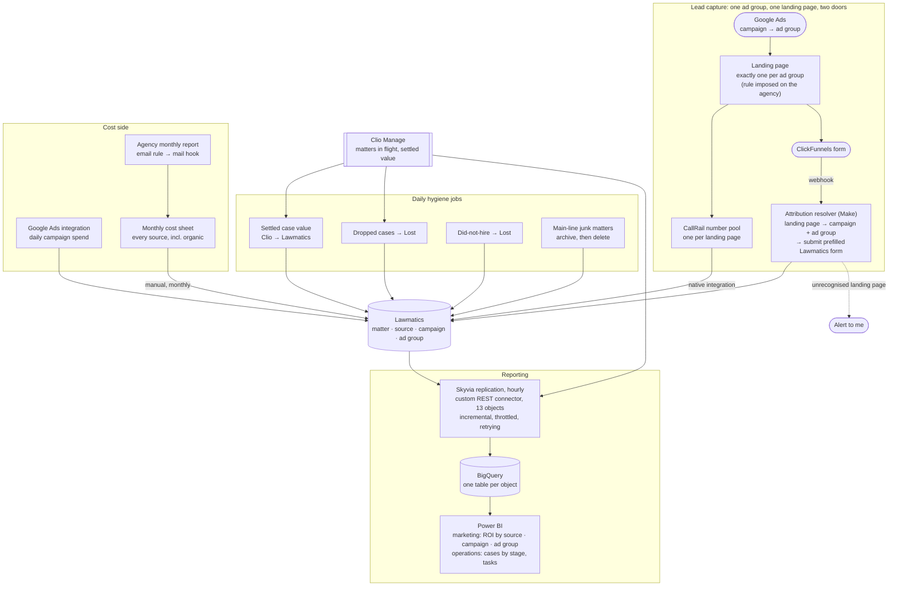

# Marketing Attribution

> A small criminal-defense and personal-injury firm was spending well over half a million
> dollars a year on marketing and could not say which of it produced cases. The fix was not a
> dashboard. It was forcing the firm's own agency to restructure its ad account so that leads
> became attributable at all, then rebuilding the taxonomy, the capture, the cost model and the
> revenue backflow underneath. Paid search went from **no attribution to ad-group-level
> attribution on both the call and the form channel**, with ROI per source in Power BI that the
> owner could act on instead of a slide written by the vendor being evaluated.

## At a glance

| | |
|---|---|
| **Client** | US law firm, criminal defense and personal injury, single office <!-- OPEN: headcount? I only know ~6 people by role (owner, ops/marketing manager, intake specialist, Clio admin, accountant). Small enough that the owner sees every invoice. --> |
| **Domain** | Marketing operations and intake attribution |
| **My role** | Sole engineer, from diagnosis and pitch through to handover |
| **Timeline** | Delivered in workstreams over many months. The ROI attribution piece alone was scoped at 20 to 30 hours across 2 to 3 weeks <!-- OPEN: when did you pick the client up, and what were the start and end dates overall? --> |
| **Stack** | Lawmatics, Clio Manage, Make, Skyvia, BigQuery, Power BI, CallRail, Google Ads, Google LSA, Meta Ads, ClickFunnels, QuickBooks Online, Google Sheets, Google Workspace admin rules |
| **Status** | In production, handed off to a colleague |

---

## 1. Context

The firm practises criminal defense and personal injury out of a single office. Criminal
defense is the larger book. Its cases are priced at intake, because the fee is what the client
agrees to pay. Personal injury is the growth bet, and a PI case is worth nothing definite
until it settles, months or years later.

New business arrives through two doors. People call, or people fill in a form on a landing
page. Everything lands in **Lawmatics**, the intake CRM, where leads are qualified and either
converted or marked lost. The ones that convert move into **Clio Manage**, where the legal
work happens and where a case's real value is eventually recorded.

The firm buys most of its new business. Paid search, local service ads, social, printed ads,
streaming ads, a marketing agency on retainer, and a lead vendor that sells personal injury
cases **already signed** at roughly $3,000 each. <!-- OPEN: confirm the ~$30k/month lead
vendor figure and the ~$20k/month PPC budget cap. Both are from the walkthrough call and I
want them confirmed before they sit in a public repo. -->

## 2. Diagnosis: how I knew this was the problem to solve

The firm named the symptom itself. It was spending heavily across a lot of marketing sources
and could not see which of them worked. What it did not have was a cause, a route to fixing
one, or any sense of how far down the problem went. There was no ticket and no budget line for
this, and it took months of pitching before it became a funded project, because the symptom
sounds like a reporting request and the fix is four layers underneath the reports.

**Why it had stayed unfixed.** A firm that buys its cases and wants to grow has to spend more,
and the question I kept putting in front of them was not "what should we automate", it was
"you are about to spend more, and you cannot tell me what the last spend bought you." That is
a slower sell than a broken workflow, because nothing is visibly on fire. It became fundable
once growth came up as an explicit goal, and a diagnosis with no proposal attached gets nodded
at and forgotten. I had one ready.

**What the evidence said.** Four things, each of which independently broke ROI reporting:

1. **The source taxonomy was unusable.** Roughly **a thousand marketing sources** in
   Lawmatics, because someone had created one source per individual referral partner. Add
   duplicates on top, including three separate sources that all meant paid search. No
   grouping, so no denominator, so no rate of anything.
2. **The ad account had no one-to-one structure, so neither channel could be attributed.**
   This is the root cause, and it sat in the agency's Google Ads setup rather than anywhere in
   the firm's systems. The same landing page was serving several campaigns and ad groups at
   once, so a personal injury ad and a criminal defense ad could deliver a visitor to the same
   page. That page carries one call-tracking number and one form, so both routes into the firm
   arrive identical no matter which ad was paid for. Tracking numbers were reused across
   campaigns on top of that. There was no signal left to attribute on, and the form path made
   it worse by pushing submissions into Lawmatics through an integration that set no UTM
   parameters, so those leads landed with the marketing origin blank.
3. **The revenue side only counted half the firm.** Case value is recorded in Clio Manage and
   never flowed back to Lawmatics, so Lawmatics reported revenue for criminal defense (priced
   at intake) and effectively zero for personal injury. Every PI source looked like it
   produced nothing.
4. **The conversion rates were wrong in the firm's favour.** Cases marked hired and then
   dropped stayed hired. Leads moved into the "did not hire" pipeline kept an open status.
   Both inflate conversion, and both inflate it hardest on the sources sending the weakest
   cases, which is precisely where you need the number to be honest.

**The reports that already existed.** The agency sent a monthly report, and it was vanity
numbers. Impressions, clicks, reach. Nothing connecting a dollar to a signed case, and nothing
the firm could audit, because the agency owned the reporting, the landing pages, the ad
accounts and the analysis of its own performance. The firm was paying a vendor to grade
itself.

That reframes the project. The deliverable is not a dashboard. It is **the firm's ability to
evaluate its own suppliers**, including the agency and including the lead vendor selling
$3,000 pre-signed cases that the firm was quietly dropping later.

**What building the reporting layer then surfaced.** Two of the four problems above I only
found once I started modelling the data for the dashboard. Aggregating the pipeline is what
exposed matters sitting in a did-not-hire stage while still carrying an open status, which is
invisible one record at a time and obvious the moment you count. Building the reporting layer
turned out to be the best diagnostic instrument on the project, which is an argument for
building it earlier than felt justified.

**What I ruled out.** Pulling spend from the ad platforms and the accounting system and
reporting on it outside Lawmatics entirely. It would have been faster and it was the obvious
move. I rejected it because spend is only half the fraction. The other half is signed cases
and their settled value, which live in Lawmatics and Clio, and joining them somewhere else
means maintaining a parallel copy of the firm's operational data to answer a question
Lawmatics already answers once the data underneath it is correct. The principle I held to:

> We could fake the numbers in the dashboard. We want everything as clean as possible instead
> of modifying the information at the point where it gets displayed.

So the work went into the source data, and the reporting layer stayed thin.

## 3. Problem

The firm was spending well over half a million dollars a year to acquire cases and had no
reliable read on which sources produced them. The ad account had no one-to-one structure, so
paid search leads could not be attributed on either the call or the form channel. The source
taxonomy could not be grouped. Personal injury revenue never reached the system doing the
reporting. And the conversion rates that did exist were biased upward by cases that had been
dropped or rejected without being marked as such.

The cost of leaving it alone is not staff hours. It is capital allocation. Every month the
firm renewed a roughly $20,000 paid search budget, a retainer with an agency it suspected was
underperforming, and a lead vendor charging $3,000 a case, on the basis of numbers that were
either wrong or supplied by the vendor being evaluated. Scaling marketing spend without
attribution scales the error.

## 4. Solution

One clean taxonomy, both capture channels attributed against it, spend and settled revenue
landing on the same rows, daily jobs whose only purpose is to stop the data drifting back out
of true, and a Power BI dashboard reading the result.

**Rebuild the taxonomy.** I mapped every existing source to a target model, collapsed the
per-partner sprawl into grouped sources such as referrals and word of mouth, deduplicated paid
search, and added the sources the firm was actually using but had never set up. Then I
exported every historical matter, remapped old sources to new ones, and had the file
reimported so history stayed comparable. I did that remapping by hand rather than handing it
to a model, because a silent mis-map in the historical data poisons every rate the system
later reports and there is no way to notice it happened.

**Restructure the ad account first, because everything else depends on it.** No amount of
integration work fixes a setup where two different ads land on the same page. So the enabling
move was a structural rule imposed on the agency: **one landing page per ad group**, and a
campaign carries several ad groups, which is what buys the granularity. Then **one
call-tracking number per landing page**, which I set up. That single change makes the page
itself the attribution key, and it fixes both channels at once, because on a landing page the
phone number and the form are two doors into the same room.

**Attribute the calls.** Once each landing page has its own tracking number, the only way to
reach that number is to have come through that ad group. Attribution stops being an inference
and becomes a property of the structure. The numbers are dynamic tracking numbers that swap
per visitor, so this had to be one number pool per page rather than one static number.

**Attribute the forms.** The agency's forms live in ClickFunnels, not Lawmatics, so the clean
path (embed a Lawmatics form and let it read the UTM parameters) was closed. Two moves
instead. First, I rebuilt the Lawmatics intake form so attribution could be supplied at
submission time, through a hidden source field, a campaign field and a custom field for ad
group. Second, I negotiated the agency's webhook away from Lawmatics and into a Make scenario,
which reads the landing page off the payload and routes on it. Every route posts to the same
form endpoint. What differs is the body: source is a constant, campaign is the ad group's
parent, and the ad group goes into the custom field. Submitting a real form rather than
writing a record sideways means the CRM runs its normal intake handling, workflows and all.

**Get the real revenue in.** Criminal defense value is already correct at intake. Personal
injury value is only final when Clio says so, so a daily job carries the settled value across,
gated on an explicit "this value is final" checkbox rather than on a stage change or case
closure.

**Stop the metrics lying.** Three jobs, each closing a specific gap: dropped cases get marked
lost, did-not-hire leads get their status corrected, and junk matters created by the firm's
main phone line get archived and deleted.

**Get the costs in, because attribution alone is not ROI.** Knowing a campaign produced eleven
signed cases says nothing until you know what it cost. This turned out to be its own
workstream, because "what does this source cost" has a different answer for every source.
Paid search spend arrives through the native Google Ads integration, which is the one thing
that integration is good for. Agency fees and the ad spend the firm cannot see directly are
parsed out of the agency's monthly report by email. Referral fees and anything that arrives as
a bill come out of the accounting system, by report and by API. Organic channels are costed
rather than counted as free, so the social channel carries the posting time it consumes plus
its design subscription, which I worked out by sitting down with the person who does the
posting and going through her week. Everything lands in a monthly cost sheet that gets keyed
into Lawmatics. That last mile is manual, and §5 explains why it has to be.

**Put a dashboard on it.** Lawmatics' native reporting is the floor. It can only see its own
system, and the questions worth asking span two, so the reporting layer is Power BI over a
BigQuery warehouse fed from both.

Nothing existed to get either system into that warehouse. Skyvia does the replication and had
no connector for Lawmatics, so I wrote one: a declarative REST connector definition covering
thirteen objects, with auth, paging, throttling, retry and incremental-sync rules, replicating
hourly into BigQuery. That definition is the most interesting artifact on the project and it is
the excerpt below.

It runs to five pages, because once the warehouse exists the marginal cost of the next question
is a query rather than a project:

- **Intake overview**, from Lawmatics. The funnel from total leads through qualified to hired,
  with conversion and qualification rates, split by practice area, plus lead volume by month
  and by day of week.
- **Source performance**, the page the attribution work exists to make true. Leads, hires,
  conversion rate and case value by source, by campaign and by ad group, with referral
  partners broken out individually.
- **Intake detail.** Consultations booked, attended, missed and paid, and a full breakdown of
  **why** rejected leads were rejected, separating leads the firm turned down from leads that
  turned the firm down.
- **Matters overview**, from Clio. Open cases by practice area, pipeline funnels per practice
  area, median days to close, and an aging list of the oldest open files, each deep-linking
  back into Clio so the dashboard is a way into the work rather than a read-only artifact.
- **Financials.** Estimated against actual case value, accrued and cash positions by month,
  and average settlement value by lead source, which is the join that turns attribution into a
  buying decision.

<!-- OPEN:
  - Do the costs reach it from the values keyed into Lawmatics monthly, or from the Sheet?
  - Who opens it, how often, and did it fully replace the V1 Lawmatics-native dashboard?
  - The Clio half: custom connector too, or does Skyvia ship one for Clio?
-->

## 5. Architecture



### Key decisions and tradeoffs

| Decision | Why | What I gave up |
|---|---|---|
| **Fix the source data, do not correct at the reporting layer** | A dashboard that compensates for known-bad inputs becomes a second source of truth that silently diverges from the first. Clean statuses in Lawmatics benefit every consumer, not just the report. | Much slower. A presentation-layer fix would have shown a plausible number in days. |
| **Derive campaign and ad group from the landing page** | We control neither the landing pages, the ad accounts, nor the UTM parameters, and the party who does had already declined to help. The landing page is in every payload and cannot be repointed without our routing breaking visibly. | A hard dependency on a page-to-campaign convention that is enforced socially rather than technically. |
| **Gate the case-value sync on an explicit "final" checkbox** | Both alternatives are worse. Triggering on case closure adds months of lag, because the firm only closes a file when it is completely finished. Triggering on a stage change relies on staff updating the value before they move the stage, and lets them skip the stage entirely. | Depends on a human ticking a box. If they never tick it, the value never arrives, and nothing errors. |
| **Write a "migrated" flag back into Clio** | The syncs are daily sweeps over recently-updated records rather than event-driven, so they must be safe to re-run. Flipping a flag on the source record makes the query filter itself the idempotency guard. | A write back into Clio on every sync, and one more field for staff to see and wonder about. |
| **Archive junk matters to a sheet before deleting them** | The firm was nervous about an automation that deletes. The archive costs one step and made the deletion approvable. | Nobody has ever read the archive. It is a trust artifact, and it earns its cost anyway. |
| **Costs entered by hand each month** | Lawmatics has no API for marketing-source costs, and its only alternative is per-campaign daily entry, which for a fixed monthly agency fee means asking a person to divide by thirty and type it in thirty times. | About fifteen minutes of manual work a month, and a dependency on someone remembering. I filed a feature request for the cost endpoint. |
| **Power BI over Lawmatics' native dashboards** | ROI per source is a joined question, and native reporting can only see its own system. It cannot reach Clio for settled case value or the sheet for costs. | A whole extra pipeline to own, for a client with no data team. |
| **Replicate into a warehouse rather than point the BI tool at the API** | The API is paginated at 100 records a page and rate limited to ten requests a second. A BI tool refreshing against that is slow, fragile, and re-fetches everything to answer anything. A warehouse gives SQL, joins against the cost data, and history the API does not keep. | Latency between the CRM and the dashboard, and a second copy of the data to secure. |
| **Custom fields land as a single JSON column** | Users add custom fields in the CRM whenever they like. Flattening them into typed columns means the warehouse schema changes underneath the dashboard every time someone adds a checkbox. Keeping them as JSON makes the schema stable and pushes the unnesting into queries that can be updated deliberately. | Anything inside custom fields costs a JSON extraction to query, and the warehouse cannot type-check it. |
| **Incremental windows overlap on purpose** | The sync filters on updated-since, and the greater-than-or-equals variant carries a one-unit negative delta, so each run re-reads a sliver of the previous window. A duplicate is cheap and detectable downstream. A record that falls in the gap between two windows is invisible forever. | Duplicate rows to handle, which the API produces on its own anyway. |

### Constraints I built inside

- **A key vendor owned the inputs and was also the party being measured.** The agency held the
  landing page platform, the ad accounts and the reporting. Any design that needed their
  cooperation had to survive them not cooperating.
- **Lawmatics has no API for marketing-source costs**, which puts a permanent manual step in
  the middle of an otherwise automated pipeline.
- **Lawmatics fires a given automation once per matter, ever.** A lead that goes lost, comes
  back, and goes lost again does not re-trigger. That single limitation is why the hygiene
  jobs are daily sweeps instead of triggers.
- **The CallRail integration cannot filter by number.** Every call to the tracked main line
  creates a matter, and roughly nine in ten of those are junk, because the firm routed its
  general telephony through it.
- **No off-the-shelf path from Lawmatics into Power BI.** The replication platform has
  connectors for the usual SaaS estate and none for Lawmatics, so the connector had to be
  written before any reporting could start. The API also returns a thin payload by default, so
  the main object has to name all seventy-odd fields it wants explicitly on every request.
- **The API returns occasional duplicate records** for the same primary key. That is upstream
  and not fixable from here, so the warehouse has to tolerate it.
- **Non-technical users throughout.** The people whose behaviour the data quality depends on
  are an intake specialist and an operations manager, so anything that needed doing had to be
  a checkbox on a screen they were already looking at.

### Illustrative excerpt: attributing a form submission with no UTM parameters

*Redacted and simplified. The decision worth showing is deriving attribution from the one
field a hostile-ish upstream cannot quietly change, and making the unmatched case loud.*

In production this is a router tree, one branch per landing page, each with an equality filter
on the page URL. Expressed as a table it reads like this:

```jsonc
// The agency owns the landing pages and sets no UTM parameters, so the page the form was
// submitted on IS the attribution key. Sound only because one page maps to one ad group.
POST /v1/forms/<intake-form-id>/submit          // one form for every route
{
  "first_name": "…", "last_name": "…", "email": "…", "phone": "…",
  "case_blurb": "…",

  "source":   <paid-search-id>,                 // constant on this path, by construction
  "campaign": <campaign-id>,                    // the ad group's parent campaign
  "custom_field_<id>": "<ad group name>"        // the granularity the client actually buys on
}
```

```js
// The fallback branch is the whole reason this survives contact with a vendor that
// changes things without telling anyone.
if (isUnmappedLandingPage(payload.landing_page)) {
  submitForm({ ...payload, source: PAID_SEARCH });   // partial attribution beats none
  notify('Unassigned landing page, review');          // and somebody gets told
}
```

Two things about the fallback. It still creates the lead, because dropping a paying client's
enquiry to protect a reporting field would be the wrong trade by a wide margin. And it
attributes what it can rather than nothing, since the traffic being paid search is known from
the channel even when the campaign is not.

**The part that made this work was not the code.** None of the above is possible while one
landing page serves several ad groups, because then the page identifies nothing. The agency
was doing exactly that, and reusing tracking numbers across campaigns on top of it. Its
position was that it could produce the statistics from its own platforms, which is true and
useless, because those numbers cannot reach Lawmatics where the signed cases are. I had no
commercial leverage over a vendor the firm was paying, so I took it to the firm's owner, who
did, and got **one landing page per ad group** agreed as a standing rule. The routing table
above is a consequence of that negotiation, not a substitute for it.

That rule is also what fixed the phone channel, which is the part worth noticing. Each landing
page carries its own call-tracking number pool, so once pages map one to one onto ad groups,
the number a caller dials identifies the ad group by construction. One structural change
attributed both channels, and neither could have been fixed downstream.

*Second excerpt: the daily value sync, and why it is safe to re-run.*

```js
// Runs daily. Sweeps rather than subscribes, because Lawmatics automations fire once per
// matter for all time, so anything event-driven silently misses the second occurrence.
const candidates = await clio.matters.updatedSince(hoursAgo(24));

for (const m of candidates) {
  if (m.practiceArea !== PERSONAL_INJURY) continue;   // criminal value is correct at intake
  if (!m.actualValueIsFinal) continue;                // the explicit human gate
  if (m.syncedToLawmatics) continue;                  // idempotency: already carried across

  await lawmatics.matters.update(m.lawmaticsId, { actualValue: m.actualValue });
  await clio.matters.update(m.id, { syncedToLawmatics: true });  // flip only after the write lands
}
```

The flag is written to the source system rather than held in the job, so the guard survives
the job being re-run, re-deployed, or run twice in a day after a failed reauthentication.

### Illustrative excerpt: the connector that did not exist

*Redacted and trimmed from thirteen object definitions to one. No credentials appear in the
definition itself, since auth is supplied by the platform at runtime.*

The replication platform had no Lawmatics connector, so the source is described declaratively
and the platform does the fetching. Most of the value is in four rules that have nothing to do
with the data model:

```jsonc
{
  "ProviderConfiguration": {
    "BaseUrl": "https://api.lawmatics.com/v1",
    "AuthorizationType": "AuthorizationToken",
    "AuthorizationToken": { "TokenType": "Header", "TokenName": "Bearer", "HeaderName": "Authorization" },

    // 1. Stay under the API's ceiling rather than discovering it in production.
    "RateLimitThrottling": { "RequestsLimit": 10, "TimeInterval": 1000 },

    // 2. Page by number, and trust the API's own page count rather than
    //    walking until an empty response, which cannot distinguish "done" from "failed".
    "PagingStrategy": {
      "Type": "PageNo", "PageNoParameterName": "page", "PageSizeParameterName": "per_page",
      "PageSize": 100, "StartIndex": 1, "TotalPageCountJPath": "meta.total_pages"
    },

    // 3. Throttling is a guess, so treat 429 as expected rather than exceptional.
    "ErrorHandling": {
      "Failover": {
        "FailoverErrors": ["Too Many Requests", "429", "rate limit"],
        "MaxRetries": 5, "MinDelay": 1000
      }
    }
  },

  "Metadata": { "Objects": [{
    "Name": "Prospects",
    "Url": "/prospects",
    // The API returns a thin payload unless asked otherwise, so every field is named.
    "ConstantParameters": [{ "ParameterName": "fields", "Value": "<70+ fields>" }],
    "Columns": [
      { "Name": "id",              "APIPath": "id",                            "Primary": true },
      { "Name": "source_id",       "APIPath": "relationships.source.data.id"                   },
      { "Name": "campaign_id",     "APIPath": "relationships.campaign.data.id"                 },
      { "Name": "actual_value_cents", "APIPath": "attributes.actual_value_cents", "DbType": "Int64" },

      // Unbounded and user-editable, so it stays JSON. Flattening it would mean the
      // warehouse schema changes every time someone adds a field in the CRM.
      { "Name": "custom_fields",   "APIPath": "attributes.custom_fields",      "DbType": "JsonArray" },

      // 4. Incremental sync, with a deliberate overlap. The >= variant carries a negative
      //    delta so each run re-reads the edge of the last window. Duplicates are cheap and
      //    detectable. A record lost in the gap between two windows is invisible forever.
      { "Name": "UpdatedDate", "APIPath": "attributes.updated_at", "DbType": "DateTime",
        "FilterOperations": [
          { "Operation": "GreaterThan",         "ParameterName": "updatedFrom" },
          { "Operation": "GreaterThanOrEquals", "ParameterName": "updatedFrom", "Delta": -1 }
        ] }
    ]
  }]}
}
```

The lookup objects, sources, campaigns, stages and practice areas, are small enough to declare
as unpaged, which removes a round trip each and a class of paging bug that only shows up when
a list crosses one hundred entries.

That overlap rule in (4) is the decision I would defend hardest. It guarantees duplicates, and
the API produces duplicates of its own regardless, so the warehouse has to tolerate them
either way. Choosing to create more of a problem you already have, in exchange for closing a
silent one, is usually the right trade in a reporting pipeline, because a number that is
slightly double-counted gets questioned and a number that is quietly missing rows does not.

## 6. My involvement

Sole engineer on this client, and the work was mine end to end. <!-- OPEN: confirm the split
below and correct anything I have wrong. -->

**Mine.** Pitching the project and getting it funded. The source taxonomy analysis and target
model. The historical data remap, done by hand. The custom field cleanup on both sides and the
Lawmatics to Clio field mapping, including reworking the intake forms so the conditional logic
collected the new fields at intake instead of leaving staff to chase half of them later. The
lead vendor integration, including its field mapping, workflow carve-outs, and the task
automation around the seven-day window for disputing leads the firm is charged for. The
attribution resolver and every Make scenario. The cost model, including the interviews that
established how each source is actually paid for. The daily sync and hygiene jobs. The
replication connector, the warehouse and the Power BI dashboard. The client relationship,
weekly updates, and the handover.

**On the connector, plainly.** I wrote it by iterating against the live API with a model rather
than from a specification, because there was no specification. Vibe coded, and I would say so
in an interview. It is a declarative definition rather than a program, which is exactly the
shape of problem where that approach holds up: the failure modes are visible on the first run,
the platform validates the schema, and being wrong costs a re-run rather than a bad write. I
would not have built the deletion automation that way.

**How the design work was communicated.** Each workstream was mapped in Figma and walked
through with the client before it was built, which for a non-technical audience is the
difference between approving a change and approving a description of a change. The source
taxonomy rework in particular is impossible to review as a list, and readable as a diagram of
a thousand sources collapsing into a dozen.

**Not mine.** A colleague set Clio Manage up before I took the client over, including its
document templates and task lists, and built the inbound document routing. I worked on top of
that and did not touch it.

**The unglamorous parts.** Most of the difficulty here was not engineering. It was getting a
vendor with no incentive to cooperate to change how it built landing pages, which took several
meetings and eventually the owner's involvement. It was persuading a firm that had been burned
by bad reporting to accept an automation that deletes records, which is what the archive step
is for. And it was months of pitching a project nobody had asked for.

## 7. Impact

| | Before | After |
|---|---|---|
| **Attribution granularity** | None on paid search. Two different ads could deliver a visitor to the same page, the same number and the same form | **Source, campaign and ad group**, on both the call and the form channel |
| Marketing sources in Lawmatics | ~1,000, one per referral partner, plus duplicates | A grouped taxonomy, deduplicated, with historical matters remapped onto it |
| Form-submitted leads carrying source and campaign | None | Every one, carried by which prefilled form the router submits |
| Personal injury revenue visible to ROI reporting | None. Only criminal defense, priced at intake | Settled PI value synced back from Clio daily on an explicit final-value gate |
| Conversion rates | Overstated, since dropped and rejected cases kept their prior status | Corrected daily by the hygiene jobs |
| Cost per source | Known only for paid search | Every source carries a cost, including organic ones costed at the time they consume |
| Reporting | The agency's monthly report, on impressions and clicks | Power BI over an hourly warehouse: ROI and conversion by source, campaign and ad group, plus rejection reasons |
| Basis for evaluating the agency and the lead vendor | The vendors' own reports | The firm's own data |

The row that matters is the first one. The firm went from being unable to attribute a paid
search lead at all to attributing it down to the ad group, which is the level at which spend
decisions actually get made.

**What it surfaced in the first pass.** A reporting layer earns its keep by changing someone's
mind, and joining case value onto lead source put three questions in front of the owner that
he could not previously have asked:

- **The pre-signed case vendor looks inverted.** Its leads convert well, which is what you
  would expect from cases that arrive already signed, but the average settlement value on that
  source came out roughly an order of magnitude below the roughly $3,000 the firm pays per
  lead. That number needs a caveat before anyone acts on it, because personal injury cases take
  a long time to close and this cohort is young, so recent sources are structurally
  understated. The point is not that the dashboard produced a verdict. It produced the first
  version of the question that had ever been answerable, on a line item costing tens of
  thousands a month.
- **The largest single reason for rejecting a lead is that the firm does not offer the
  service.** It accounts for over 40% of rejections. That is not an intake problem, it is a
  media buying problem, and it is invisible until rejection reasons are counted against the
  source that produced them.
- **Around one lead in ten is invalid**, spam, a wrong number or an internal test. Worth
  knowing before quoting a cost per lead to anyone.

<!-- OPEN: the three findings above are read off the dashboard, not off a decision. If any of
them actually changed the spend, that is the sentence this section wants. -->

<!-- OPEN: the firm's absolute financials (total case value, open matter counts, lead volumes)
are all on the dashboard and I have deliberately kept them out, using ratios instead. Say if
you are comfortable publishing any of the absolutes and I will put the strongest ones back. -->

**A finding outside the brief.** The Clio half of the dashboard showed the case-management task
backlog running at roughly four fifths overdue. That is nothing to do with marketing
attribution and I was not asked to look at it. It is the kind of thing a reporting layer hands
you for free once the data is in one place, and it is worth saying out loud to a client even
when it is not billable, because it is a bigger operational risk than anything on the marketing
page.

<!-- OPEN: the table above is a capability change, which is real and defensible. What would
make this section land is a business outcome on top of it:
  - Did it change a spend decision? A campaign or ad group cut or scaled on these numbers, the
    lead vendor evaluated at month six or nine, the agency contract not renewed. One decision
    made on this data beats any percentage.
  - Conversion rate before vs after the hygiene jobs, if both are visible.
  - Junk matters deleted per week.
  - Lead-dispute recovery: did the seven-day task automation actually save chargebacks, and
    roughly how much? At $3,000 a lead that could be the single best number in the study.
  - Dashboard adoption: who opens it, how often.
If none of it was measured, say so and I will write one honest qualitative line instead. -->

## 8. What I'd do differently

- **The routing table encodes a convention I do not control.** Every entry depends on the
  agency keeping one landing page per ad group. The alert on an unrecognised page is a good
  tripwire, and it is still only a tripwire. I would push much harder and much earlier for the
  firm to own the landing page platform under its own account, which is the dependency the
  firm later had to start unwinding anyway.
- **A hand-maintained routing table drifts, and mine did.** Reviewing it later turned up a
  landing page used as the filter on two different branches, so submissions from it create two
  leads under two different ad groups; two branches carrying an ad group label copied from the
  branch above and never changed, so a personal injury page reports as a criminal defense ad
  group; and one entry whose subdomain does not match the same page in the catch-all's
  exclusion list, so that page both matches its branch and falls through to the fallback,
  producing a duplicate lead and a false alert. None of these announce themselves, because
  every one of them still creates a lead. The lesson is that a routing table assembled by hand,
  branch by branch, needs a test that asserts the obvious invariants: every filter value
  appears exactly once, every branch's label matches its route, and the catch-all's exclusion
  list is exactly the set of mapped pages. That check is a few lines and I never wrote it.
- **Debug instrumentation outlived its purpose.** The scenario emails the full payload of every
  lead to me, which was right while I was verifying the routing and wrong the day after. It is
  still on, so a copy of every enquirer's name, phone, email and case description accumulates
  in an inbox that is not the system of record and is not covered by the client's retention
  rules. Temporary monitoring needs an expiry date attached at the moment it is added.
- **I over-engineered the cost ingestion.** Parsing the agency's monthly report out of email,
  finding the right month's column and writing two cells into a copied sheet is a lot of
  machinery to save someone copying two numbers. It has more ways to break than the manual
  step it replaced.
- **The "value is final" checkbox is a silent failure mode.** If nobody ticks it, nothing
  errors and the case value simply never arrives. It needs a companion report of settled cases
  sitting unflagged, so the gap is visible rather than absent.
- **Deleting junk matters fights the users.** When staff merge a newly created matter into an
  existing one, the merged record can inherit the new matter's identity and get deleted by a
  job that was right to fire. I patched it with a "created today" guard, which narrows the
  window without closing it. The real fix is upstream, in whether the general phone line
  should have been routed through call tracking at all.
- **I should have built the dashboard first.** Two of the four data-quality problems were only
  visible in aggregate, and I found them late because I treated reporting as the last step
  rather than as the instrument that shows you what is wrong.
- **The connector pulls fields the warehouse has no business holding.** The field list on the
  main object was written to be exhaustive, so it includes social security number, driver
  licence and date of birth, which are replicated into the warehouse and are not used by a
  single measure on the dashboard. Exhaustive is the wrong default when the destination is a
  copy of the data outside the system of record. The field list should name what the reporting
  needs and nothing else.

---

<details>
<summary>Evidence</summary>

<!-- Candidates, all needing a redaction pass:
     - The source mapping sheet, old taxonomy to new (redact referral partner names)
     - The Make scenario canvas showing the campaign routers (redact campaign names, which
       contain the practice area and the state)
     - The monthly cost sheet (redact vendor names, or redact spend, not neither)
     - The Power BI dashboard, ROI by source view (redact spend and vendor names)
     Check every image for: firm name, staff names, vendor names, campaign names containing
     the city or state, tracking phone numbers, real spend figures, client names. -->

Not yet added.

</details>
