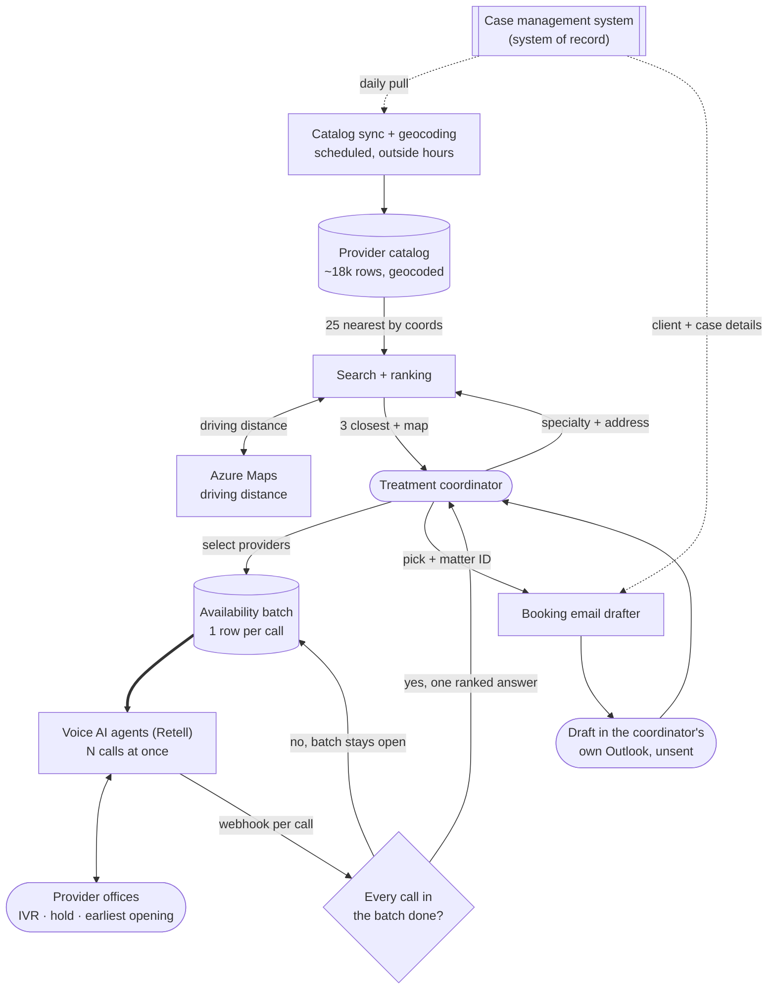

# Medical Provider Selection and Booking

> A provider search and booking app for the treatment team at a 400-person personal injury firm.
> It ranks an ~18,000-provider directory by driving distance from the client's home, sends voice
> AI agents to phone the shortlist for their earliest appointment, and drafts the booking email.
> Choosing providers was costing the 65-person team **~350–440 staff-hours a week**.

## At a glance

| | |
|---|---|
| **Client** | Plaintiff-side personal injury firm, ~400 staff, ~$50M annual revenue (US) |
| **Domain** | Treatment coordination. Following a client's post-accident care, booking the appointments a doctor recommends, chasing the bills and records afterwards |
| **My role** | Co-owned the idea and the diagnosis. Sole engineer on the implementation, end to end. Change management was the client's, by agreement |
| **Timeline** | 6 weeks, first client conversation to rollout, alongside nine other solutions from the same audit |
| **Stack** | React/TypeScript Code App on Microsoft Power Platform, Dataverse, Power Automate, Azure Maps, Retell AI (voice), Copilot Studio, Outlook, Teams |
| **Status** | Completed and rolled out <!-- OPEN: in production since when, and how many coordinators use it? --> |

---

## 1. Context

The firm runs plaintiff-side personal injury cases across a ~400-person operation. A client's
medical treatment runs for months alongside the legal case, and how fast they get the right care
shapes their recovery and what the case is worth.

The treatment team, about 65 people, owns that side of the file. When a doctor recommends a
procedure or a specialist they find a provider and book the appointment. They also follow the
client through treatment, checking that they are going and that the care is working, and chase the
bills and records back from each office afterwards. Booking is the largest single piece of that
job rather than all of it.

Provider choice is not clerical. The firm cares how fast a case moves, so the earliest opening is
usually the right one. And these providers treat on a lien, paid out of the eventual settlement,
so how much a provider historically reduces its bill affects what the client keeps.

One of roughly ten solutions delivered as a single program off one audit of the firm. Another, a
[voice agent that opens claims with carriers](../fnol-voice-agent), came from the claims
department next door.

## 2. Diagnosis: how I knew this was the problem to solve

**The method was shadowing.** Elsewhere in the audit the findings came from interviews down the
management ladder. Ask a coordinator how they choose a provider, though, and you get a reasonable
two-line answer, because the cost is in the clicking either side of the decision and nobody
narrates their own clicking. So we sat and watched.

**What the screen required.** The case management system holds a contact directory of roughly
**18,000 providers**, filterable by specialty and nothing else. No coordinates, no map, no
distance sort. To answer "who is near this client", a coordinator filtered to the specialty,
scrolled the list, copied the client's address into Google Maps, copied a candidate provider's
address in after it, read off the distance, and repeated for the next candidate. Having narrowed
that to the best few matches, they phoned those offices for each one's earliest availability,
because the earliest opening moves the case fastest. Sequential calls, one office at a time,
through an IVR and a hold queue each.

**Nobody could say which providers to avoid.** The directory has a do-not-use checkbox and staff
were never instructed to use it, so they flagged bad providers by typing a DNU note onto the
record instead. A note carries nothing that tells you whether it is still true, and the few
providers actually ticked were stale for the same reason. The exclusion data was not missing. It
was contradictory, and contradictory data still gets acted on.

**The reframe.** The ask was reasonable and we built it. Make the list easier to search, keep the
directory centralised in the case management system where the firm already maintains it. The team
needed a third thing on top. A directory answers what the firm knows about a provider. The
coordinator's question is which of 18,000 is the best choice for *this* client today, which
resolves against four variables at once: driving distance, whether the provider is excluded, how
much it tends to reduce its bill, and how much of the firm's caseload already sits with it. A
contact list does not rank against a specific client, so the records stay where they are and a
daily mirror does the ranking.

Ranking still leaves the calls. A person holds one line at a time, so three ten-minute calls is
thirty minutes of wall clock. No single call is slow. They cannot overlap.

**What I ruled out** is letting the voice agent book on the call. Policy requires the request in
writing, it usually carries the client's previous records as attachments, and the thread is what
the coordinator follows up on weeks later. So the call settles availability, and the system writes
the email itself.

<!-- Asked Lara 2026-08-13 for other alternatives evaluated and rejected; nothing further to add
for now. Leave this as-is rather than padding it with plausible-sounding options. -->

## 3. Problem

Choosing a provider meant scrolling a specialty slice of an 18,000-row directory with Google Maps
open in a second tab, then a sequential call to each shortlisted office. The exclusion data
contradicted itself, so quality depended on which coordinator was doing it. Every one of those
steps sat between an injured client and the treatment that both their recovery and the case value
depend on.

**What it cost, on conservative numbers.** Treatment runs for months, so one case is not one
appointment. Across a case the team picks a provider and phones around roughly **6 times** and
drafts around **30 booking emails**. The firm takes in **~100–125 new cases a week** and finishes
about as many as it starts, so weekly volume is per-case volume times intake:

| | |
|---|---|
| Provider selections per week | ~600–750 (~6 per case, ~100–125 new cases) |
| Searching the directory | ~15 min per selection, **~150–190 hours a week** |
| Availability calls | ~2 per selection at ~10 min, **~200–250 hours a week** |
| **Combined** | **~350–440 hours a week** |
| Booking emails drafted | ~3,000–3,750 a week |

That is about **35 minutes per selection** and **3.5 hours per case** before a single appointment
is booked. Against the team's ~2,600 weekly hours of capacity, provider selection was taking **13%
to 17% of the department**, or nine to eleven people doing nothing but scrolling a directory,
pasting addresses into Google Maps, working phone trees and sitting on hold. None of it required
clinical or legal judgment, and every figure above is the low end of what shadowing showed.

<!-- Units confirmed with Lara 2026-08-13, do not re-derive: ~6 selections per case, ~2 calls
per selection, ~30 emails per case, ~15 min per search. Estimates, not stopwatch figures.
OPEN: ~100-125 new cases/week is the claims department's measured intake, reused on Lara's
confirmed assumption that treaters see the same cases. Every weekly figure scales off it. -->

## 4. Solution

An app in Teams that ranks providers against the client's address, phones the shortlist with voice
AI agents to get their earliest availability, and drafts the booking email into the coordinator's
own outbox.

Two scheduled jobs keep it current outside working hours. One mirrors the provider catalog from
the case management system, with the do-not-use flag, open and total case counts and average bill
reduction. The other geocodes new and changed addresses. A provider added upstream today is in the
app tomorrow.

Then a coordinator:

1. **Searches.** Pick the specialty, enter the client's address. The app returns the three
   closest providers by driving distance, plus every provider of that specialty on a map. Gold
   pins for the top picks, blue for other active providers, black for do-not-use. Each shows its
   driving distance, average bill reduction, and the firm's caseload with it.
2. **Checks availability.** Select one provider or several, add one that is not in the catalog,
   ask the agent to confirm the office performs the procedure before it asks about dates, and
   attach constraints such as nothing before Monday or no morning slots.
3. **Gets one answer.** Every selected office is phoned at the same time. The agent works the
   IVR, holds, and asks for the earliest opening. One request returns one ranked result, once
   every call in it has finished. Results expire after six hours, because slots go.
4. **Books.** Pick a provider and enter the matter ID. A flow pulls the client and case details
   from the case management system, an LLM step composes the request, and the draft lands in the
   coordinator's own Outlook. They read it and send it.

If they already know which provider they want, they skip the calls and go straight to the draft.

**How the do-not-use problem got fixed.** The checkbox became the only way to mark a provider,
with documentation and training on how to use it, so the loose notes stop accumulating and the
field gets cleaned up in the case management system and then in the app's copy of it. And ticking
it now does something: the provider is never recommended, drops to the bottom of the results in
its own group, and turns black on the map. Hiding it would look tidier and would tell a
coordinator nothing when they went looking for a provider they know exists.

## 5. Architecture



### Key decisions and tradeoffs

| Decision | Why | What I gave up |
|---|---|---|
| **Rank on driving distance, but shortlist the 25 nearest by coordinates first and route only those** | A provider two miles away across a river with no crossing for six is not the nearest provider, and a coordinator would have caught that and stopped trusting the tool. Routing all ~18,000 per search is unaffordable, so coordinate proximity is the cheap filter and driving distance decides the ranking. | A paid routing call per candidate, latency in the search, and an edge case where the best drive sits outside the 25 nearest as the crow flies. |
| **The do-not-use flag stays upstream, and excluded providers are shown rather than hidden** | One source of truth, maintained where the team already maintains provider records. A provider at the bottom of the list in black tells a coordinator it was excluded. One that is simply absent tells them nothing. | The app cannot fix a bad flag in place, and a correction waits for the next sync. |
| **One row per call, grouped by a batch ID, and nothing notifies until every row is terminal** | Four notifications for a four-provider request makes the coordinator do the collation. | Per-call results are invisible until the slowest office is done. |
| **Confirm by phone, book by email** | Policy requires the request in writing, it usually carries the client's previous records as attachments, and the thread is what the coordinator follows up on weeks later. A booking agreed on a call produces none of that. | Not end to end. |
| **The draft lands in the requester's own Outlook and is never sent** | This is where I put the human review. The alternative was a review screen in the app and then an automatic send, which is a second place to learn and a worse way to read an email. Checking a draft in your own outbox is something coordinators do all day. | A step that could have been automated stays manual. |
| **A provider missing from the catalog can be added ad hoc, for that one request** | The catalog is a daily mirror, so adding a provider upstream does not make it usable until tomorrow, and a coordinator with an appointment to book cannot wait a day. They can reach any provider immediately, and are trained to add it upstream in parallel so it syncs overnight and becomes permanent. | Ad-hoc providers are not reusable until they sync. |

That last row is the opposite of the claims-side agent's rule, where staff cannot add an insurance
carrier in the app at all. Both follow from one principle and differ on latency. That solution
reads the case management system live, so a carrier added upstream is available minutes later and
an in-app shortcut would only start a second source of truth. Here the mirror is a day behind, so
the same rule would mean telling a coordinator to wait a day to make a call.

### Constraints I built inside

- **The exclusion problem was organisational.** The design had to make an existing, ignored field
  authoritative rather than replace it, or the same drift would have restarted in a new column.
- **Non-technical users.** Treatment coordinators, not analysts. The surface is a search box, a
  map and two buttons.
- **Built inside the firm's existing Microsoft estate**, with access by existing security group
  membership. No new logins for IT to learn.

### Illustrative excerpt: the batch completion gate

*Redacted, with table and column names replaced. This is what makes an unbounded number of calls
behave like one request.*

```js
// Post-call webhook. Fires once per completed call, so N times for an N-provider request.
const call = await findCallByVoiceCallId(payload.call_id);

if (!reachedAHuman(payload)) {
  // Offices are busy, and a hold queue that times out is not a failed provider.
  if (call.attempts < MAX_ATTEMPTS) {          // MAX_ATTEMPTS = 3
    return placeCallAgain(call);               // row stays pending, no notification
  }
  return markTerminal(call, 'no_human_reached');
}

await markTerminal(call, 'success', {
  earliestAvailability: payload.extracted.earliest_date,
  procedureOffered:     payload.extracted.performs_procedure,
});

// The gate. Every call started together shares a batch ID, so completion is a
// question about siblings, not about this call.
const siblings = await findCallsInBatch(call.batchId);
if (siblings.some(isStillPending)) return;     // someone is still on hold

await notifyRequester(call.batchId, siblings); // one card, all providers, ranked
```

A slow office cannot trigger a premature "here are your results", and a retry stays invisible,
because a pending row keeps the batch open rather than reporting a failure. The claims-side agent
runs the same model against the same status option set, so ten solutions on one platform share one
vocabulary for "this thing finished".

## 6. My involvement

**Nobody asked for this one.** It came out of shadowing a department to find out where its time
went. The idea and the diagnosis were co-owned, including the shadowing sessions and the finding
that an existing ignored field, rather than a new one, was the fix for provider exclusion.

**The implementation was mine alone**, everything from that observation to a deployed app: the
data model and the two scheduled jobs; the ranking approach that shortlists on coordinates before
paying for driving distance; the React app, the map and the comparison interface; the voice agent
and its prompt, the per-call row model and the batch completion gate; and the booking-email flow.
Six weeks from the first client conversation to rollout, alongside nine other solutions.

**What I did not own: change management.** Training the coordinators and driving adoption were the
client's by agreement. The one design choice here that ran on human behaviour rather than code was
the do-not-use flag, and it needed staff to be trained to use it. That training was somebody
else's to deliver, and it happened (see §7). Measurement sat with the same people, which is why no
after-state numbers came back to me.

<!-- OPEN: did you write the three handover docs this was drawn from (user guide, maintenance
runbook, architecture)? Worth claiming above if so. Not asserted because I do not know. -->

## 7. Impact

| Metric | Before |
|---|---|
| Provider directory | ~18,000 records, specialty filter only. No coordinates, no map, no distance sort |
| How distance was found | Two addresses pasted into Google Maps, per candidate |
| Which providers to avoid | Stale ticks, undated notes, individual memory |
| **Cost of choosing providers** | **~350–440 hours a week, 13% to 17% of the 65-person team's capacity** |

**What the design changes, mechanically.** The 150 to 190 weekly hours of searching went on
reading a list and driving a second browser tab to answer a question the data could answer
directly. A specialty and an address now return the three closest by driving distance. The 200 to
250 hours of calling went on hold music and phone trees, and the agent absorbs almost all of it.
Because the calls go out at once, the wall clock is the slowest call rather than the sum, so
checking six providers costs about what checking one costs. Six offices used to be an hour, so
nobody did it.

**The one outcome I can report.** The do-not-use checkbox is now the only way to mark a provider,
staff were trained on it, and it is the single source of truth. The tempting fix was a new
exclusion flag inside the new app, which would have been faster to build and would have failed the
same way, because the old field was never ignored for lack of a better field.

**What was not measured.** Nothing was measured after rollout. No count of appointments booked, no
agent reach rate, no change in time-to-first-appointment, no adoption figure. The before-state
numbers come from shadowing and the estimates in §3, and everything after that is mechanical,
meaning it follows from how the system works rather than from watching it work.

## 8. What I'd do differently

- **The deploy can silently ship the previous build.** A type error leaves the output directory
  untouched while the push step reports success and uploads the stale bundle. The runbook tells
  the operator to read the build output first, which is a documented workaround for something the
  pipeline should refuse to do.
- **Search is specialty-gated, so a provider with no specialty is unreachable.** The row exists,
  it syncs, it geocodes, and no search can return it. That should surface as a data-quality
  warning instead of living in a troubleshooting table.
- **The "draft ready" notification depends on the user having installed the bot.** The draft is in
  Outlook either way, but someone waiting for a card that will never arrive cannot know that.
- **The specialty mapping refresh is manual.** The lookup that gates all search depends on someone
  remembering to run it. It belongs on the same schedule as the other two jobs.
- **I built the thing and then could not tell you what it did.** Change management was the
  client's by agreement and I treated measurement as part of it, so no after-state numbers came
  back, even though quantifying the before state was the whole basis for building this. Next time
  the instrumentation goes in the build rather than the handover.
- <!-- OPEN: yours, on the technical side. Anything that actually frustrated you, or that you
  would rebuild? The Azure Maps cost model, the map component, the 25-provider cap, the
  six-hour expiry window, the scheduled-mirror approach to the provider catalog? -->

---

<details>
<summary>Evidence</summary>

<!-- Candidates, needing redaction first: the search screen (ranked list beside the map) is the
     best single artifact, since the diagnosis is "they could not see this"; a do-not-use
     provider at the bottom in black; a multi-provider result; a booking draft. Use a demo
     address. Check every image for firm name, provider names, client names and addresses,
     matter IDs, dates of loss, dollar figures, PHI. Provider names are this project's specific
     risk, since a real clinic name is identifying even though it is not the client. -->

Not yet added.

</details>
