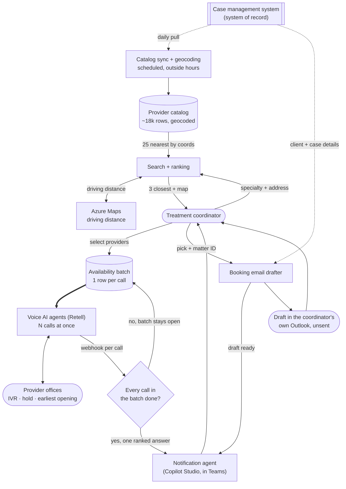

# Medical Provider Selection and Booking

> A provider search and booking app for the treatment team at a 400-person personal injury firm.
> It ranks an ~18,000-provider directory by driving distance from the client's home, sends voice
> AI agents to phone the shortlist for their earliest appointment, and drafts the booking email.
> Choosing providers was costing the 65-person team **~350–440 staff-hours a week**.

## At a glance

| | |
|---|---|
| **Client** | Plaintiff-side personal injury firm, ~400 staff, ~$50M annual revenue (US) |
| **Domain** | Treatment coordination. Following a client's post-accident care, booking the appointments a doctor recommends, chasing the bills and records afterwards |
| **My role** | Co-owned the idea and the diagnosis. Sole engineer on the implementation, end to end. Change management was the client's, by agreement |
| **Timeline** | 6 weeks, first client conversation to rollout, alongside nine other solutions from the same audit |
| **Stack** | React/TypeScript Code App on Microsoft Power Platform, Dataverse, Power Automate, Azure Functions, Azure Maps, Retell AI (voice), Copilot Studio, Outlook, Teams |
| **Status** | Completed and rolled out <!-- OPEN: in production since when, and how many coordinators use it? --> |

---

## 1. Context

The firm runs plaintiff-side personal injury cases across a ~400-person operation. A client's
medical treatment runs for months alongside the legal case, and how fast they get the right care
shapes their recovery and what the case is worth.

The treatment team, about 65 people, owns that side of the file. When a doctor recommends a
procedure or a specialist they find a provider and book the appointment. They also follow the
client through treatment, checking that they are going and that the care is working, and chase the
bills and records back from each office afterwards. Booking is the largest single piece of that
job rather than all of it.

Provider choice is not clerical. The firm cares how fast a case moves, so the earliest opening is
usually the right one. And these providers treat on a lien, paid out of the eventual settlement,
so how much a provider historically reduces its bill affects what the client keeps.

One of roughly ten solutions delivered as a single program off one audit of the firm. Another, a
[voice agent that opens claims with carriers](../fnol-voice-agent), came from the claims
department next door.

## 2. Diagnosis: how I knew this was the problem to solve

**The method was shadowing.** Elsewhere in the audit the findings came from interviews down the
management ladder. Ask a coordinator how they choose a provider, though, and you get a reasonable
two-line answer, because the cost is in the clicking either side of the decision and nobody
narrates their own clicking. So we sat and watched.

**What the screen required.** The case management system holds a contact directory of roughly
**18,000 providers**, filterable by specialty and nothing else. No coordinates, no map, no
distance sort. To answer "who is near this client", a coordinator filtered to the specialty,
scrolled the list, copied the client's address into Google Maps, copied a candidate provider's
address in after it, read off the distance, and repeated for the next candidate. Having narrowed
that to the best few matches, they phoned those offices for each one's earliest availability,
because the earliest opening moves the case fastest. Sequential calls, one office at a time,
through an IVR and a hold queue each.

**Nobody could say which providers to avoid.** The directory has a do-not-use checkbox and staff
were never instructed to use it, so they flagged bad providers by typing a DNU note onto the
record instead. A note carries nothing that tells you whether it is still true, and the few
providers actually ticked were stale for the same reason. The exclusion data was not missing. It
was contradictory, and contradictory data still gets acted on.

**The reframe.** The ask was reasonable and we built it. Make the list easier to search, keep the
directory centralised in the case management system where the firm already maintains it. The team
needed a third thing on top. A directory answers what the firm knows about a provider. The
coordinator's question is which of 18,000 is the best choice for *this* client today, which
resolves against four variables at once: driving distance, whether the provider is excluded, how
much it tends to reduce its bill, and how much of the firm's caseload already sits with it. A
contact list does not rank against a specific client, so the records stay where they are and a
daily mirror does the ranking.

Ranking still leaves the calls. A person holds one line at a time, so three ten-minute calls is
thirty minutes of wall clock. No single call is slow. They cannot overlap.

**What I ruled out** is letting the voice agent book on the call. Policy requires the request in
writing, it usually carries the client's previous records as attachments, and the thread is what
the coordinator follows up on weeks later. So the call settles availability, and the system writes
the email itself.

<!-- Asked Lara 2026-08-13 for other alternatives evaluated and rejected; nothing further to add
for now. Leave this as-is rather than padding it with plausible-sounding options. -->

## 3. Problem

Choosing a provider meant scrolling a specialty slice of an 18,000-row directory with Google Maps
open in a second tab, then a sequential call to each shortlisted office. The exclusion data
contradicted itself, so quality depended on which coordinator was doing it. Every one of those
steps sat between an injured client and the treatment that both their recovery and the case value
depend on.

**What it cost, on conservative numbers.** Treatment runs for months, so one case is not one
appointment. Across a case the team picks a provider and phones around roughly **6 times** and
drafts around **30 booking emails**. The firm takes in **~100–125 new cases a week** and finishes
about as many as it starts, so weekly volume is per-case volume times intake:

| | |
|---|---|
| Provider selections per week | ~600–750 (~6 per case, ~100–125 new cases) |
| Searching the directory | ~15 min per selection, **~150–190 hours a week** |
| Availability calls | ~2 per selection at ~10 min, **~200–250 hours a week** |
| **Combined** | **~350–440 hours a week** |
| Booking emails drafted | ~3,000–3,750 a week |

That is about **35 minutes per selection** and **3.5 hours per case** before a single appointment
is booked. Against the team's ~2,600 weekly hours of capacity, provider selection was taking **13%
to 17% of the department**, or nine to eleven people doing nothing but scrolling a directory,
pasting addresses into Google Maps, working phone trees and sitting on hold. None of it required
clinical or legal judgment, and every figure above is the low end of what shadowing showed.

<!-- Units confirmed with Lara 2026-08-13, do not re-derive: ~6 selections per case, ~2 calls
per selection, ~30 emails per case, ~15 min per search. Estimates, not stopwatch figures.
OPEN: ~100-125 new cases/week is the claims department's measured intake, reused on Lara's
confirmed assumption that treaters see the same cases. Every weekly figure scales off it. -->

## 4. Solution

An app in Teams that ranks providers against the client's address, phones the shortlist with voice
AI agents to get their earliest availability, and drafts the booking email into the coordinator's
own outbox.

Two scheduled jobs keep it current outside working hours. One mirrors the provider catalog from
the case management system, with the do-not-use flag, open and total case counts and average bill
reduction. The other geocodes new and changed addresses. A provider added upstream today is in the
app tomorrow.

Then a coordinator:

1. **Searches.** Pick the specialty, enter the client's address. The app returns the three
   closest providers by driving distance, plus every provider of that specialty on a map. Gold
   pins for the top picks, blue for other active providers, black for do-not-use. Each shows its
   driving distance, average bill reduction, and the firm's caseload with it.
2. **Checks availability.** Select one provider or several, add one that is not in the catalog,
   ask the agent to confirm the office performs the procedure before it asks about dates, and
   attach constraints such as nothing before Monday or no morning slots.
3. **Gets one answer.** Every selected office is phoned at the same time. The voice agent works
   the IVR, holds, and asks for the earliest opening. One request returns one ranked result once
   every call in it has finished, and a Copilot agent messages the coordinator in Teams when it is
   ready. Results expire after six hours, because slots go.
4. **Books.** Pick a provider and enter the matter ID. A flow pulls the client and case details
   from the case management system, an LLM step composes the request, and the draft lands in the
   coordinator's own Outlook. The same Copilot agent says when it is there. They read it and send
   it.

If they already know which provider they want, they skip the calls and go straight to the draft.

**How the do-not-use problem got fixed.** The checkbox became the only way to mark a provider,
with documentation and training on how to use it, so the loose notes stop accumulating and the
field gets cleaned up in the case management system and then in the app's copy of it. And ticking
it now does something: the provider is never recommended, drops to the bottom of the results in
its own group, and turns black on the map. Hiding it would look tidier and would tell a
coordinator nothing when they went looking for a provider they know exists.

## 5. Architecture



### Key decisions and tradeoffs

| Decision | Why | What I gave up |
|---|---|---|
| **Rank on driving distance, but shortlist the 25 nearest by coordinates first and route only those** | A provider two miles away across a river with no crossing for six is not the nearest provider, and a coordinator would have caught that and stopped trusting the tool. Routing all ~18,000 per search is unaffordable, so coordinate proximity is the cheap filter and driving distance decides the ranking. | A paid routing call per candidate, latency in the search, and an edge case where the best drive sits outside the 25 nearest as the crow flies. |
| **The do-not-use flag stays upstream, and excluded providers are shown rather than hidden** | One source of truth, maintained where the team already maintains provider records. A provider at the bottom of the list in black tells a coordinator it was excluded. One that is simply absent tells them nothing. | The app cannot fix a bad flag in place, and a correction waits for the next sync. |
| **One row per call, grouped by a batch ID, and nothing notifies until every row is terminal** | Four notifications for a four-provider request makes the coordinator do the collation. | Per-call results are invisible until the slowest office is done. |
| **Confirm by phone, book by email** | Policy requires the request in writing, it usually carries the client's previous records as attachments, and the thread is what the coordinator follows up on weeks later. A booking agreed on a call produces none of that. | Not end to end. |
| **The draft lands in the requester's own Outlook and is never sent** | This is where I put the human review. The alternative was a review screen in the app and then an automatic send, which is a second place to learn and a worse way to read an email. Checking a draft in your own outbox is something coordinators do all day. | A step that could have been automated stays manual. |
| **A provider missing from the catalog can be added ad hoc, for that one request** | The catalog is a daily mirror, so adding a provider upstream does not make it usable until tomorrow, and a coordinator with an appointment to book cannot wait a day. They can reach any provider immediately, and are trained to add it upstream in parallel so it syncs overnight and becomes permanent. | Ad-hoc providers are not reusable until they sync. |

That last row is the opposite of the claims-side agent's rule, where staff cannot add an insurance
carrier in the app at all. Both follow from one principle and differ on latency. That solution
reads the case management system live, so a carrier added upstream is available minutes later and
an in-app shortcut would only start a second source of truth. Here the mirror is a day behind, so
the same rule would mean telling a coordinator to wait a day to make a call.

### Constraints I built inside

- **The exclusion problem was organisational.** The design had to make an existing, ignored field
  authoritative rather than replace it, or the same drift would have restarted in a new column.
- **Non-technical users.** Treatment coordinators, not analysts. The surface is a search box, a
  map and two buttons.
- **Built inside the firm's existing Microsoft estate**, with access by existing security group
  membership. No new logins for IT to learn.

### Illustrative excerpt: the batch completion gate

*Logic taken off the Power Automate flow and written as code for readability, with table and
column names replaced. It is what makes an unbounded number of calls behave like one request.*

```js
// Post-call webhook. Fires once per completed call, so N times for an N-provider request.
const call = await findCallByVoiceCallId(payload.call_id);

if (!reachedAHuman(payload)) {
  // Offices are busy, and a hold queue that times out is not a failed provider.
  if (call.attempts < MAX_ATTEMPTS) {          // MAX_ATTEMPTS = 3
    return placeCallAgain(call);               // row stays pending, no notification
  }
  return markTerminal(call, 'no_human_reached');
}

await markTerminal(call, 'success', {
  earliestAvailability: payload.extracted.earliest_date,
  procedureOffered:     payload.extracted.performs_procedure,
});

// The gate. Every call started together shares a batch ID, so completion is a
// question about siblings, not about this call.
const siblings = await findCallsInBatch(call.batchId);
if (siblings.some(isStillPending)) return;     // someone is still on hold

await notifyRequester(call.batchId, siblings); // agent posts one card, all providers, ranked
```

A slow office cannot trigger a premature "here are your results", and a retry stays invisible,
because a pending row keeps the batch open rather than reporting a failure. The claims-side agent
runs the same model against the same status option set, so ten solutions on one platform share one
vocabulary for "this thing finished".

## 6. My involvement

Nobody asked for this one. I co-owned the idea and the diagnosis, including the shadowing
sessions and the finding that an existing ignored field, rather than a new one, was the fix for
provider exclusion. That is the part that decided whether the project should exist at all.

Then I built it, starting with the geocoding, because nothing ranks by distance until every
provider has coordinates:

- **Geocoding the ~18,000-row catalog.** Addresses go to Azure Maps through an Azure Function
  and the coordinates go back into Dataverse. Doing that a row at a time is 18,000 calls on each
  side, so I batched it 100 rows at a time on both, calling the Dataverse API directly rather
  than the prebuilt actions. That is **180 calls on each end instead of 18,000, about 90% off
  the cost of geocoding, and a full run down from a few hours to around 15 minutes.**
- **The React app.** The search screen, the map and its pin states, and the comparison view that
  puts driving distance, average bill reduction and the firm's caseload with a provider side by
  side.
- **The flow that runs the calls.** Placing every call in a request at once, taking each result
  back on a webhook, and holding the notification until the whole batch is in.
- **The flow that drafts the booking email.** Pulling the matter's client and case details,
  composing the request, and leaving it in the coordinator's own Outlook drafts.
- **The voice agent in Retell AI.** The call design and prompting: working an office's IVR,
  asking for the earliest opening on a named procedure, checking the office performs it at all,
  and honouring constraints like no morning slots.

Six weeks from the first client conversation to rollout, running alongside the nine other
solutions the same audit produced.

<!-- OPEN: did you write the three handover docs this was drawn from (user guide, maintenance
runbook, architecture)? Worth claiming above if so. Not asserted because I do not know. -->

## 7. Impact

**The before state, from the shadowing sessions:**

| Metric | Before |
|---|---|
| Provider directory | ~18,000 records, specialty filter only. No coordinates, no map, no distance sort |
| How distance was found | Two addresses pasted into Google Maps, per candidate |
| Which providers to avoid | Stale ticks, undated notes, individual memory |
| **Cost of choosing providers** | **~350–440 hours a week, 13% to 17% of the 65-person team's capacity** |

**What the design changes, mechanically.** The 150 to 190 weekly hours of searching went on
reading a list and driving a second browser tab to answer a question the data could answer
directly. A specialty and an address now return the three closest by driving distance. The 200 to
250 hours of calling went on hold music and phone trees, and the agent absorbs almost all of it.
Because the calls go out at once, the wall clock is the slowest call rather than the sum, so
checking six providers costs about what checking one costs. Six offices used to be an hour, so
nobody did it.

**The one outcome I can report.** The do-not-use checkbox is now the only way to mark a provider,
staff were trained on it, and it is the single source of truth. The tempting fix was a new
exclusion flag inside the new app, which would have been faster to build and would have failed the
same way, because the old field was never ignored for lack of a better field.

## 8. What I'd do differently

- **Make the sync run both ways.** The catalog is a one-way daily mirror of the case management
  system, and two of the design decisions above exist only because of that. A provider added in
  the app covers the request in front of the coordinator but is not permanent until someone adds
  it upstream as well and waits for the overnight sync. A wrong do-not-use flag can only be
  fixed upstream, so the app keeps showing it wrong until the next pull. Both ask the
  coordinator to enter the same thing twice in two places. I would rather the app wrote back, so
  that ticking do-not-use or adding a missing provider from wherever someone is already working
  lands in the case management system and everything else reads it from there. This one's API is
  limited enough that writing back was not on the table. On a case management system that
  accepts writes I would build it two-way from the start.

<!-- OPEN: Lara gave the write-back item on 2026-08-16 and said she was not sure what else.
More may come. Do not add any without her. -->

---

<details>
<summary>Evidence: nine screenshots of the working app</summary>

The deployed app, in the order a coordinator moves through it, from a search to an unsent booking
email. The last four run on a test record, whose date of birth is 01/01/2000 and whose phone
number is also a clinic's number elsewhere in the same app.

Five things are boxed out. The client address typed into the search box on the second and third
screens, and its pin on the one map that is zoomed to street level. An email address that recurs
on the last four screens. A provider's named staff email. The matter ID. And the case management
vendor's name, which appears in one field's helper text on the booking modal and which this entry
keeps out of its prose.

**A specialty on its own returns the catalog.** Every provider of that specialty is on the map, and
the list is unranked, because there is no address to rank it against.


**With the client's address it ranks by driving distance.** Three top picks, numbered to match
their pins, each with mileage, drive time and the firm's caseload with that provider. Every other
active provider follows underneath. This screen replaced pasting two addresses into Google Maps,
once per candidate.


**The coordinator picks who gets called.** Ticking a provider adds it to the request and the
footer counts the selection.


**The call is set up before anything dials.** One procedure for the whole request, a note the agent
carries onto every call in it, and per provider the name, procedure, phone and address the agent
will work from. Ticking "Ask first if they do this procedure" makes the agent confirm the office
performs it before asking about dates. A provider missing from the catalog gets added here, for
this request.

![A modal titled "Confirm availability" reading "We'll call 3 providers to check the earliest availability. Verify each provider's details below, or add one that isn't on the list." The procedure is Open MRI and the details for the agent read "Client is available starting Monday 29". A Teams notification field is empty and fixed to the requester's own account. Below, under "PROVIDERS (3)", each provider has an editable name, procedure, phone and address, and a ticked "Ask first if they do this procedure" checkbox](./assets/04-confirm-availability.png)

**One request, one answer.** A request sits in Pending until someone books off it. Each provider
row carries what its call produced: the earliest date offered, anything else the office said about
availability, and a note. The second provider on the first request was ruled out on the call
because it does not perform the procedure, which is the check being ticked on the previous screen.
Booking starts from this list.

![The My Requests tab, with tabs for Pending (2) and Past (0) and a line explaining that pending requests are awaiting a booking and move to Past once one is made. The first request, for an Open MRI, holds two providers: one marked Success with an earliest slot of 06/26/2026 09:00 AM, a line of further availability and a note about bringing ID, with a "Book with this provider" button; the other marked "Not offered" with the text "This provider doesn't perform the procedure" and a note referring the request to a sister office. A second request below holds one provider, marked Success at 06/29/2026 11:00 AM](./assets/05-results-and-booking.png)

**Booking takes the slot and a matter ID.** The matter ID is how the flow finds the client and case
details, and the modal says up front that the draft takes a minute or two rather than appearing on
submit. This provider had no email address in the catalog, so the coordinator adds one here.

![A modal headed "Book with" the chosen provider, reading "Confirm the details below. This drafts an email to the provider in your Outlook. It isn't instant: you'll be notified when the draft is ready (usually 1-2 minutes), then you review and send it." It shows the earliest availability found, a provider email field that is boxed out under the note "No email on file for this provider, add one to draft the email", a boxed-out matter ID with helper text saying it is 7 digits and where to find it, the procedure, and a free-text box for anything the draft should mention](./assets/06-book-with-provider.png)

**A Copilot agent says when the draft is ready.** It is the same agent that messages a coordinator
when availability results come back, and Teams is where its messages land. Its card
repeats the provider booked, the slot and the case details the flow pulled, and opens either the
draft or the app.

![A Teams chat with the notification agent, whose name reads "Medical Provider Booking Agent". Its card is headed "Booking draft ready" for an Open MRI, with a "Provider booked" block giving the provider, phone, earliest availability of 06/26/2026 09:00 AM and a draft status of success, then a "Client & case" block giving the client name, phone, a boxed-out email, address, date of birth and date of loss. Two buttons read "Open draft" and "Open App". Above it, an earlier card from the same bot is partly visible](./assets/07-teams-draft-ready.png)

**The request moves to Past carrying what happened on it.** The provider booked, the slot, and
below that the other office that was called and could not offer the procedure. A coordinator
picking the case up weeks later can see who was tried.

![The My Requests tab with Pending (1) and Past (1), and the Past tab open. The request is badged "Draft created" and carries a "Client & case" block giving client name, phone, a boxed-out email, address, date of birth, date of loss and procedure. Below it, a "Booked:" heading naming the provider, with a "Draft created" badge, the slot of 06/26/2026 09:00 AM, further availability, a note about bringing ID and an "Open draft" button. Under a heading "Also confirmed availability with", a second provider is listed with a red "Not offered" badge](./assets/08-request-moved-to-past.png)

**The draft sits unsent in the coordinator's own Outlook.** It carries the case details the flow
pulled, the slot to confirm, and a request that the office keep referrals, liens, reports and bills
on this thread, which is what the coordinator will be following up on weeks later. They read it
and send it.

![An Outlook draft, marked "[Draft] This message hasn't been sent", with the subject "Appointment Request - Client" followed by the client name and the procedure. The body asks the office to contact the client and book an Open MRI on Friday, June 26 at 9:00 AM and to notify the firm once it is confirmed, then lists the client's name, date of loss, date of birth, address, phone and a boxed-out email. A closing line asks that referrals, pending attorney liens, reports and bills come back on the same thread](./assets/09-booking-draft-in-outlook.png)

<!-- OPEN: seven things on this evidence section.
  1. Order. These run in the order the app is used, search through to draft. The numbering you put
     on the files did not survive either upload, since filenames are stripped, and both batches
     arrived in the reverse of this order. Say the word if the numbers meant something else and I
     will reorder. Easiest next time is to say the order in the message.
  2. Confirm the test record on the last four screens, because the page now says so publicly. The
     tells are a 01/01/2000 date of birth, a client phone number that is also a clinic's number
     elsewhere in the app, and the email address I boxed out, which was not a person's. If any of
     it is a real matter, those four come straight back out.
  3. The search address on screens 2 and 3. A street address was sitting in the client address box,
     so it is boxed out on both, and on the street-level map its pin is boxed too, because a pin at
     that zoom gives the block. If it was a demo address, say so and the boxes come off, which
     makes both screens better. If it was a real client's, tell me and I will crop the map out of
     that screen instead of leaving the origin readable to a few blocks.
  4. The case management vendor's name is in the matter ID helper text on the booking modal, and I
     boxed it, because this entry says "the case management system" throughout. Naming software
     vendors is fine by the standing decision, so the box can come off, but then the prose should
     name it too rather than the screenshot doing it alone. Your call, and the same call applies to
     the FNOL entry.
  5. Provider names. Around fifteen real clinics are legible across the nine images. No client is
     named by any of them, but together they place the firm in one state, which no other part of
     this entry does. An earlier note on this section called real clinic names the specific risk
     here. Leave them, or blank them and lose some of what makes the screens read as a working
     system.
  6. The notification agent is now in section 4 steps 3 and 4 and in the architecture diagram, on
     your correction that the Copilot agent does the notifying and Teams is only where it lands.
     Check the diagram: both the ranked availability result and the booking draft now go through
     the agent to the coordinator, and the Outlook draft still goes straight to them. Section 6
     does not claim the agent, because I do not know whether you built it. If it is yours it
     belongs in that list beside the two flows and the Retell agent.
  7. One more thing the screenshots show that the entry does not. A booked request keeps the other
     offices' results under "Also confirmed availability with", so the next person can see who was
     tried. Worth a line if you want it. Still missing: a do-not-use provider sitting at the bottom
     of a result list in black, which is the payoff of the fix in section 4. -->

</details>
