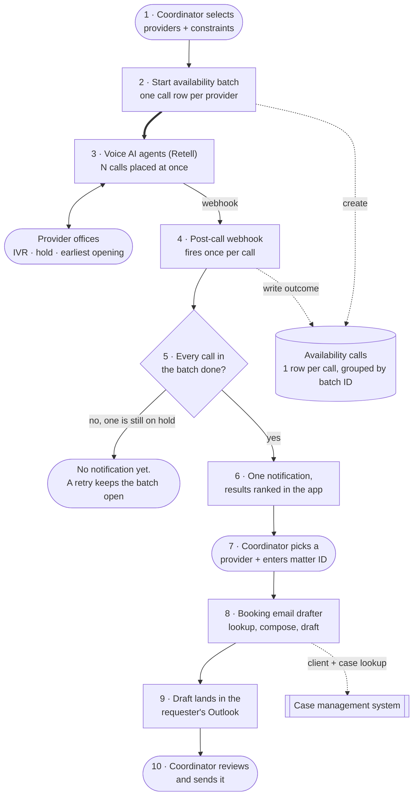

# Medical Provider Selection and Booking

> A provider search and booking app for the treatment team at a 400-person personal injury
> firm. It ranks an ~18,000-provider directory by driving distance from the client's home,
> sends voice AI agents to phone the shortlist for their earliest appointment, and drafts the
> booking email. **Three availability calls used to be thirty minutes of sequential phone work.
> Now they run at once, and one request comes back as one answer.**

## At a glance

| | |
|---|---|
| **Client** | Plaintiff-side personal injury firm, ~400 staff, ~$50M annual revenue (US). Same firm and same engagement as the [FNOL voice agent](../fnol-voice-agent), different department |
| **Domain** | Treatment coordination. Following a client's post-accident care and booking the appointments a doctor recommends |
| **My role** | <!-- OPEN: solo vs team; which parts were yours --> |
| **Timeline** | <!-- OPEN: dates + duration --> |
| **Stack** | React/TypeScript Code App on Microsoft Power Platform, Dataverse, Power Automate, Azure Maps (custom connector), Retell AI (voice), Copilot Studio, Leaflet/MapLibre, Outlook, Teams |
| **Status** | <!-- OPEN: in production since when? how many users? --> |

---

## 1. Context

The same audit that produced the FNOL voice agent covered a second department at this firm. The
claims department opens claims with carriers. The **treatment team** handles what happens next:
tracking a client's medical care after the accident, and when a doctor recommends a procedure
or a specialist, finding a provider and booking the appointment.

Booking appointments is the bulk of that team's day. Two things make provider choice
consequential rather than clerical. The firm cares how fast a case moves through the pipeline,
so the provider with the earliest opening is usually the right one. And these providers treat
on a lien, meaning they get paid out of the eventual settlement, so how much a provider
historically reduces its bill affects what the client actually keeps.

## 2. Diagnosis: how I knew this was the problem to solve

**The method here was shadowing, not interviewing.** For the claims department the finding came
out of interviews down the management ladder, because the gap between the process as designed
and the process as run was where the waste hid. The treatment team's problem was visible in a
way that interviews would have flattened, so we sat with them and watched them book
appointments.

**What the screen actually required.** The case management system holds a contact directory of
roughly **18,000 providers**, filterable by specialty. There are twenty to thirty specialties,
so filtering leaves a shorter list, and still a list to be read. The directory has no
coordinates, no map, and no distance sort.

So to answer "who is near this client", a coordinator:

1. filtered the directory to the specialty the doctor recommended,
2. scrolled the resulting list,
3. copied the client's address into Google Maps,
4. copied a candidate provider's address in after it,
5. read off the distance, and repeated from step 4 for the next candidate.

Then, having picked candidates, they phoned each office to ask its earliest availability,
because the earliest opening moves the case fastest. Sequential calls, each one through an IVR
and a hold queue.

**The list itself could not be trusted.** Two findings came out of watching people use it:

- Notes on provider records were **outdated**, so what the record said and what staff knew
  disagreed.
- The directory has a **"do not use" checkbox**, and it was not used to mark do-not-use
  providers. Which providers to avoid lived in individual coordinators' heads.

That second finding reads as staff carelessness and it is not. The field was not missing.
Ticking it had no consequence anywhere in anyone's workflow, so nobody ticked it. That makes it
a governance problem, and adding a second exclusion flag inside a new app would have reproduced
it exactly.

**The reframe.** A request like this arrives as "make the provider directory easier to search",
and better search does not help. A directory answers "what do we know about this provider". The
coordinator's question is "which of these 18,000 is the best choice for *this* client, today",
which resolves against four things at once:
driving distance from the client's home, whether the provider is excluded, how much the
provider tends to reduce its bill, and how much of the firm's existing caseload already sits
with it. Ranking against a specific client is a different job from storage, and the system of
record was never built to do it.

**The second half of the reframe** is the same finding as FNOL, arrived at independently. Once
you have a shortlist you still have to phone every office, and a person holds one line at a
time. Three ten-minute calls is thirty minutes of wall clock because they cannot overlap.

**What I ruled out.** One I can state: **letting the voice agent book the appointment on the
call.** Firm policy requires appointment requests in writing, so a phone booking would not have
counted. The agent confirms availability and a human sends an email.
<!-- OPEN: what else did you evaluate and reject? Candidates I'd guess but will not assert:
  (a) fixing the directory inside the case management system, blocked by what the platform
      allows;
  (b) straight-line distance instead of driving distance, cheaper and wrong across a river or
      a highway;
  (c) a pre-computed distance matrix, 18k providers x every client address does not build;
  (d) hiring or reassigning coordinators.
Tell me which of these were real and why each lost. -->

## 3. Problem

Choosing a provider took a manual pass over a specialty slice of an 18,000-row directory,
followed by copy-pasting two addresses into Google Maps once per candidate, on a team whose
main job is booking appointments. The list carried outdated notes and an exclusion flag nobody
filled in, so selection quality depended on which coordinator happened to be doing it.
Confirming availability then meant a sequential phone call per office, through an IVR and a
hold queue each time. Every one of those steps sat between an injured client and the treatment
that both their recovery and the case value depend on.

<!-- OPEN: this section needs the arithmetic that makes it fundable, the way the ~125-200
hrs/wk figure does for FNOL. I need:
  - how many people are on the treatment team
  - appointments booked per week (or per coordinator per day)
  - how long one provider selection took, from the shadowing sessions. You watched this, so
    there is probably a timing.
Without those I can only assert that it was slow, which a hiring manager discounts. With them
this becomes the strongest paragraph in the case study. If it was never timed, say so and I
will write it qualitatively and label it as such. -->

## 4. Solution

An app that ranks providers against the client's address, phones the shortlist with voice AI
agents to get their earliest availability, and drafts the booking email into the coordinator's
own outbox. It lives in Teams, where the team already works.

**Kept fresh in the background, every weekday morning:**

1. **Catalog sync.** A scheduled pull from the case management system refreshes the provider
   catalog: contact details, the do-not-use flag, open and total case counts with that
   provider, and average bill reduction.
2. **Geocoding.** A second scheduled pass turns new or changed addresses into coordinates. A
   provider appears on the map once it has them.

**What a coordinator does:**

3. **Search.** Pick the specialty, enter the client's address. The app returns the **three
   closest providers by driving distance**, plus every provider of that specialty on a map.
   Gold pins for the top picks, blue for other active providers, black for do-not-use.
4. **Compare.** Each provider shows driving distance, average bill reduction, and the firm's
   open and total caseload with it, so the choice is made against the variables the team
   actually weighs.
5. **Check availability.** Select one provider or several. Optionally add a provider that is
   not in the catalog. Optionally ask the agent to confirm the office performs the procedure
   before asking about dates, and attach constraints such as nothing before next Monday or no
   morning slots.
6. **Parallel calls.** Every selected office is phoned **at the same time**. The voice agent
   works the IVR, holds, and asks for the earliest opening for that procedure. **One request
   returns one answer**, once every call in it has finished, however many calls that was.
7. **Book.** Pick the provider from the returned results and enter the matter ID. A flow pulls
   the client and case details from the case management system, an LLM step composes the
   request, and the email lands in the coordinator's **own Outlook drafts**. They review and
   send it. Nothing goes out automatically.

**Two escape hatches.** If the coordinator already knows which provider they want, they can
skip the calls and draft the email straight away. If
the provider they need is not in the catalog, they can add it ad hoc and mix it into a batch
with catalog providers.

**How the do-not-use problem got fixed.** The flag stays in the case management system, so
there is one source of truth and the team keeps managing it where they already manage provider
records. What changed is that ticking it now does something: a do-not-use provider is **never
recommended**, drops to the bottom of the results in its own group, and turns black on the map.
It stays visible on purpose. Hiding it would look tidier and would tell a coordinator nothing
when they went looking for a provider they know exists.

## 5. Architecture

**How the catalog stays fresh and searchable.** Two scheduled jobs mirror and enrich the
provider list, and search combines a cheap coordinate filter with a paid routing call.


**What one request does.** Steps 1, 7 and 10 are the human ones. Step 5 is the gate that turns
an unbounded number of phone calls into a single answer.



### Key decisions and tradeoffs

| Decision | Why | What I gave up |
|---|---|---|
| **Driving distance, not straight-line** | Straight-line distance is free and ranks wrong. A provider two miles away across a river or with no crossing for six miles is not the nearest provider, and the coordinator would have caught the error and stopped trusting the tool. | A paid routing call per candidate, and latency in the search. |
| **Shortlist the 25 nearest by coordinates, then ask the routing API for driving distance on those** | Routing every one of ~18,000 providers per search is unaffordable and pointless. Coordinate proximity is a cheap, good-enough filter, and driving distance decides the actual ranking. | An edge case where the true best drive sits outside the 25 nearest as the crow flies. |
| **The do-not-use flag stays in the case management system and is shown, not hidden** | One source of truth, managed where the team already manages providers. Showing excluded providers at the bottom in black makes the exclusion legible instead of making a provider mysteriously absent. | The app cannot fix a bad flag in place, and a correction waits for the next morning's sync. |
| **One row per call, grouped by a batch ID, and nothing notifies until every row in the batch is terminal** | A four-provider request that sends four notifications makes the coordinator do the collation. The point of the batch is a single comparison. One request, one answer, however many calls. | A completion gate to get right, and per-call results are invisible until the slowest office is done. |
| **Confirm by phone, book by email** | Firm policy requires the appointment request in writing. Automating the booking call would have produced a step the firm could not use. | Not end-to-end. A human still sends the email. |
| **The draft lands in the requester's own Outlook drafts and is never sent** | The email goes to a treating provider from a named person at the firm, and it commits the client to an appointment. Review costs seconds. | A step that could have been automated stays manual by choice. |
| **Confirmed availability expires after six hours** | Appointment slots go. Booking against a slot that was free this morning produces a wrong email and a call from the provider's office. Expired results have to be reconfirmed. | Coordinators who leave a request overnight have to rerun the calls. |
| **Ad-hoc providers create a call row but never a catalog row** | Staff can reach any provider immediately without anyone typing into the permanent catalog, so the synced catalog stays a faithful mirror of the system of record. | Ad-hoc providers are not reusable. Using one twice means adding it twice. |

### Constraints I built inside

- **The case management system is the system of record and its API is limited.** The provider
  catalog is pulled on a schedule and mirrored, rather than queried live. That is why the app
  is a day-fresh copy and why a do-not-use correction takes effect the next business day.
- **The exclusion problem was organisational.** The design had to make an existing, ignored
  field consequential rather than replace it, or the same drift would have started again in a
  new column.
- **Appointments must be requested in writing.** Shaped the whole back half: confirm by voice,
  commit by email.
- **Non-technical users.** Treatment coordinators, not analysts. The surface is a search box,
  a map, and two buttons.
- **Built inside the firm's existing Microsoft estate**, with access granted by membership of
  an existing security group, the same pattern as the other solutions in this engagement. No
  new logins, no new access model for IT to learn.

### Illustrative excerpt: the batch completion gate

*Redacted, with table and column names replaced. This is the piece worth showing, because it
is what makes an unbounded number of phone calls behave like one request.*

```js
// Post-call webhook. Fires once per completed call, so N times for an N-provider request.
// The coordinator gets exactly one notification, after the last call lands.

const call = await findCallByVoiceCallId(payload.call_id);

if (!reachedAHuman(payload)) {
  // Offices are busy, and a hold queue that times out is not a failed provider.
  if (call.attempts < MAX_ATTEMPTS) {          // MAX_ATTEMPTS = 3
    return placeCallAgain(call);               // row stays pending, no notification
  }
  return markTerminal(call, 'no_human_reached');
}

await markTerminal(call, 'success', {
  earliestAvailability: payload.extracted.earliest_date,
  procedureOffered:     payload.extracted.performs_procedure,
  details:              payload.extracted.notes,
});

// The gate. Every call started together shares a batch ID, so completion is a
// question about siblings, not about this call.
const siblings = await findCallsInBatch(call.batchId);
if (siblings.some(isStillPending)) return;     // someone is still on hold

await notifyRequester(call.batchId, siblings); // one card, all providers, ranked
```

Three things that gate buys. A slow office cannot trigger a premature "here are your results".
A retry is invisible to the coordinator, because a pending row keeps the batch open rather than
reporting a failure. And because the unit of completion is the batch rather than the call, the
same code path serves a one-provider request and a nine-provider one.

The shape is deliberately the same as the FNOL agent's one-row-per-carrier-per-attempt model,
and both share a status option set across the engagement. Ten solutions built by the same team
against the same data platform should not each invent their own vocabulary for "this thing
finished".

### Illustrative excerpt: shortlisting before routing

```js
// Search: specialty is a hard gate, distance is the ranking.
const candidates = await providers.where({
  specialty: chosenSpecialty,
  isActive:  true,
  geocoded:  true,                    // no coordinates, no ranking, no map pin
});

// Cheap first pass. Coordinate distance to pick who is worth a routing call.
const nearest25 = candidates
  .map(p => ({ ...p, crowFlies: haversine(clientCoords, p.coords) }))
  .sort((a, b) => a.crowFlies - b.crowFlies)
  .slice(0, 25);

// Paid second pass, on 25 rows rather than ~18,000.
const routed = await azureMaps.driveTimes(clientCoords, nearest25);

const ranked = [
  ...routed.filter(p => !p.doNotUse).sort(byDrivingDistance),
  ...routed.filter(p =>  p.doNotUse).sort(byDrivingDistance),   // last, always, in black
];
```

## 6. My involvement

<!-- OPEN: the section interviewers read closest, and the one I cannot write for you.
  - Did you run the shadowing sessions yourself? Who else was there?
  - Which parts did you personally build vs. review vs. delegate?
    (the catalog sync / the geocoding and ranking / the React app and map / the voice agent
    and its prompt / the batch completion gate / the email drafter / the data model)
  - Did you write these three handover docs? The maintenance runbook in particular is better
    than most internal docs and that is worth claiming.
  - Who trained the coordinators, and did anyone resist giving up their own mental provider
    list?
  - Is it handed to the client's IT, or still yours?
-->

## 7. Impact

**The before state, from the shadowing sessions:**

| Metric | Before |
|---|---|
| Provider directory size | ~18,000 records, filterable by specialty only |
| Distance information available in the system of record | None. No coordinates, no map, no distance sort |
| How distance was determined | Two addresses copied into Google Maps, once per candidate provider |
| Which providers to avoid | An unused checkbox, plus individual staff memory |
| Confirming availability for three providers | Three sequential calls, ~10 min each, ~30 min of wall clock |

**What the design changes, mechanically.** Provider ranking stops being a manual pass over a
list plus a browser tab, and becomes a specialty and an address typed into one box. Availability
calls stop being sequential: three ten-minute calls become one ten-minute wait, because the
wall clock is now the length of the slowest call rather than the sum of all of them, and the
coordinator is not on any of them. Since call concurrency has no practical ceiling here,
checking six providers costs about what checking one costs.

<!-- OPEN: everything above is either measured before-state or mechanical arithmetic, and this
section stops there on purpose. To make it land I need whatever was measured after rollout:
  - appointments booked through the app (count, over what period)
  - availability calls placed, and how often the agent reached a human
  - change in time-to-first-appointment, if anyone tracked it, since that is the metric the
    firm actually cares about
  - adoption: how many coordinators use it, is it the default path now
  - whether the do-not-use flag is now being maintained, which is the real test of that design
    choice and would be a genuinely satisfying number
If none of it was measured, tell me and I will write it as an honest qualitative outcome. An
unverifiable percentage in a public portfolio is worse than no percentage. -->

## 8. What I'd do differently

- **The deploy can silently ship the previous build.** The build script type-checks and then
  bundles, so a type error leaves the output directory untouched, and the push step still
  reports success and uploads the stale bundle. The runbook tells the operator to read the
  build output for errors before pushing, which is a documented workaround for something the
  pipeline should refuse to do. The push should fail on a failed type-check.
- **Search is specialty-gated, so a provider with no specialty is unreachable.** The row exists,
  it syncs, it geocodes, and no search can return it. That is a silent data trap rather than a
  visible error, and it should surface as a data-quality warning instead of living in a
  troubleshooting table.
- **The "draft ready" notification depends on the user having installed the bot.** The card
  cannot reach a coordinator who has not added the agent's Teams app, and the fix is an
  install policy. The draft is in Outlook either way, so nothing is lost, but a coordinator
  waiting for a card that will never arrive has no way to know that.
- **The specialty mapping refresh is manual.** It runs on demand rather than on a schedule,
  which means the lookup that gates all search depends on someone remembering. It should be on
  the same weekday recurrence as the other two jobs.
- <!-- OPEN: yours. What actually frustrated you here, or what would you rebuild? The Azure
  Maps cost model, the map component, the 25-provider cap, the six-hour expiry window, the
  scheduled-mirror approach to the provider catalog? -->

---

<details>
<summary>Evidence</summary>

<!-- Candidates, all needing a redaction pass first:
     - The search screen: ranked provider list beside the map, gold/blue/black pins. Best
       single artifact, since the whole diagnosis is "they could not see this". Blur provider
       names and the client address, and use a demo address rather than a real client's.
     - A do-not-use provider sitting at the bottom of the results in black.
     - The availability results view for a multi-provider batch, showing one request with
       several returned dates.
     - A drafted booking email with everything identifying redacted.
     Check every image for: firm name, provider names, client names and addresses, matter IDs,
     dates of loss, dollar figures, PHI. Provider names are the new risk here that FNOL did
     not have, since a real clinic name is identifying even though it is not the client. -->

Not yet added.

</details>
